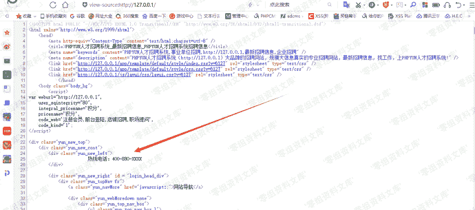
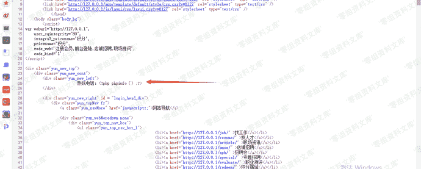
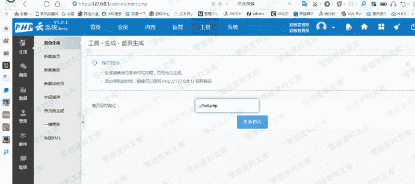
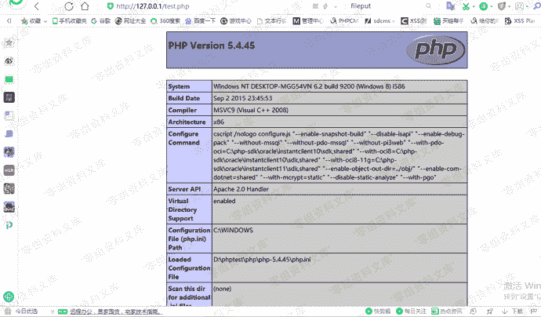
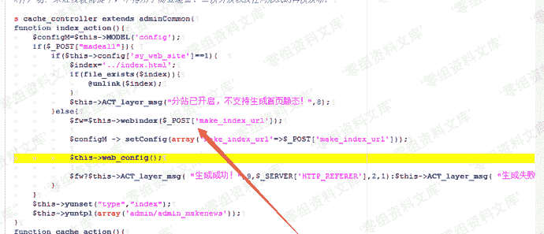
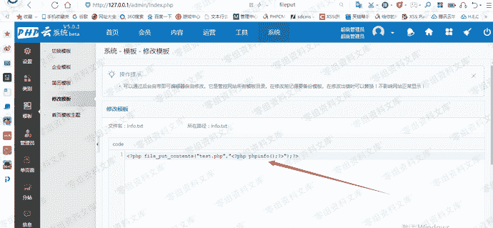

# Phpyun v5.0.1 后台getshell

> 原文：[https://www.zhihuifly.com/t/topic/3093](https://www.zhihuifly.com/t/topic/3093)

# Phpyun v5.0.1 后台getshell

## 一、漏洞简介

## 二、漏洞影响

Phpyun v5.0.1

## 三、复现过程

安装好本地环境,看了下系统功能,等等测试,最后查看前台index.php源码。



后台直接写入被过滤掉了。



又去翻了下后台功能,发下有个生成功能,并且没有后缀限制。



生存成功,但是发现()被大写,使用经典的include包含,随意找了一个模板下的info.txt文件,写入执行代码。

```
<?php include'app/template/info.txt';？> 
```



成功执行代码
代码分析：



对post的数据没有任何验证,直接代入

