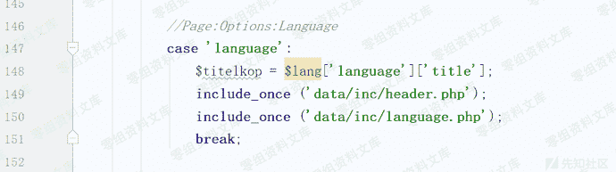
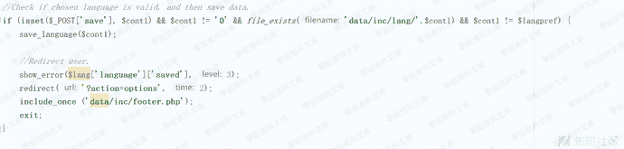
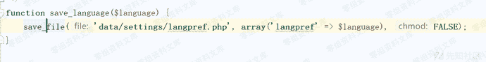
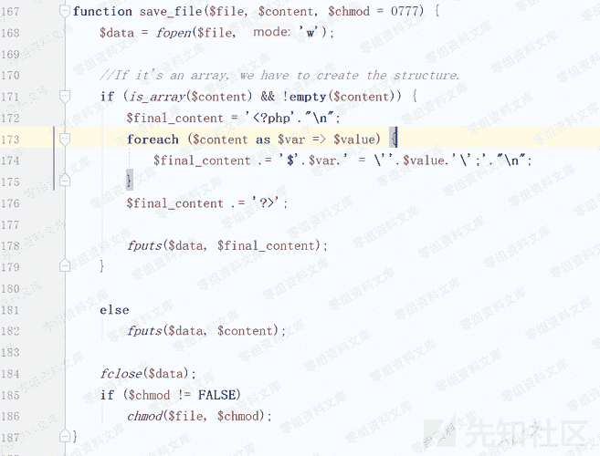
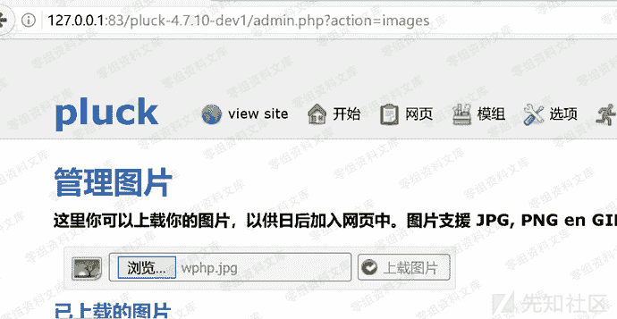
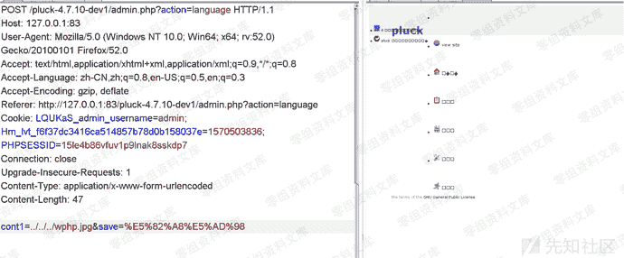
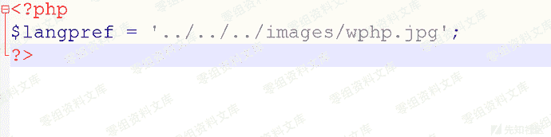
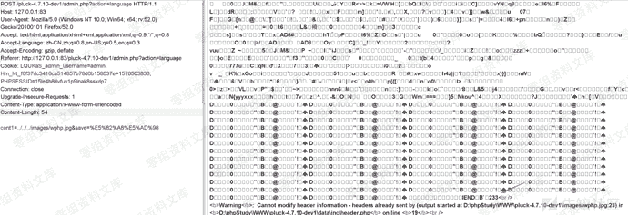
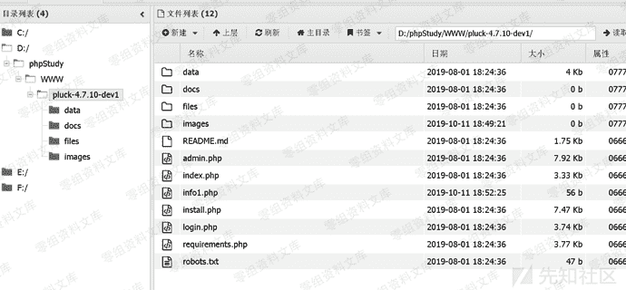

# Pluck CMS 4.7.10 后台 文件包含+文件上传导致getshell

> 原文：[https://www.zhihuifly.com/t/topic/3095](https://www.zhihuifly.com/t/topic/3095)

# Pluck CMS 4.7.10 后台 文件包含+文件上传导致getshell

## 一、漏洞简介

## 二、漏洞影响

Pluck CMS Pluck CMS <=4.7.10

## 三、复现过程

### 1、分析过程

目前最新版本为4.7.10，个人测试github上最旧的4.7.2版本仍然存在该漏洞，框架本身语言选择模块数据注入导致的文件包含漏洞，官方更新版本并没有对这部分代码进行修改，可以认为是全版本通用的。该漏洞是在复现"我怎么这么帅"在先知发表的《Pluck CMS 4.7.10远程代码执行漏洞分析》之余审计其他代码发现的，在此致谢。

v4.7.1分析
从入口文件admin.php查看:



查看language.php,满足指定的文件存在，并传入的cont1参数和原本设置的$langpref参数不等，进入save_language($cont1)。



调用save_file方法。



由于只有一个数据，直接182写入php文件。



至此，langpref的值变成可控值，这个值对应的文件，用于控制网站的语言选择，会自动被全局php文件包含。可以包含上传功能点上传的图种文件解析其中的一句话导致getshell。文件上传功能点使用白名单，但是没有进行重命名，所以路径可以简单猜解。


### 2、复现过程

文件上传一个可以写一句话木马的php图种。





上述参数保存于php文件：

```
\data\settings\langpref.php 
```



由于该参数是网站语言控制的php文件，访问任意网页，包含langpref对应的文件。



访问生成的php一句话木马。

