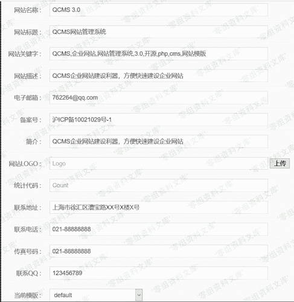
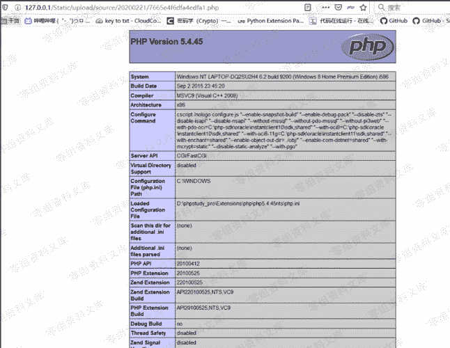

# QCMS 3.0 任意文件上传

> 原文：[https://www.zhihuifly.com/t/topic/3099](https://www.zhihuifly.com/t/topic/3099)

# QCMS 3.0 任意文件上传

## 一、漏洞简介

## 二、漏洞影响

QCMS 3.0

## 三、复现过程

漏洞产生点在系统设置上传logo处

构造一个test.php文件，内容为`，点击上传

可以看到，上传后给出了路径

访问文件，发现上传成功

需要注意的是，每次上传后会将内容的hash保存到数据库中，如果再次上传时会检查数据库内容是否有重复，有则拒绝上传，因此如果第一遍上传有误，需要对内容进行简单的修改才能上传。

## 参考链接

> https://xz.aliyun.com/t/7269