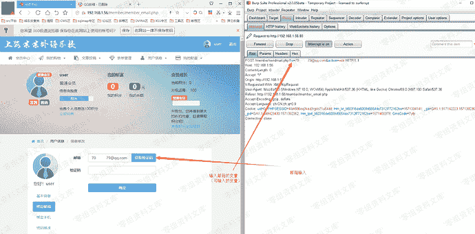
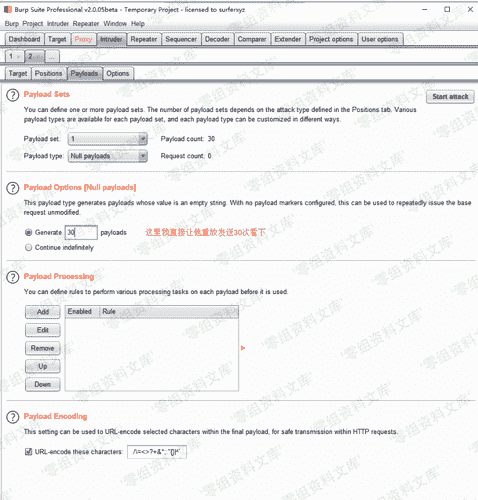
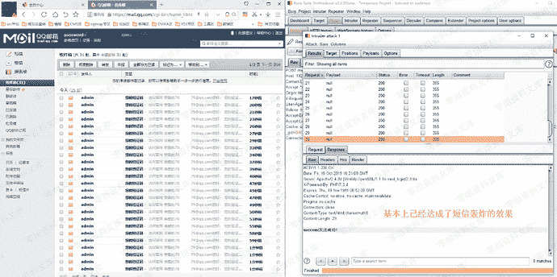

# S-CMS 学校建站系统 v5.0 邮箱短信轰炸逻辑漏洞

> 原文：[https://www.zhihuifly.com/t/topic/3110](https://www.zhihuifly.com/t/topic/3110)

# S-CMS 学校建站系统 v5.0 邮箱短信轰炸逻辑漏洞

## 一、漏洞简介

应用程序的短信注册和邮箱注册模块，以及短信和邮箱绑定模块，没有添加时间限制发送数量的机制，导致存在逻辑缺陷，没有限定一段时间内可发送的短信数量。

## 二、漏洞影响

S-CMS 学校建站系统 v5.0

## 三、复现过程

该漏洞存在的位置有：前台注册，后台短信模块测试，以及前台用户绑定邮箱以及手机号的位置，均存在该逻辑漏洞。

