# Semcms v2.7 密码找回漏洞

> 原文：[https://www.zhihuifly.com/t/topic/3121](https://www.zhihuifly.com/t/topic/3121)

# Semcms v2.7 密码找回漏洞

## 一、漏洞简介

## 二、漏洞影响

SemCMS v2.7

## 三、复现过程

先在本地搭建好环境。

访问后台登录页面如下：

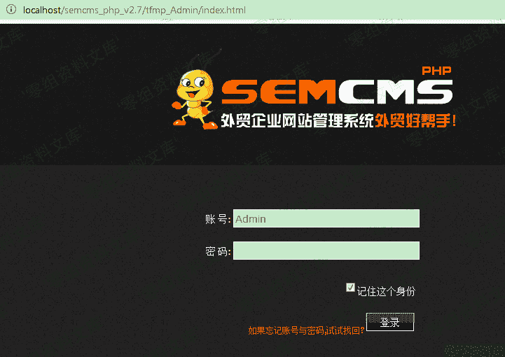

先来看看正常的找回密码的过程。

首先，查看 tfmp_Admin/index.html 的源码：

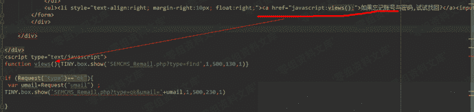

从代码可以看到，当点击登录按钮旁边的链接“如果忘记账号与密码，试试找回？”，时，会执行 js的views() 函数，该函数是弹出一个对话框并向SEMCMS_Remail.php?type=find 发送请求，让用户填写要接收重置后密码的邮箱地址，如下：

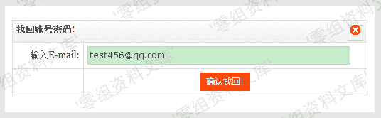

可以看到，就是构造上面那个要求输入E-mail的表单，点击“确认找回”按钮，该表单会提交到

```
../Include/web_email.php?type=findpassword 
```

，再看一下 web_email.php 中 type=findpassword 时的代码：

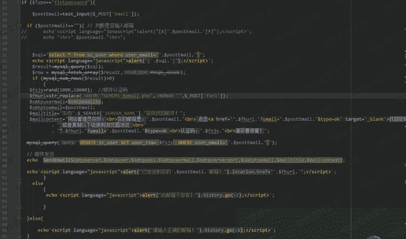

代码会根据用户输入的E-mail地址，查找 sc_user 表，看是否存在使用该E-mail地址的用户，如果存在，则随机生成4位数的认证码，并将其拼接到一个密码重置链接中，最后以邮件的形式发送给用户。用户点击邮件中的密码重置链接即可；但如果不存在，则弹出对话框，提示“此邮箱不存在！”，如图：

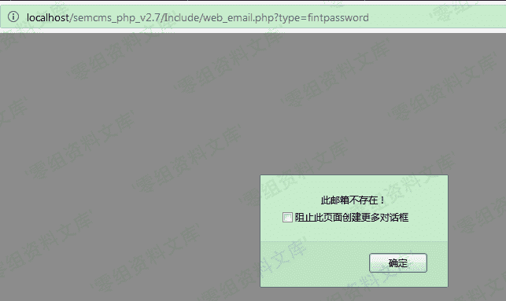

这里假设知道了管理员的邮箱，由于认证码是随机的4位数，这里很容易想到暴力破解。但通过

```
../Include/web_email.php?type=findpassword 
```

无法进行暴力破解，因为如上面代码所示，每次进入 if ($Type == 'findpassword') 语句块，认证码会重新生成。所以只能看看有没有别的地方可以利用。

回头再查看 index.html 的代码：

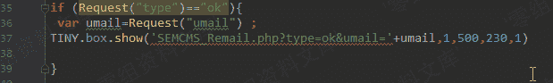

当请求参数 type=ok 时，SEMCMS_Remail.php后面跟的参数type也是ok，而前面提到，这种情况下，SEMCMS_Remail.php会构造另外一个表单，如下：

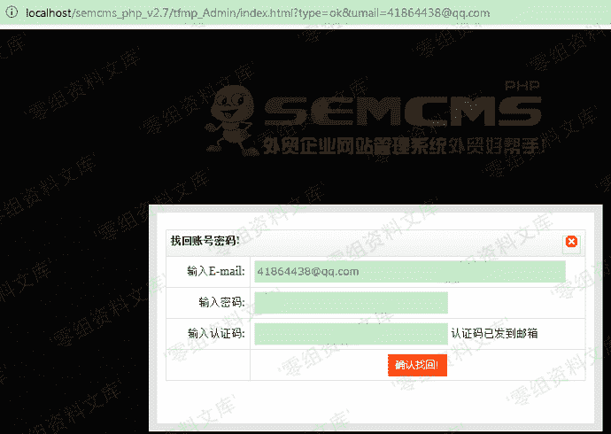

点击“确认找回”按钮，会提交到

```
../Include/web_email.php?type=findok 
```

，web_email.php 相应部分的代码如下：

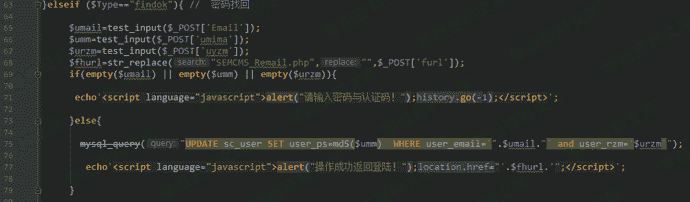

可以看到，密码会经过md5加密后再存入数据库中。
因此，这里可以通过

```
http://0-sec.org/semcms_php_v2.7/tfmp_Admin/index.html?type=ok&umail=41864438@qq.com 
```

弹出的表单，提交表单，使用BurpSuite进行暴力破解从而将密码重置。

为了本地测试方便，所以将初始密码设置为 111111，其md5的值为：96e79218965eb72c92a549dd5a330112。重置后密码将变为123456，MD5加密后即 e10adc3949ba59abbe56e057f20f883e


先用Python生成一个四位数字的字典：

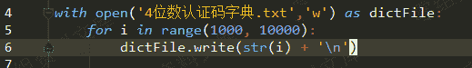

利用BurpSuite 进行暴力破解：

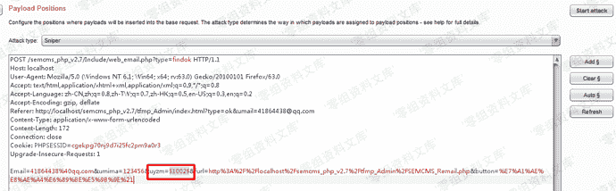

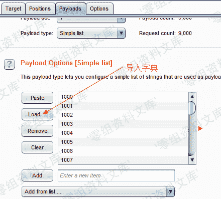

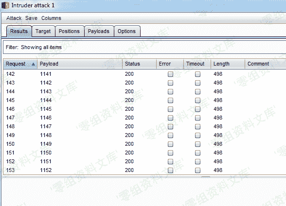

结束后，查看数据库，发现密码确实被重置了：


使用 Admin/123456 可以成功登陆后台管理页面：

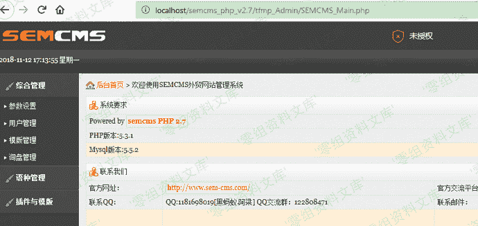

另外，这里涉及到表单提交，所以过程中我也想到过能否使用sql注入，然而每一次表单的提交，php代码中都在sql语句构造前，对用户的表单输入通过 test_input() 函数进行了安全检查和过滤，所以不存在SQL注入的问题。

## 参考链接

> https://www.jianshu.com/p/4776cec565c1