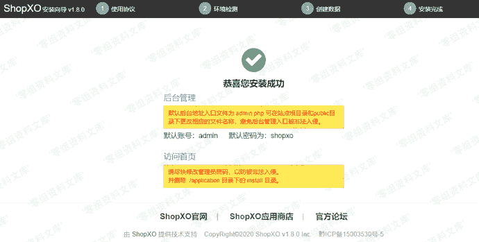
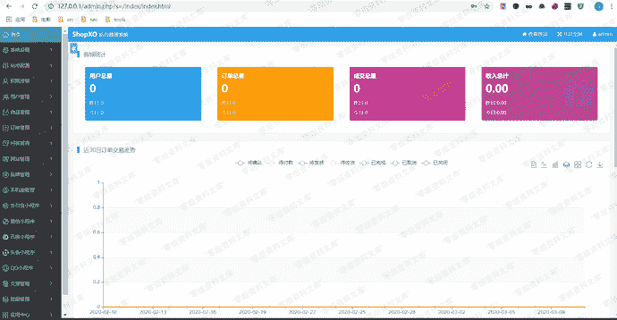
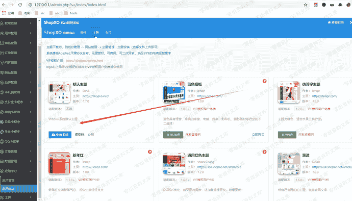
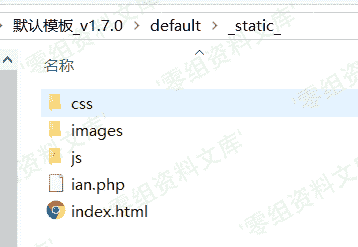
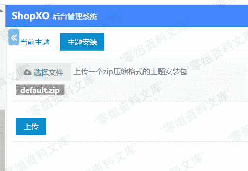
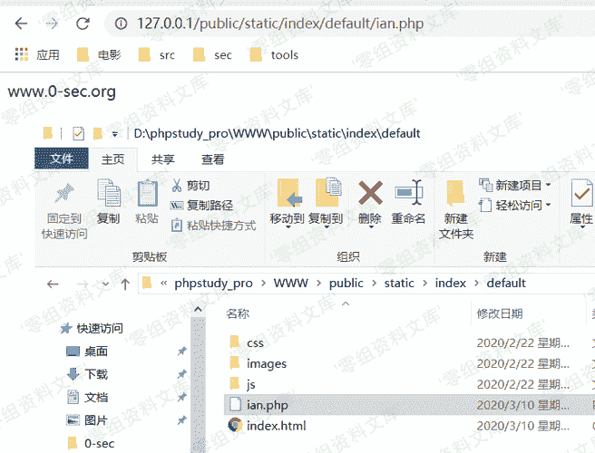

# ShopXO v1.8.0 后台getshell

> 原文：[https://www.zhihuifly.com/t/topic/3125](https://www.zhihuifly.com/t/topic/3125)

# ShopXO v1.8.0 后台getshell

## 一、漏洞简介

## 二、漏洞影响

ShopXO 小于v1.8.0

## 三、复现过程

默认后台密码
admin shopxo





登入后台-》应用中心-》应用商店-》主题

随便下载一个主题





然后把下载下来的压缩包解压出来 把shell放入static目录



回到网站后台
网站管理-》主题管理-》安装主题



shell地址

```
http://www.0-sec.org/static/index/default/shell.php 
```

> public是运行目录！！！