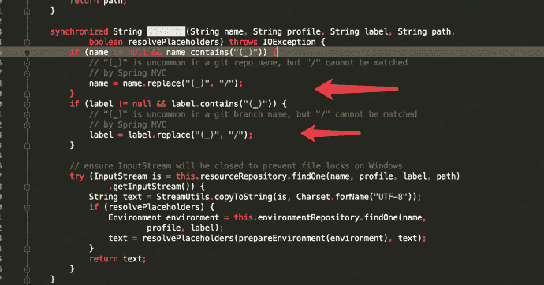
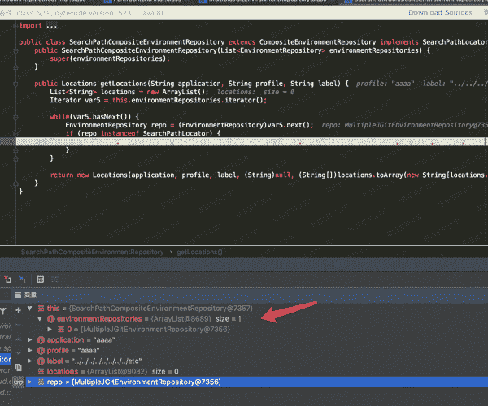
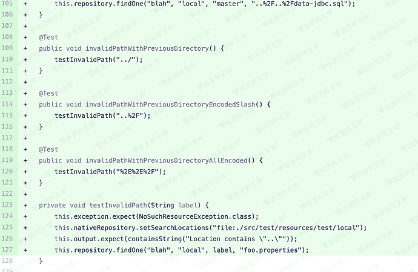
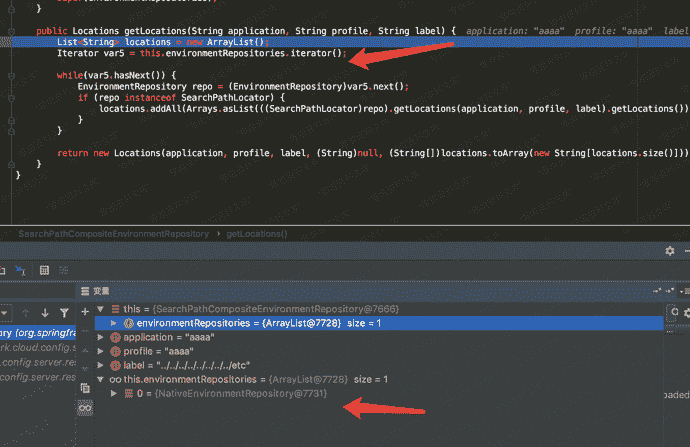
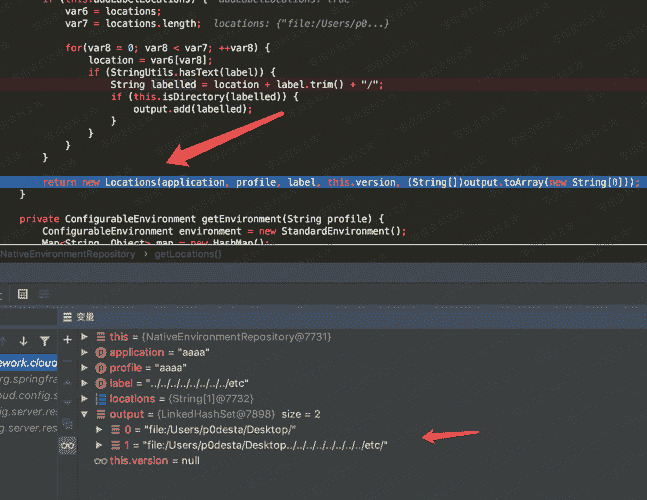

# （CVE-2020-5405）Spring Cloud Config Server 目录穿越

> 原文：[https://www.zhihuifly.com/t/topic/3135](https://www.zhihuifly.com/t/topic/3135)

# （CVE-2020-5405）Spring Cloud Config Server 目录穿越

## 一、漏洞简介

## 二、漏洞影响

Spring Cloud Config Server 2.2.0-2.2.1

Spring Cloud Config Server 2.1.0-2.1.6

## 三、复现过程

### 漏洞分析

其实往前看有个替换的操作,很显眼



name和label的`(_)`会被替换成`/`,看到这里,我尝试构造poc

```
http://www.0-sec.org:8888/aaaa/aaaa/%2e%2e%28%5f%29%2e%2e%28%5f%29%2e%2e%28%5f%29%2e%2e%28%5f%29%2e%2e%28%5f%29%2e%2e%28%5f%29%2e%2e%28%5f%29%2e%2e%28%5f%29%65%74%63/passwd 
```

我们让label为`..(_)..(_)..(_)..(_)..(_)..(_)..(_)..(_)etc`,path为`passwd`,这样拼接完应该是`file:/xxx/xxx/xxx/../../../../../etc/passwd`

但是如果label不为master的话,代码逻辑就会先去checkout,然后就异常了

这里面会导致抛出异常,具体抛出异常的点在哪呢,在`org.springframework.cloud.config.server.environment.MultipleJGitEnvironmentRepository`



在CVE-2019-3799中,我们使用的配置是常用的`spring.cloud.config.server.git.uri`,它会选择使用`MultipleJGitEnvironmentRepository.class`的getLocations,然后就会走到checkout,抛出异常了,那么我们怎么去不走checkout逻辑呢。

通过翻文档[https://zq99299.github.io/note-book/spring-cloud-tutorial/config/002.html#%E7%89%88%E6%9C%AC%E6%8E%A7%E5%88%B6%E5%90%8E%E7%AB%AF%E6%96%87%E4%BB%B6%E7%B3%BB%E7%BB%9F](https://zq99299.github.io/note-book/spring-cloud-tutorial/config/002.html#%E7%89%88%E6%9C%AC%E6%8E%A7%E5%88%B6%E5%90%8E%E7%AB%AF%E6%96%87%E4%BB%B6%E7%B3%BB%E7%BB%9F)

得知这个配置是让它从本地进行加载,而不是用git,通过在application.properties配置

```
spring.profiles.active=native
spring.cloud.config.server.native.search-locations=file:/Users/p0desta/Desktop 
```

其实通过补丁我们也可以发现端倪



配置后重新跟进调试



然后就在`/org/springframework/cloud/config/server/environment/NativeEnvironmentRepository.class@getLocations`中对路径进行了处理,大致就是对路径进行拼接,然后存在ouput数组中,返回一个新的Locations对象



然后后面就是跟CVE-2019-3799一样,直接读文件了。

## 参考链接

> http://p0desta.com/2020/04/16/spring-cloud-config%E7%9B%AE%E5%BD%95%E7%A9%BF%E8%B6%8A%E6%BC%8F%E6%B4%9E%E5%88%86%E6%9E%90/#CVE-2020-5405%E6%BC%8F%E6%B4%9E%E5%88%86%E6%9E%90