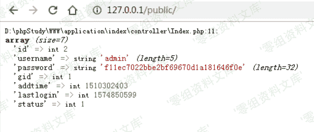
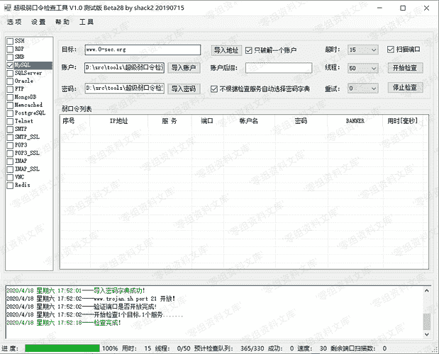
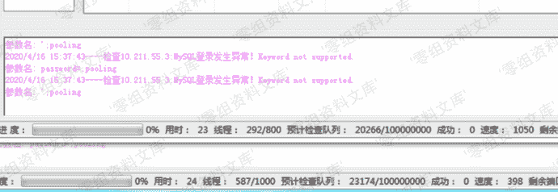
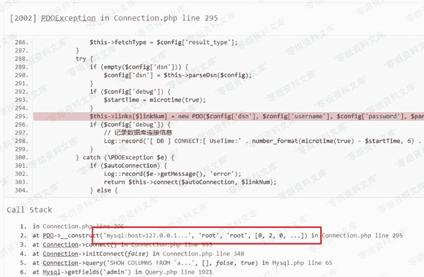

# Thinkphp 5.0.24 mysql账号密码泄露

> 原文：[https://www.zhihuifly.com/t/topic/3164](https://www.zhihuifly.com/t/topic/3164)

# Thinkphp 5.0.24 mysql账号密码泄露

## 一、漏洞简介

Thinkphp 5.0.24 在开启debug的模式下，可通过高线程爆破mysql导致tp报错泄露mysql账号密码。

## 二、漏洞影响

Thinkphp 5.0.24

## 三、复现过程

利用条件：

*   开启debug模式
*   mysql开启外连

通过MySQL爆破工具，来建立大量链接

连接数到达一定的程度以后就会抛出错误

导致泄漏出MySql帐号密码

## 修复方案

*   关闭tp5 debug选项（推荐）

*   注释掉thinkphp\library\think\db\Connection.php 中305行附近的throw $e;（不推荐）

## 参考链接

> https://zhuanlan.zhihu.com/p/131414060