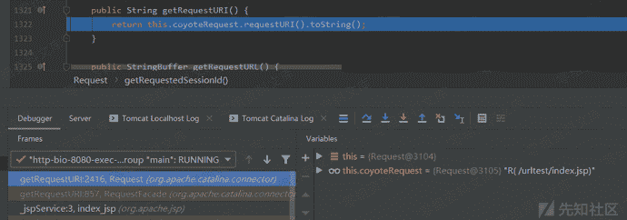
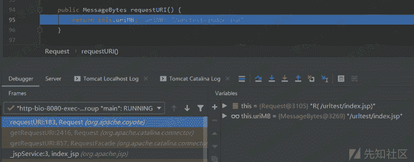

# Tomcat getRequestURI()的处理

> 原文：[https://www.zhihuifly.com/t/topic/3186](https://www.zhihuifly.com/t/topic/3186)

### Tomcat getRequestURI()的处理

我们直接在index.jsp中调用getRequestURI()函数的地方打上断点调试即可。

这里是直接调用Request.requestURI()函数然后直接返回其字符串值：

跟进Request.requestURI()函数，这里是直接返回请求的URL内容，没有做任何处理以及URL解码：

Tomcat