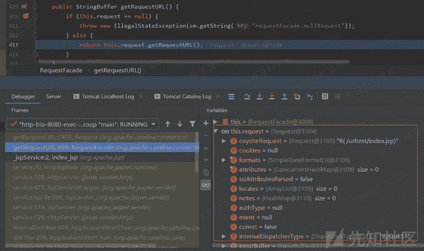
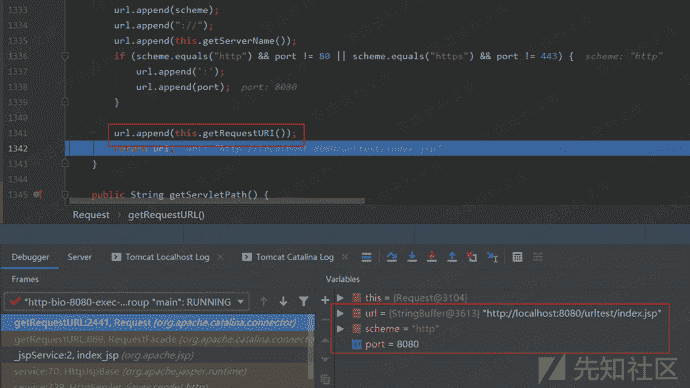

# Tomcat getRequestURL()的处理

> 原文：[https://www.zhihuifly.com/t/topic/3187](https://www.zhihuifly.com/t/topic/3187)

### Tomcat getRequestURL()的处理

在getRequestURL()函数中是调用了Request.getRequestURL()函数的：

跟进该函数，在提取了协议类型、host和port之后，调用了getRequestURI()函数获取URL请求的路径，然后直接拼接进URL直接返回而不做包括URL解码的任何处理：

