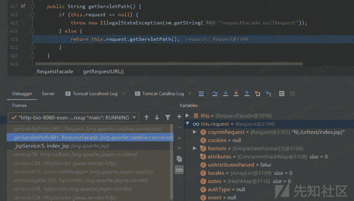
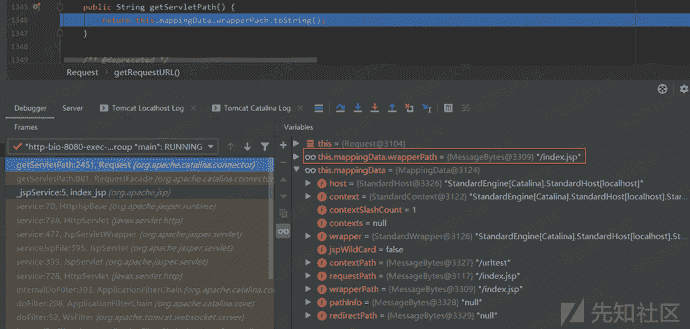

# Tomcat getServletPath()的处理

> 原文：[https://www.zhihuifly.com/t/topic/3188](https://www.zhihuifly.com/t/topic/3188)

### Tomcat getServletPath()的处理

在getServletPath()函数中是调用了Request.getServletPath()函数的：

跟进去，看到是直接返回前面Tomcat已经处理过后的提取处理的Servlet路径，注意这里是获取MappingData类对象中的wrapperPath属性值：

