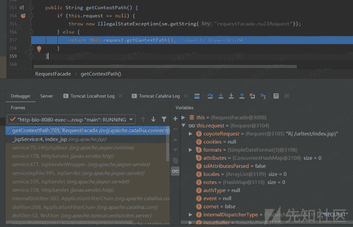
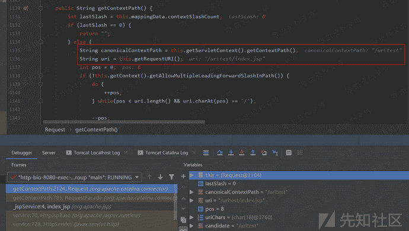
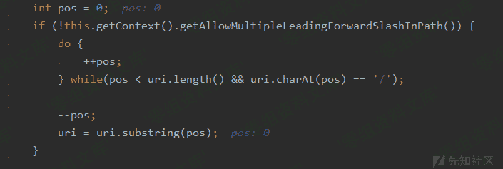
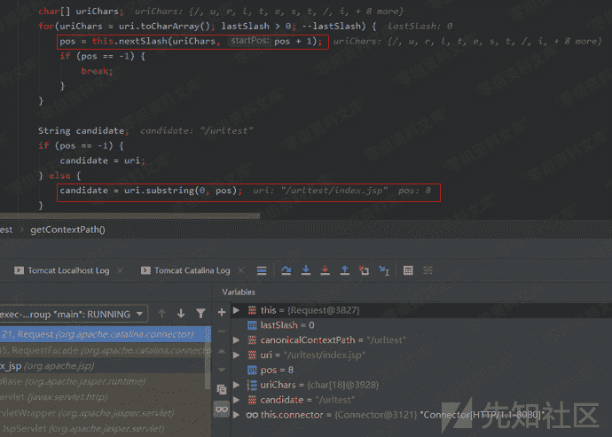
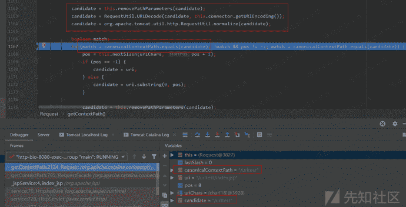
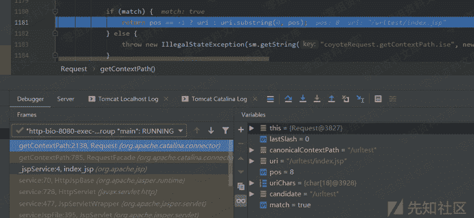

# Tomcat getContextPath()的处理

> 原文：[https://www.zhihuifly.com/t/topic/3190](https://www.zhihuifly.com/t/topic/3190)

### Tomcat getContextPath()的处理

在getContextPath()函数中，调用了Request.getContextPath()函数：

跟进该函数，先是调用getServletContext().getContextPath()来获取当前Servlet上下文路径以及调用getRequestURI()函数获取当前请求的目录路径：

往下的这段循环是处理uri变量值中如果存在多个连续的`/`则删除掉：

再往下，获取下一个`/`符号的位置，然后根据该位置索引对uri变量值进行工程名的切分提取：

接着，就是对刚刚切分得到的candidate变量进行和Tomcat一样的特殊字符处理过程，先调用removePathParameters()处理`;`和`.`，然后进行URL解码，再调用normalize()函数进行标准化处理，处理过后比较处理完的candidate变量值和之前获取的规范上下文路径是否一致，不一致的话就循环继续前面的操作直至一致为止：

最后，直接返回按pos索引切分的uri变量值：

