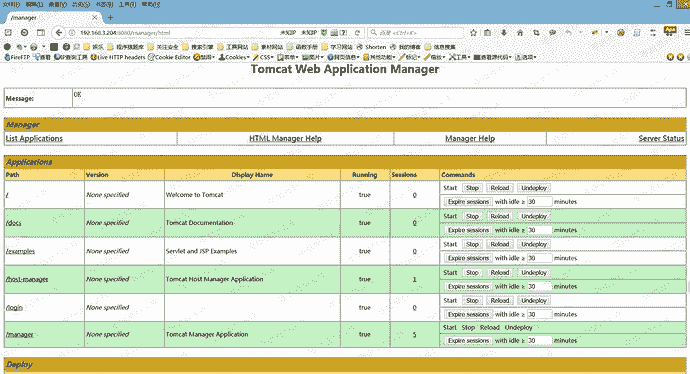
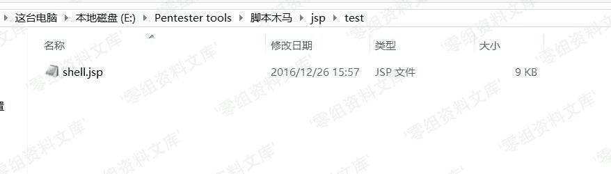
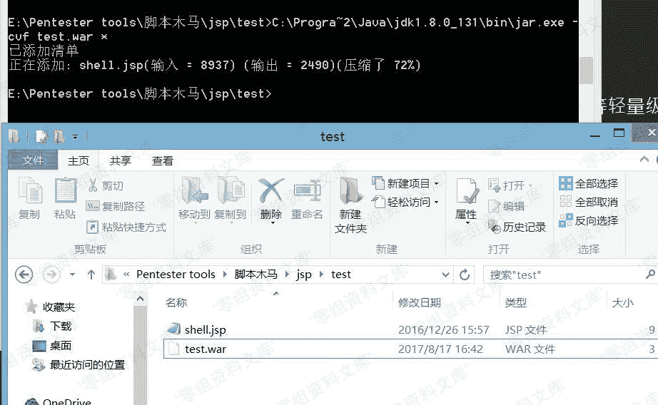
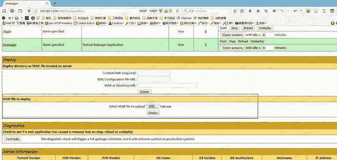
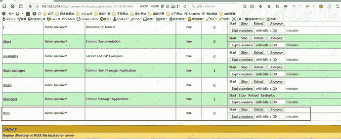
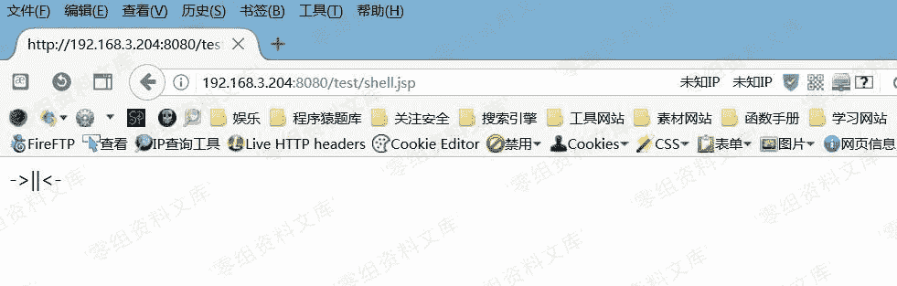

# Tomcat 后台部署war木马getshell

> 原文：[https://www.zhihuifly.com/t/topic/3194](https://www.zhihuifly.com/t/topic/3194)

# Tomcat 后台部署war木马getshell

## 一、漏洞简介

## 二、漏洞影响

## 三、复现过程

在获取到令牌后，我们可以进入Tomcat后台了：

在这个后台，我们可以操作每个应用的状态……以及读取每个应用下的Session。

但是这都不是最大的安全隐患 :)

下面来讲一下如何制作war包。

> war包：Java web工程，都是打成war包，进行发布，如果我们的服务器选择TOMCAT等轻量级服务器，一般就打出WAR包进行发布

先准备了一个JSP的一句话木马，安装好JDK环境，我的目录是在`C:\Program Files (x86)\Java\jdk1.8.0_131\bin`,这个目录下又个文件叫`jar.exe`。

执行:`jar -cvf [war包名称].war 打包目录`

我们现在已经打包好了一个WAR包。

找到Tomcat管理页面中的`WAR file to deploy`进行上传就可以部署了。

应用列表已经出现了我们的目录：

访问文件名即可：

##参考链接

> https://payloads.online/archivers/2017-08-17/2#tomcat-%E7%88%86%E7%A0%B4