# weblogic爆破

> 原文：[https://www.zhihuifly.com/t/topic/3220](https://www.zhihuifly.com/t/topic/3220)

# weblogic爆破

## 一、部署weblogic

现有的redhat环境7.0,jdk版本1.7。

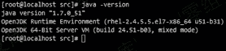

## 二、weblogic下载

操作系统：RedHat7

weblogic版本：10.3.6

## 三、安装weblogic

### 1、weblogic安装

创建一个用户

useradd weblogic

passwd weblogic

chmod a+x wls1036_generic.jar

su weblogic

java -jar wls1036_generic.jar -mode=console

出现问题

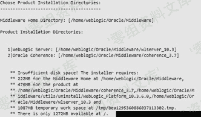

提示空间内存大小不够，清理空间再下一步。

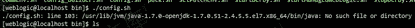

[root@localhostsrc]# cd /usr/lib/jvm/java-1.7.0-openjdk-1.7.0.51-2.4.5.5.el7.x86_64

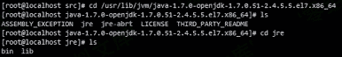

修改 commEnv.sh 文件

JAVA_HOME="/usr/lib/jvm/java-1.7.0-openjdk-1.7.0.9.x86_64/ jre"

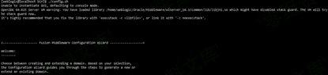

### 2、启动weblogic

[weblogic@localhostroot]$cd /home/weblogic/Oracle/Middleware/user_projects/domains/base_domain/
[weblogic@localhost base_domain]$ ./startWebLogic.sh

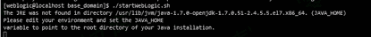

在目录/usr/lib/jvm/java-1.7.0-openjdk-1.7.0.79.x86_64中找不到JRE

编辑setDomainEnv.sh

重新启动weblogic服务

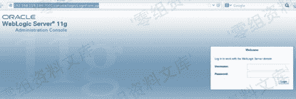

## 四、破解weblogic控制台密码

### 第一步 将用户名和密码保存到boot.properties文件中

[root@localhost security]# pwd

/home/weblogic/Oracle/Middleware/user_projects/domains/base_domain/servers/AdminServer/security

在adminserver目录下创建security目录，并创建文件boot.properties

Username=weblogic

Password=weblogic123

### 第二步 重新启动WebLogic服务

[root@localhost bin]# ./startWebLogic.sh&

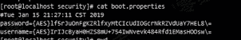

已经加密

### 第三步 暴力破解

#### 1.java和javac的版本一致

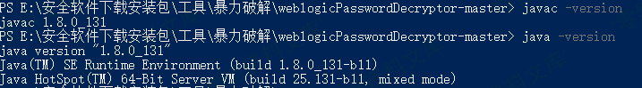

#### 2.编译WebLogicPasswordDecryptor.java

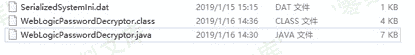

3.破解密码

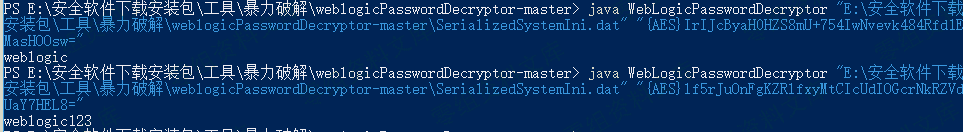