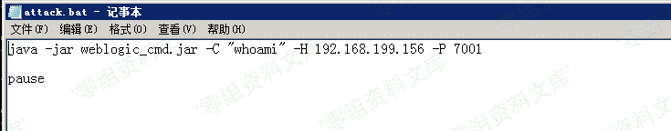

# （CVE-2017-3248）Weblogic 反序列化漏洞

> 原文：[https://www.zhihuifly.com/t/topic/3221](https://www.zhihuifly.com/t/topic/3221)

# CVE-2017-3248 Weblogic 反序列化漏洞

## 一、漏洞简介

## 二、漏洞影响

WebLogic 10.3.6.0
WebLogic 12.1.3.0
WebLogic 12.2.1.0
WebLogic 12.2.1.1

## 三、复现过程

```
http://wiki.0-sec.org/download/CVE-2017-3248.rar 
```

