# WordPress Plugin - Quizlord 2.0 XSS

> 原文：[https://www.zhihuifly.com/t/topic/3243](https://www.zhihuifly.com/t/topic/3243)

# WordPress Plugin - Quizlord 2.0 XSS

## 一、漏洞简介

## 二、漏洞影响

## 三、复现过程

首先搭建worepress，我的版本是4.4。然后进入后台下载插件Quizlord，版本是2.0。

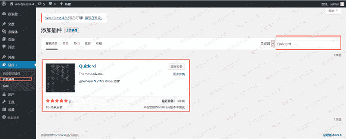

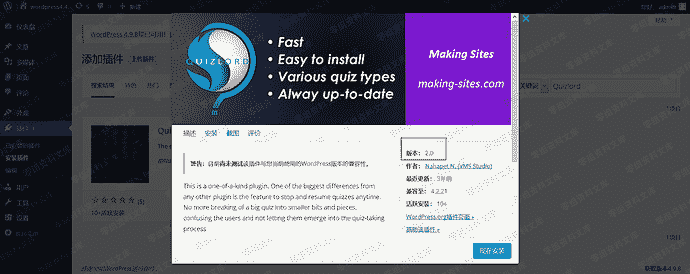

下载、安装完成后，需要点击启用插件。

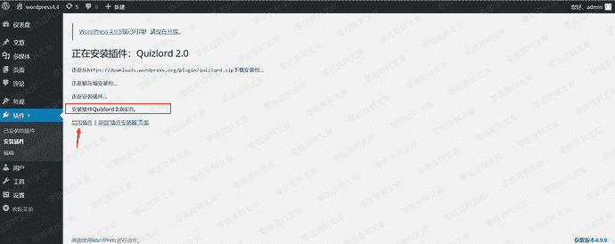

根据exploit-db给出的漏洞详情，找到触发漏洞的位置。

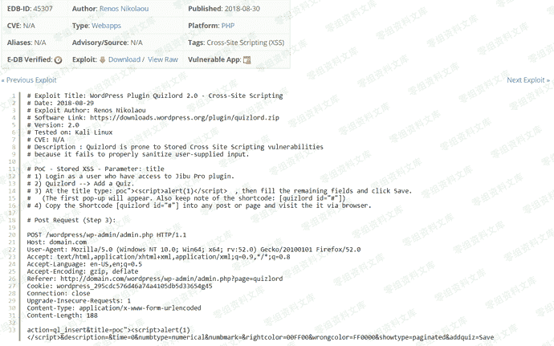

进入后台选择Quizlord插件

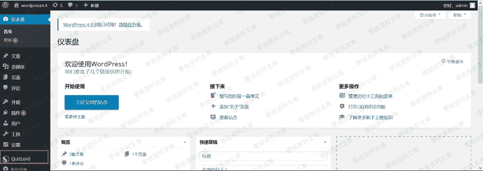

此时浏览器的地址栏正好对应poc中的referer内容，现在只要使用火狐插件hackbar并根据POC构造POST请求

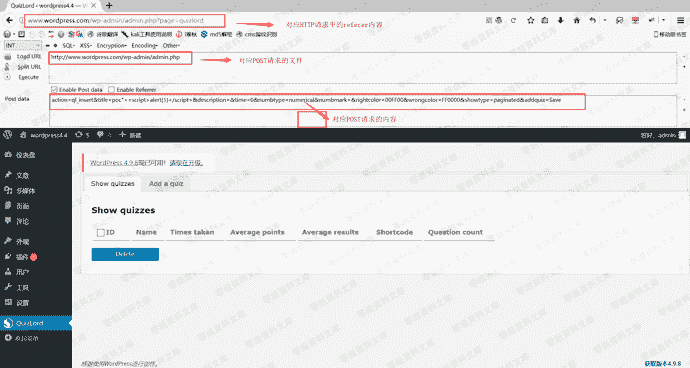

点击execute即可发送该POST请求。

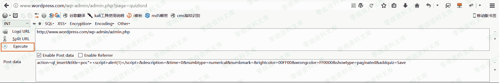

请求成功后，返回是一个空白页。

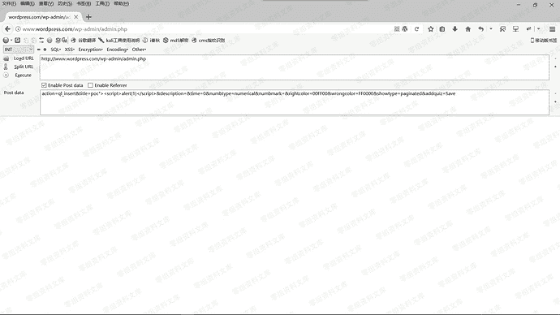

返回上一页并刷新即可触发该漏洞。

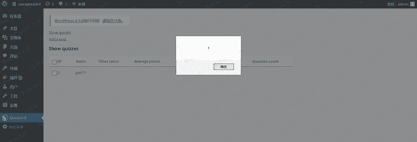

通过复现这个漏洞，我们可以知道它属于后台存储型XSS，且它的危害其实并不是很大。

需要进入后台，因此必须得知道后台用户的账号和密码。

下面我们来简单分析一下漏洞的成因。

### 漏洞成因分析

WordPress插件源码位置：

```
\wp4_4\wp-content\plugins\ 
```

进入Quizlord插件目录，找到quizlord.php文件。

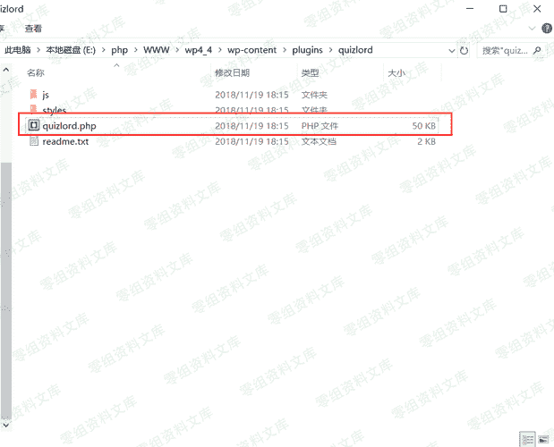

下图是quizlord.php文件的内容

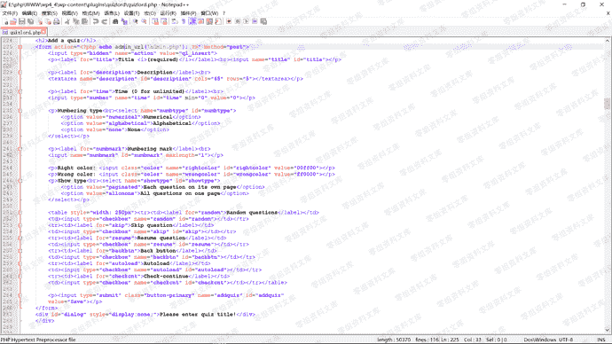

根据POC快速定位到函数。发现POST传入的数据并没有被程序过滤就写入了数据库中。

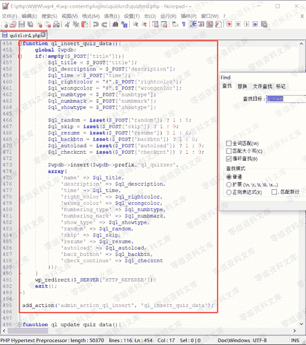

## 四、参考链接

> https://www.freebuf.com/vuls/189814.html

> https://www.exploit-db.com/exploits/45307/