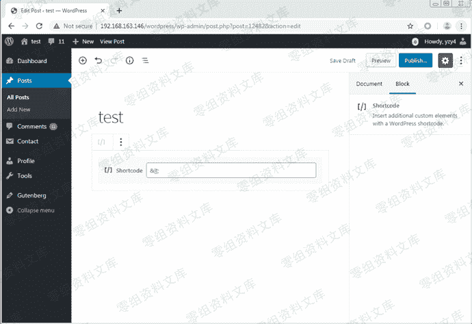
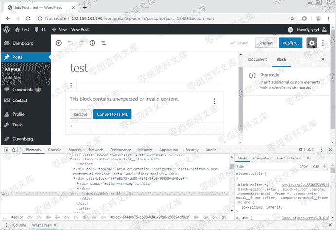
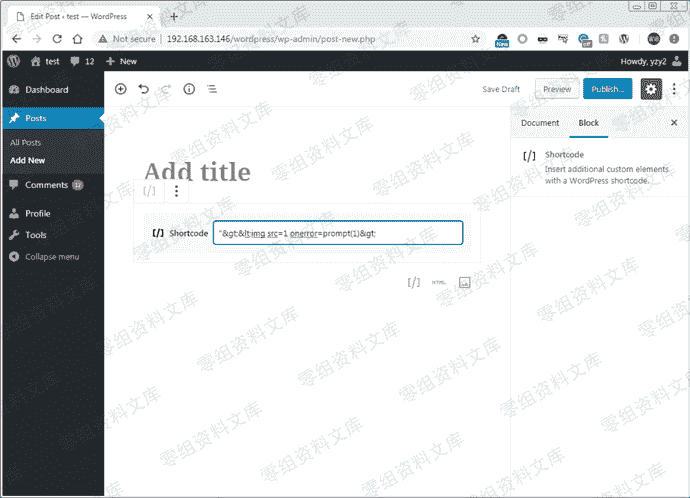
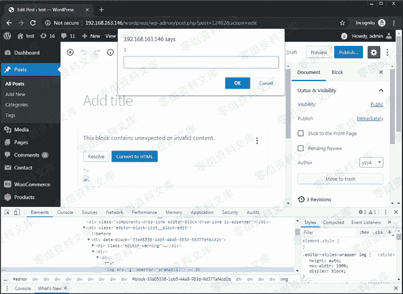

# （CVE-2019-16219）WordPress 5.2.3 内置编辑器Gutenberg 储存型xss

> 原文：[https://www.zhihuifly.com/t/topic/3264](https://www.zhihuifly.com/t/topic/3264)

# （CVE-2019-16219）WordPress 5.2.3 内置编辑器Gutenberg 储存型xss

## 一、漏洞简介

Gutenberg编辑器无法过滤“简码”错误消息中的JavaScript / HTML代码，导致可执行任意JavaScript / HTML代码

## 二、漏洞影响

WordPress 5.2.3

## 三、复现过程

在WordPress 5.0中，用户可以在帖子中添加Shortcode块。当在Shortcode块中添加某些HTML编码字符（例如“＆lt;”），然后重新打开该帖子时，它将显示错误消息，并通过将“＆lt;”解码为“ <”来预览它。

图1.将HTML编码的字符插入Shortcode块



图2.带有预览的Shortcode错误消息



可以通过PoC

```
"&gt;&lt;img src=1 onerror=prompt(1)&gt; 
```

轻松绕过此预览中的XSS过滤器。

图3.将PoC代码插入Shortcode块



当任何受害者查看此帖子时，XSS代码将在其浏览器中执行。



如果受害者恰巧具有管理员权限，则攻击者可以利用此漏洞来控制管理员的帐户，将WordPress内置功能用于GetShell，然后控制服务器。