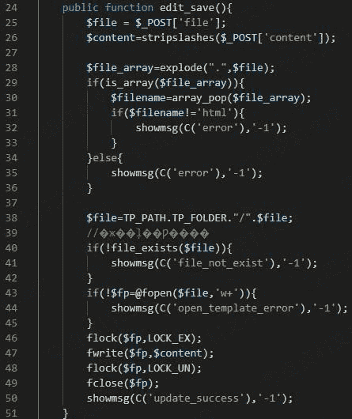

# XDCMS 1.0 xss漏洞

> 原文：[https://www.zhihuifly.com/t/topic/3275](https://www.zhihuifly.com/t/topic/3275)

# XDCMS 1.0 xss漏洞

## 一、漏洞简介

## 二、漏洞影响

XDCMS 1.0

## 三、复现过程

漏洞文件：`system\modules\xdcms\template.php`，URL：`index.php?m=xdcms&c=template&f=edit&file=footer.html`

插入xss平台代码

成功接受到信息

