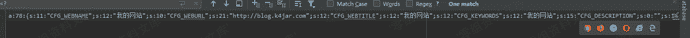
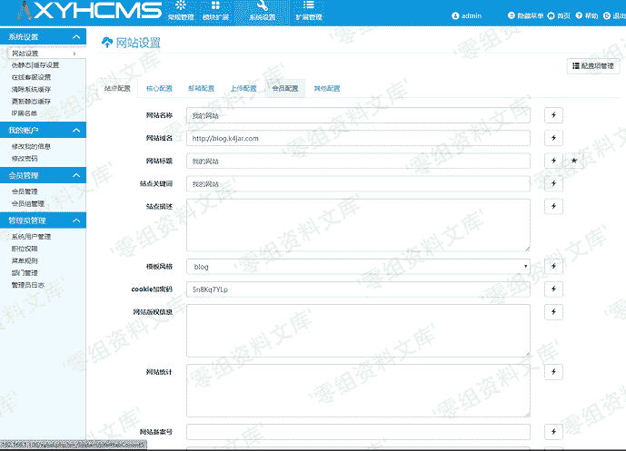
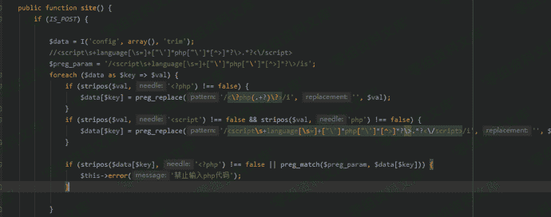
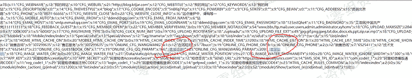
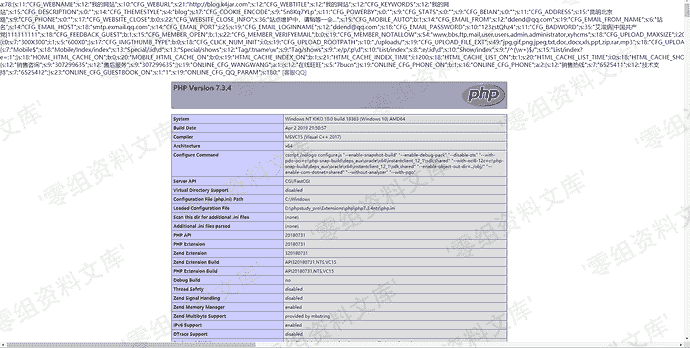

# XYHCMS 3.6 后台代码执行漏洞

> 原文：[https://www.zhihuifly.com/t/topic/3287](https://www.zhihuifly.com/t/topic/3287)

# XYHCMS 3.6 后台代码执行漏洞（一）

## 一、漏洞简介

（CNVD-2020-03899） XYHCMS后台存在代码执行漏洞，攻击者可利用该漏洞在site.php中增加恶意代码，从而可以获取目标终端的权限。

## 二、漏洞影响

XYHCMS 3.6

## 三、复现过程

搜索site.php 打开发现是一堆配置文件,这让我想起了前不久看到的一个漏洞
所以就全局去找写入点

很显然这里是可以写入的,不过却没有这么简单

有过滤,所以我暂时放弃了’但是我找到一个其他的写入点并没有过滤

## 参考链接

> http://101.200.56.59/cnvd-2020-03899%E5%88%86%E6%9E%90/