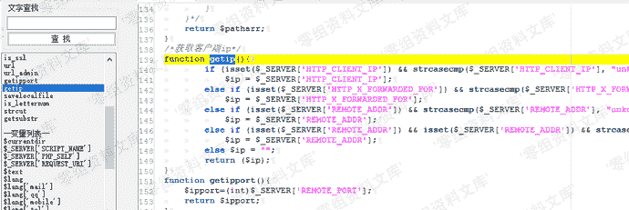
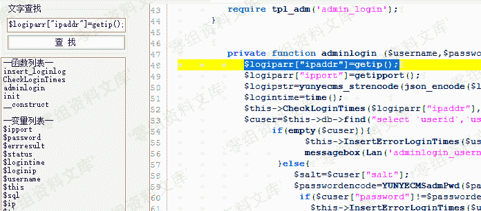
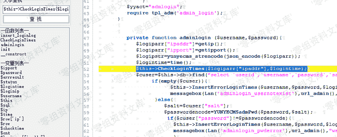
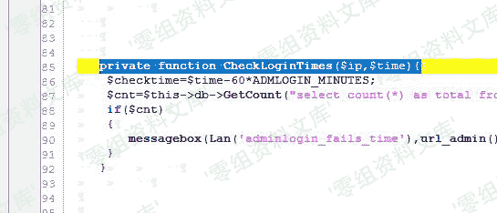
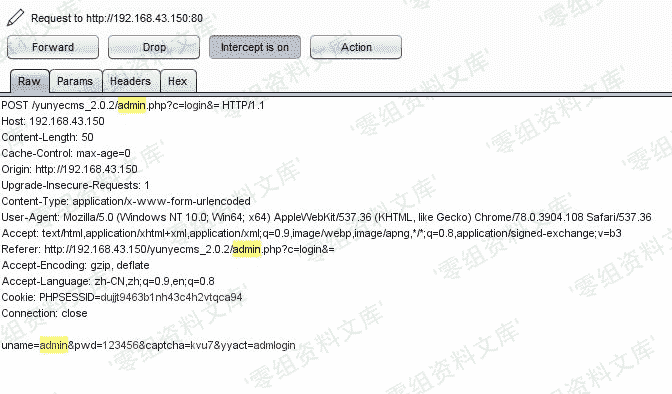
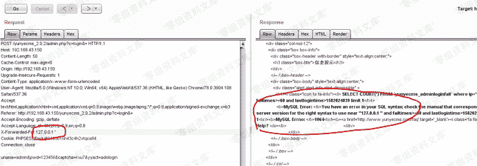
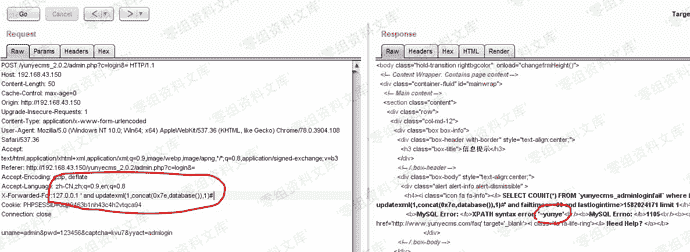
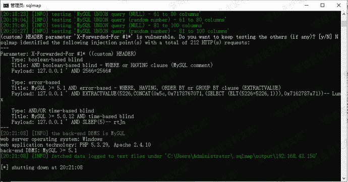

# Yunyecms V2.0.2 前台注入漏洞（一）

> 原文：[https://www.zhihuifly.com/t/topic/3292](https://www.zhihuifly.com/t/topic/3292)

# Yunyecms V2.0.2 前台注入漏洞（一）

## 一、漏洞简介

云业CMS内容管理系统是由云业信息科技开发的一款专门用于中小企业网站建设的PHP开源CMS，可用来快速建设一个品牌官网(PC，手机，微信都能访问)，后台功能强大，安全稳定，操作简单。

## 二、漏洞影响

yunyecms 2.0.2

## 三、复现过程

### 漏洞分析

下载源码，搭建起来，打开登录页面。

```
http://127.0.0.1/yunyecms_2.0.2/admin.php?c=login&=
1 
```

打开Seay源代码审计工具，分析代码。
经过一番寻找与“提示”，发现getip()方法获取ip没有进行过滤，可能有戏。



搜索getip()函数，发现login.php调用了该函数，变量为$logiparr。



跟踪该变量，发现CheckLoginTimes函数调用该变量。



去到该函数定义处，发现我们的ip变量没有进行任何过滤直接由GetCount函数执行。



### 漏洞发现

```
$cnt=$this->db->GetCount("select count(*) as total from `#yunyecms_adminloginfail`  where ip='$ip' and failtimes>=".ADMLOGIN_MINUTES." and lastlogintime>$checktime limit 1"); 
```

可以看出，我们可以构造该ip变量达到注入目的，打开burp抓包。



发送到Repeater模块，构造参数，可以看到sql报错。



进一步利用，得到数据库名称，漏洞存在。



### 漏洞利用

将抓的包保存下来，使用sqlmap去跑就可以了。

```
sqlmap.py -r C:\Users\Administrator\Desktop\yunye.txt --batch 
```



## 参考链接

> http://www.freesion.com/article/7074313754/