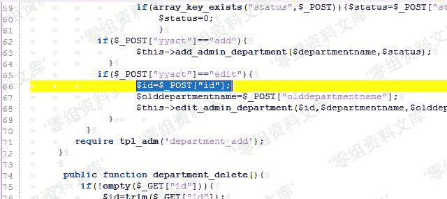
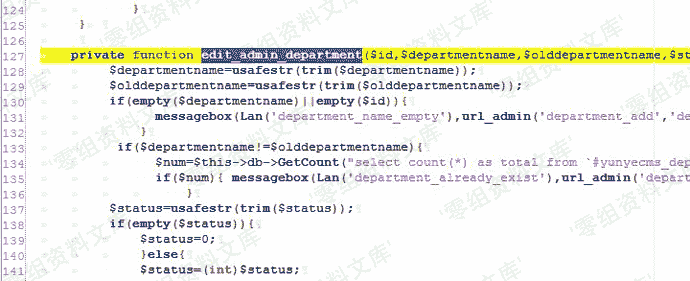
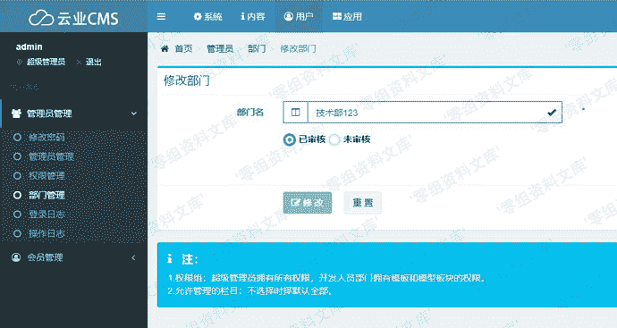
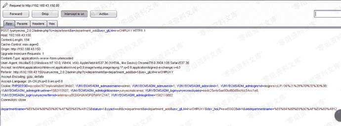
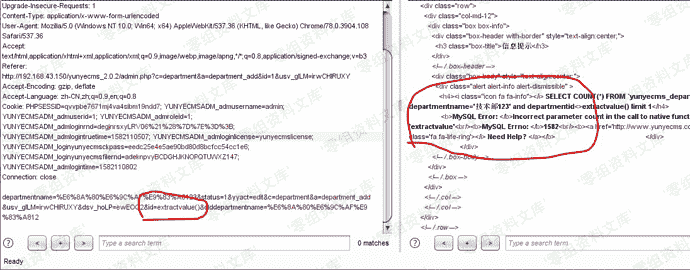
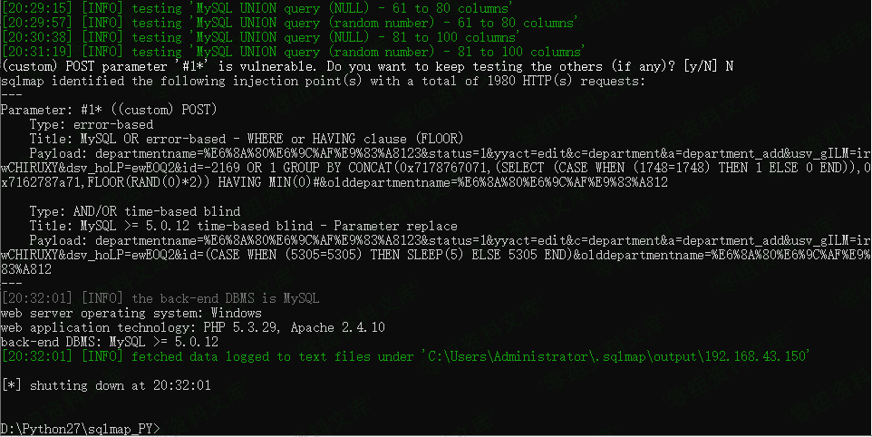

# Yunyecms V2.0.2 后台注入漏洞（一）

> 原文：[https://www.zhihuifly.com/t/topic/3294](https://www.zhihuifly.com/t/topic/3294)

# Yunyecms V2.0.2 后台注入漏洞（一）

## 一、漏洞简介

云业CMS内容管理系统是由云业信息科技开发的一款专门用于中小企业网站建设的PHP开源CMS，可用来快速建设一个品牌官网(PC，手机，微信都能访问)，后台功能强大，安全稳定，操作简单。

## 二、漏洞影响

yunyecms 2.0.2

## 三、复现过程

### 漏洞分析

废话不多说，又经过一番寻找与“提示”，发现core/admin/deparment.php文件，其中id值是通过post直接获取的，然后被edit_admin_department()调用。



去到edit_admin_department()函数定义处，发现过滤语句。



但是仔细一看，发现代码只是过滤了departmentname和olddepartmentname两个变量，放过了我们的id变量，只是判断id值是否为空。

```
if($departmentname!=$olddepartmentname){
		$num=$this->db->GetCount("select count(*) as total from `#yunyecms_department` where departmentname='$departmentname' and departmentid<>$id limit 1");
		if($num){ messagebox(Lan('department_already_exist'),url_admin('department_add','','',$this->hashurl['usvg']),"warn");	}
} 
```

从代码可以看出，如果departmentname的值不等于olddepartmentname，就执行sql语句，我们的id值没有任何过滤出现在sql语句中，应该有注入无疑了。

### 漏洞复现

来到core/admin/deparment.php所在的页面，即后台的部门管理处。



修改部门名字，只要前后名字不一致即可，使用burp抓包。



发送到Repeater模块，构造参数，可以看到sql报错。



不想动手，就扔到sqlmap去跑就完事了。

```
sqlmap.py -r C:\Users\Administrator\Desktop\yunye.txt --batch 
```



## 参考链接

> http://www.freesion.com/article/9029315473/