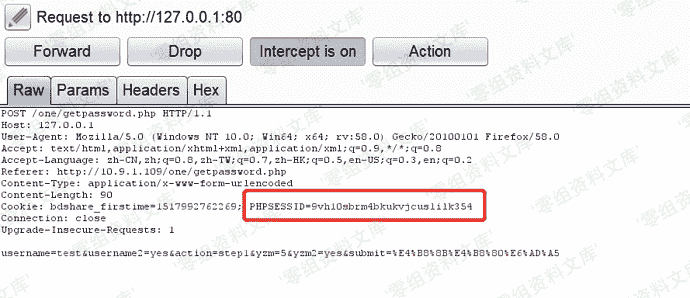
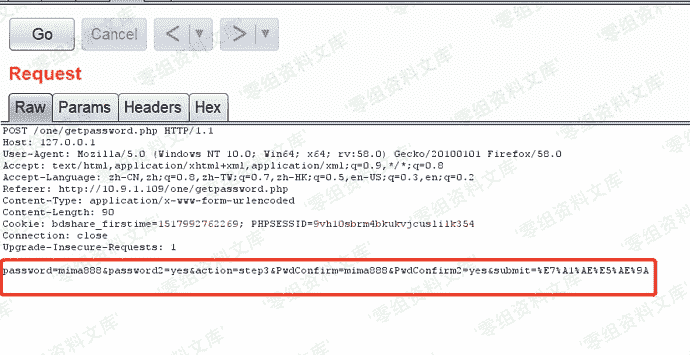
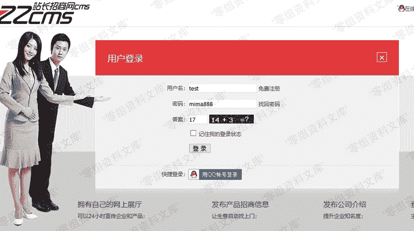

# Zzcms 8.2 任意用户密码修改

> 原文：[https://www.zhihuifly.com/t/topic/3312](https://www.zhihuifly.com/t/topic/3312)

# Zzcms 8.2 任意用户密码修改

## 一、漏洞简介

Zzcms是一款企业建站程序。 zzcms 8.2版本/one/getpassword.php文件存在漏洞，攻击者可利用该漏洞修改任意用户密码。

## 二、漏洞影响

Zzcms 8.2

## 三、复现过程

### 漏洞分析

/one/getpassword.php文件第 73行，触发漏洞的关键代码。

```
}elseif($action=="step3" && @$_SESSION['username']!=''){

$passwordtrue = isset($_POST[‘password’])?$_POST[‘password’]:"";

$password=md5(trim($passwordtrue));

query(“update zzcms_user set password=’$password’,passwordtrue=’$passwordtrue’ where username=’”.@$_SESSION['username

$strout=str_replace("{step4}","",$strout) ;

$strout=str_replace("{/step4}","",$strout) ;

$strout=str_replace("{step1}".$step1."{/step1}","",$strout) ;

$strout=str_replace("{step2}".$step2."{/step2}","",$strout) ;

$strout=str_replace("{step3}".$step3."{/step3}","",$strout) ; `$strout=str_replace("{#username}",@$_SESSION[‘username’],$strout) ;` 
```

这里仅仅判断了 action参数为 step3，并且$_SESSION['username']不为空，就进入密码修改的逻辑，直接执

行sql语句执行update操作。那么这里的$_SESSION['username']从哪里来的，我们继续看代码，在

/one/getpassword.php文件第 31行，可以看到

```
$_SESSION['username']。

if ($action==“step1”){

$username = isset($_POST[‘username’])?$_POST[‘username’]:"";

$_SESSION[‘username’]=$username;

checkyzm($_POST[“yzm”]);

$rs=query(“select mobile,email from zzcms_user where username=’” . $username . "’ ");

$row=fetch_array($rs);

$regmobile=$row[‘mobile’];

$regmobile_show=str_replace(substr($regmobile,3,4),"****",$regmobile);

$regemail=$row[‘email’]; `$regemail_show=str_replace(substr($regemail,1,2),"**",$regemail);` 
```

这里username是从step1不做中 post传递过来的 username参数，也就是我们要修改的用户名。那么漏洞就很

明显了，在第一步输入要修改的用户名，然后获取session值，直接跳到第三步，修改密码就可以打到任意

用户密码修改。

### 漏洞复现

第一步先在找回密码页面输入要修改的用户名，点击下一步，burp拦截。


抓包获取session值



这里我们获取到了 session值，然后根据上面的描述，修改数据包，直接进入修改密码操作。



这里session就是上面获取到的，只需要修改 post-data值就可以。这里改成mima888。action值要改成step3

才可以进去 数据库 update语句的操作。然后重放数据包，就可以完成任意密码修改了。

前台登录试试，是否修改成功。



成功修改密码，登录成功。


利用此漏洞，只需要知道用户名即可。